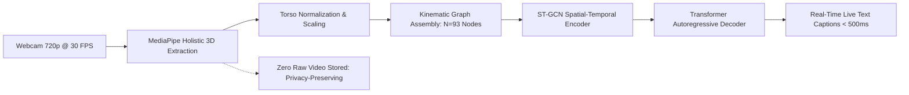

# SignTalk AI: Real-Time Indian Sign Language Translation and Communication Platform

> **A Spatial-Temporal Graph and Transformer-Based Sign-to-Text System**  
> *B.Tech Computer Science & Engineering (AI/ML) Academic Project | GLA University*

---

## 1. Executive Summary

**SignTalk AI** is an academic research platform and assistive computer vision system designed to translate continuous Indian Sign Language (ISL) signing into fluent natural-language text captions in near real time.

Operating on standard consumer webcams without specialized hardware sensors, SignTalk AI couples lightweight edge skeletal landmark extraction (Google MediaPipe Holistic) with Spatial-Temporal Graph Convolutional Networks (ST-GCN) to model multi-joint kinematic movement, followed by an autoregressive Transformer decoder to synthesize grammatically coherent natural-language sentences under strict conversational latency budgets ($\le 500\text{ ms}$).



---

## 2. Project Status & Truthfulness Protocol

In compliance with academic integrity guidelines, all subsystems, datasets, models, and performance metrics in SignTalk AI are classified under strict operational states:

- **`IMPLEMENTED`**: None in Phase 1 *(Strictly research specification, architecture design, and engineering blueprints)*.
- **`PLANNED`**: Complete specifications defined for Phase 2 through Phase 10 (MediaPipe extraction, ST-GCN encoder, Transformer decoder, FastAPI backend, React UI).
- **`PROPOSED`**: Conceptual extensions under empirical evaluation (40-point salient facial marker filtering, adaptive graph adjacency, ONNX runtime quantization).
- **`FUTURE SCOPE`**: Explicitly excluded from the current academic MVP (bidirectional 3D signing avatars, ASL/BSL translation, native mobile apps, multi-signer conversational tracking).

> [!IMPORTANT]
> **Academic Integrity Commitment:** No accuracy figures, latency values, dataset sizes, or competitor capabilities are fabricated. All claims are grounded in peer-reviewed literature, verified dataset manifests, and reproducible benchmarks.

---

## 3. Project Documentation Hierarchy

```
d:/SignAI/
├── README.md                                                 # Project Master Overview (This file)
├── .env.example                                              # Environment configuration template
├── docker-compose.yml                                        # Multi-container orchestration blueprint
├── requirements.txt                                          # Pinned Python 3.11 dependencies
├── package.json                                              # Root build and package scripts
│
├── data/                                                     # Dataset Management & Manifests
│   ├── README.md                                             # Data hygiene, storage schemas, and directory layout
│   └── dataset_registry.csv                                  # Authoritative registry of verified candidate datasets
│
└── docs/
    ├── research/
    │   └── SOURCES.md                                        # Categorized primary literature, citations, and URLs
    │
    ├── phase-1-part-1/                                       # Project Definition & Research Foundation
    │   ├── 01_Project_Definition.md                          # Problem statements (One-sentence, Short, Detailed, Math)
    │   ├── 02_Vision_and_Objectives.md                       # Vision, mission, 30-sec synopsis, 1-min viva pitch
    │   ├── 03_Target_Users_and_Use_Cases.md                  # 6 detailed personas and prioritized use cases
    │   ├── 04_Project_Scope.md                               # In-Scope, Out-of-Scope, and Future Scope boundaries
    │   ├── 05_Vocabulary_Strategy.md                         # 50-class MVP vocabulary and phrase compositions
    │   ├── 06_Research_Gap.md                                # Literature review, research gap matrix, contributions
    │   ├── 07_Existing_Systems_and_Competitors.md            # Factual comparative analysis of existing systems
    │   ├── 08_Dataset_Research.md                            # Comprehensive ISL dataset evaluation
    │   ├── 09_Data_Collection_Plan.md                        # Tiered supplementary collection protocols
    │   ├── 10_Ethics_and_Consent.md                          # IRB/IEC ethics review, consent, biometric privacy
    │   ├── 11_Functional_Requirements.md                     # FR-001 through FR-018 with MoSCoW priorities
    │   ├── 12_Non_Functional_Requirements.md                 # NFR-001 through NFR-018 (latency, throughput, memory)
    │   ├── 13_Success_Metrics.md                             # ML, translation, latency, robustness, and UX metrics
    │   ├── 14_Experimental_Strategy.md                       # Baselines (Bi-LSTM), ST-GCN, modality ablation matrix
    │   ├── 15_Assumptions_and_Constraints.md                 # Operational assumptions, hardware constraints, risks
    │   ├── 16_Project_Boundaries.md                          # Explicit boundary declarations and "Do Not Claim" guide
    │   ├── 17_Open_Questions.md                              # Blocking pre-Phase 1 Part 2 decisions
    │   ├── 18_Phase_1_Part_1_Final_Specification.md          # Consolidated master specification
    │   ├── requirements_traceability.md                      # End-to-end Problem -> Req -> Metric -> Exp mapping
    │   └── decision_log.md                                   # Architectural Decision Records (DEC-001 to DEC-013)
    │
    ├── architecture/                                         # Technical Architecture Specifications
    │   ├── 01_high_level_architecture.md                     # Layered system architecture & Mermaid diagrams
    │   ├── 02_ml_pipeline.md                                 # Two-stage ML pipeline & tensor transformations
    │   ├── 03_realtime_pipeline.md                           # Real-time sequence diagrams & latency budgets
    │   ├── 04_training_pipeline.md                           # Signer-independent training & multi-task losses
    │   ├── 05_deployment_architecture.md                     # Mode A (Local Web) vs Mode B (Future Edge)
    │   ├── 06_data_flow.md                                   # End-to-end data flow & WebSocket JSON framing
    │   ├── 07_component_architecture.md                      # Component hierarchy & subsystem decomposition
    │   ├── 08_graph_definition.md                            # Kinematic graph topology & spatial partitioning
    │   ├── 09_performance_strategy.md                        # Profiling envelopes & ONNX INT8 quantization
    │   ├── 10_model_interfaces.md                            # Typed interfaces, protocols, and contracts
    │   └── adr/                                              # Architectural Decision Records
    │       ├── ADR-001_frontend_framework.md                 # React 18 + TypeScript adoption
    │       ├── ADR-002_backend_framework.md                  # FastAPI modular monolith adoption
    │       ├── ADR-003_landmark_extraction.md                # MediaPipe Holistic adoption
    │       ├── ADR-004_stgcn_architecture.md                 # ST-GCN graph encoder selection
    │       ├── ADR-005_transformer_architecture.md           # 3-layer Transformer decoder selection
    │       ├── ADR-006_realtime_transport.md                 # WebSocket over WebRTC/HTTP selection
    │       ├── ADR-007_cloud_vs_edge.md                      # Local modular monolith strategy
    │       └── ADR-008_storage_strategy.md                   # Local filesystem & zero-database strategy
    │
    └── phase-1-part-2/                                       # Engineering Blueprints & Master Specifications
        ├── 01_Technical_Architecture.md                      # Technical stack and subsystem decomposition
        ├── 02_System_Architecture.md                         # Seven-layer system architecture breakdown
        ├── 03_Data_Pipeline.md                               # Video ingestion, filtering, and normalization
        ├── 04_Landmark_Representation.md                     # 93-node budget and coordinate transformation
        ├── 05_Multimodal_Fusion.md                           # Graph-level kinematic fusion evaluation
        ├── 06_Graph_Definition.md                            # Graph topology, edge lists, spatial partitions
        ├── 07_Baseline_Architecture.md                       # MLP and Bi-LSTM reference baselines
        ├── 08_STGCN_Architecture.md                          # 6-block ST-GCN backbone specifications
        ├── 09_Transformer_Architecture.md                    # 3-layer autoregressive Transformer decoder
        ├── 10_Continuous_Signing_Strategy.md                 # Sliding buffer, velocity rest, Levenshtein filter
        ├── 11_Real_Time_Inference.md                         # Producer-consumer threading & latency budgets
        ├── 12_Performance_Strategy.md                        # Resource envelopes & ONNX INT8 quantization
        ├── 13_Edge_Offline_Architecture.md                   # Mode B pure-edge WebGPU feasibility roadmap
        ├── 14_Frontend_Architecture.md                       # React component hierarchy & WCAG accessibility
        ├── 15_Backend_Architecture.md                        # FastAPI directory structure & lifespan handlers
        ├── 16_API_Design.md                                  # REST endpoints & WebSocket JSON protocol
        ├── 17_Model_Interfaces.md                            # Code-level dataclasses, protocols, exceptions
        ├── 18_Data_Schemas.md                                # Authoritative JSON Schemas for recordings & logs
        ├── 19_Model_Versioning.md                            # Semantic versioning & SHA-256 manifests
        ├── 20_Experiment_Tracking.md                         # Local-first TensorBoard & manifest ledger
        ├── 21_Security_Privacy_Architecture.md               # Zero raw-video storage & DPDP compliance
        ├── 22_Error_Handling.md                              # Master error matrix & user recovery prompts
        ├── 23_Testing_Architecture.md                        # Five-tier testing pyramid specifications
        ├── 24_Observability.md                               # Telemetry metrics & structured JSON logging
        ├── 25_Deployment_Architecture.md                     # Container topology & environment injection
        ├── 26_Technology_Decisions.md                        # Comprehensive technology decision matrix
        ├── 27_GitHub_Repository_Structure.md                 # Complete directory blueprint & git hygiene
        ├── 28_Environment_Configuration.md                   # Locked dependency versions & .env.example
        ├── 29_Docker_Architecture.md                         # Dockerfiles & Compose orchestration
        ├── 30_CICD_Blueprint.md                              # Automated GitHub Actions CI workflow
        ├── 31_Implementation_Roadmap.md                      # Phased roadmap for Phases 2 through 10
        ├── 32_Definition_of_Done.md                          # Verifiable DoD criteria for all subsystems
        ├── 33_Requirements_Traceability.md                   # Extended Part 2 requirements matrix
        ├── 34_Open_Technical_Decisions.md                    # Prerequisite decisions for Phase 2 kickoff
        └── FINAL_TECHNICAL_BLUEPRINT.md                      # Master consolidated 27-section blueprint
```

---

## 4. Key Architectural Decisions (Approved in Phase 1)

1. **Exclusive Language Focus on ISL (ADR DEC-001):** Avoids multi-language scope sprawl.
2. **Local MediaPipe Skeletal Landmark Extraction (ADR-003):** Zero raw-video retention; sub-35ms CPU extraction.
3. **Spatial-Temporal Graph Convolution (ADR-004):** Models biological bone connectivity and joint motion over time.
4. **Transformer Sequence Translation (ADR-005):** Translates continuous sign features into fluent natural language, bridging ISL (SOV) to English (SVO) grammar.
5. **WebSockets for Real-Time Streaming (ADR-006):** Sub-15ms transport latency for lightweight coordinate packets ($< 50\text{ KB/s}$) without WebRTC signaling complexity.
6. **Local Modular Monolith (ADR-007):** Enables self-contained execution on student workstations; zero cloud costs; 100% offline air-gapped viability.
7. **Local Filesystem & Zero Database (ADR-008):** Eliminates database bloat; guarantees privacy compliance.
8. **Sub-500 ms Latency Target:** Nominal end-to-end design latency $\approx 245\text{ ms}$, comfortably within the conversational ceiling.

---

## 5. What Phase 2 Will Implement First

Upon review and approval of this blueprint, **Phase 2 ("Dataset Acquisition & Ingestion")** will execute:
1. Automated download and verification of **INCLUDE-50** (isolated signs) and **ISL-CSLTR** (continuous sentences).
2. Generating stratified signer-independent train/val/test splits (`splits/include_50_splits.json` and `splits/isl_csltr_splits.json`).
3. Running initial 100-frame host CPU benchmarking of MediaPipe Holistic to confirm facial marker latency.
