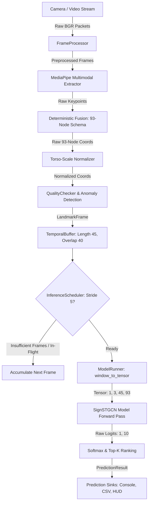

# Real-Time Sliding-Window ST-GCN Inference Architecture

**SignTalk AI: Real-Time Indian Sign Language Translation Platform**  
*Phase 4 — Part 2: Sliding-Window Inference & Temporal Prediction*

---

## 1. System Overview

Phase 4 Part 2 bridges the real-time landmark streaming pipeline established in Part 1 to the trained Spatial-Temporal Graph Convolutional Network (`SignTalk_STGCN_v1`) from Phase 3. The architecture receives a continuous stream of camera frames, maintains an anatomical rolling temporal window, enforces inference stride pacing, executes strict tensor conversion, runs forward evaluation on CPU or CUDA GPU, and publishes structured sign predictions.



---

## 2. Core Components and Responsibilities

### 2.1 [TemporalBuffer](file:///d:/SignAI/src/realtime/temporal_buffer.py)
- **Role**: Maintains a rolling FIFO sequence of `LandmarkFrame` instances.
- **Capacity**: Fixed $T = 45\text{ frames}$ (matching model sequence length).
- **Interpolation Bridge**: Linearly interpolates coordinates across 1..5 dropped frames.
- **Quality Gating**: Enforces minimum valid frame count ($\ge 15$) and active hand activity ($\ge 15\%$ frames with detected hands).

### 2.2 [InferenceScheduler](file:///d:/SignAI/src/realtime/inference_scheduler.py)
- **Role**: Paces temporal inference frequency according to sliding stride.
- **Default Stride**: $s = 5\text{ frames}$ ($200\text{ ms}$ cadence at $25\text{ FPS}$).
- **Stale Window Policy**: If ST-GCN forward evaluation is in flight when the next window arrives, the stale window is discarded to prevent queue latency buildup.

### 2.3 [STGCNRunner](file:///d:/SignAI/src/realtime/model_runner.py)
- **Role**: High-performance inference runner for `SignTalk_STGCN_v1`.
- **Model Checkpoint**: `experiments/stgcn/checkpoints/best_checkpoint.pt` (Epoch 34, 2,137,818 parameters).
- **Tensor Contract**: Strictly enforces shape `[1, 3, 45, 93]` with channel order $(C, T, V)$ where $C=0 (X), C=1 (Y), C=2 (Z)$.
- **Device Management**: Automatically selects CUDA if available, with graceful CPU fallback and strict error reporting if unavailable CUDA is requested.
- **Warm-Up**: Executes 5 dummy forward passes during initialization to prime PyTorch memory allocators and execution kernels.

### 2.4 [Prediction Sinks](file:///d:/SignAI/src/realtime/prediction_sink.py)
- **ConsolePredictionSink**: Outputs formatted sign predictions and top-3 alternatives.
- **PredictionLoggerSink**: Records timestamped diagnostic logs to `results/realtime/predictions.csv`.
- **CallbackPredictionSink**: Dispatches predictions to external handlers or UI layers.
- **CompositePredictionSink**: Multiplexes predictions to multiple sinks simultaneously.

### 2.5 [RealTimeSignPredictor](file:///d:/SignAI/src/realtime/realtime_predictor.py)
- **Role**: Top-level pipeline coordinator orchestrating ingestion, streaming, buffering, scheduling, and rendering.
- **HUD Diagnostics**: Renders skeletal tracking, buffer progress bar, current prediction, confidence, latency, and top-3 rankings.

---

## 3. Data Contracts and Schemas

### 3.1 Input Tensor Contract
The model runner strictly validates the following tensor properties before invoking the ST-GCN forward pass:
- **Dimensions**: `[B, C, T, V]` = `[1, 3, 45, 93]`
- **Data Type**: `torch.float32`
- **Mask Tensor**: `[B, 1, T, V]` = `[1, 1, 45, 93]`
- **Value Constraints**: No `NaN` or `Inf` values permitted; strictly bounded torso-scale coordinates.

### 3.2 Structured Prediction Result
Every inference cycle emits a structured [`PredictionResult`](file:///d:/SignAI/src/realtime/types.py#L150):
```python
PredictionResult(
    class_id=0,
    label="hello",
    gloss="HELLO",
    translation="Hello",
    confidence=0.9987,
    probabilities=[...],       # Full 10-class distribution
    logits=[...],              # Raw unnormalized model logits
    top_k=[(0, "hello", 0.9987), (2, "good", 0.0008), ...],
    timestamp=1791296758.11,
    window_start_time=305736.40,
    window_end_time=305741.96,
    window_frame_count=45,
    inference_start_time=...,
    inference_end_time=...,
    inference_latency_ms=118.60,
    input_quality=0.88,
    is_valid_quality=True,
    buffer_length=45,
    device="cpu"
)
```

---

## 4. Architectural Boundaries for Phase 4 Part 2

To maintain modular development and prevent premature coupling, the following features are intentionally **deferred to subsequent phases**:
- Prediction smoothing and temporal voting (Phase 4 Part 3)
- Continuous sign segmentation and silence detection (Phase 4 Part 3)
- Sentence translation via Transformer decoder (Phase 4 Part 4)
- React UI and WebRTC/WebSocket client streaming (Phase 5)
