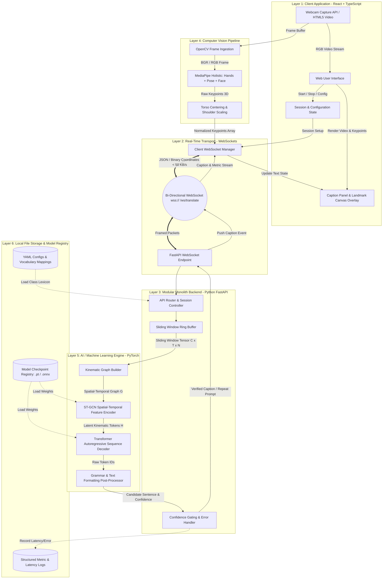

# 01. High-Level System Architecture: SignTalk AI

**Document ID:** STAI-ARCH-001  
**Project Name:** SignTalk AI  
**Document Status:** Approved Engineering Blueprint (Phase 1 — Part 2)  

---

## 1. Architectural Philosophy & Design Principles

SignTalk AI is designed as a **modular, privacy-preserving, edge-viable translation platform**. In strict accordance with the academic constraints established in Phase 1 Part 1, the architecture adheres to five core engineering principles:

1. **Simplicity over Distributed Complexity:** Avoids microservices sprawl, message queues (Kafka/RabbitMQ), and distributed orchestration (Kubernetes). Operates as a cohesive, modular monolith.
2. **Privacy-by-Design via Data Minimization:** Raw video frames are processed transiently in volatile memory and purged immediately post-landmark extraction. Only lightweight geometric skeletal coordinates traverse internal interfaces.
3. **Conversational Low-Latency Execution:** The entire end-to-end pipeline is bound to an engineering latency ceiling of $\le 500\text{ ms}$ at $\ge 20\text{ FPS}$ on standard consumer workstation hardware.
4. **Decoupled Asynchronous Streaming:** Decouples high-frequency frame ingestion ($\ge 20-30\text{ FPS}$) from sliding-window sequence translation ($3-5\text{ inferences/sec}$) via non-blocking asynchronous queues.
5. **Portability & Future Edge Readiness:** Designed for local execution with clear conversion pathways to ONNX Runtime and browser-local WebGPU/Wasm runtimes.

---

## 2. High-Level Architecture Diagram

---

## 3. Layered Architectural Decomposition

### Layer 1: Client Application (React + TypeScript)
- Manages browser webcam stream via `navigator.mediaDevices.getUserMedia()`.
- Renders zero-latency local video preview with an optional toggle for landmark skeleton overlay on HTML5 Canvas.
- Receives real-time text captions, confidence scores, and error state alerts over WebSockets, displaying them in high-contrast typography conforming to WCAG 2.1 AA accessibility guidelines.

### Layer 2: Real-Time Transport (WebSocket)
- Provides full-duplex, low-latency streaming between client and backend.
- Transmits compact JSON/binary landmark packets ($< 50\text{ KB/s}$) rather than heavy video streams ($> 2\text{ MB/s}$), ensuring high responsiveness even on modest network connections.

### Layer 3: Backend Services (FastAPI Modular Monolith)
- Manages translation session lifecycles, configuration discovery, and system health checks (`/healthz`).
- Maintains a thread-safe, rolling temporal sliding window buffer per active session.
- Coordinates confidence evaluation, unknown sign mitigation, and structured logging.

### Layer 4: Computer Vision & Feature Normalization
- Coordinates landmark extraction via Google MediaPipe Holistic.
- Maps raw keypoints into an anatomical coordinate space invariant to user distance, lateral position, and camera framing.

### Layer 5: AI / Machine Learning Engine
- **Graph Builder:** Maps normalized landmarks into an anatomical graph structure $\mathcal{G} = (\mathcal{V}, \mathcal{E}_{spatial}, \mathcal{E}_{temporal})$.
- **ST-GCN Encoder:** Extracts high-level spatial joint interactions and temporal trajectory dynamics.
- **Transformer Decoder:** Autoregressively generates natural-language English sentences from continuous kinematic embeddings.

### Layer 6: Storage & Model Registry
- Employs zero heavyweight external databases.
- Relies on structured local directories for PyTorch/ONNX model checkpoints, vocabulary JSON files, and local logging.
