# 02. AI / ML Pipeline Specification: SignTalk AI

**Document ID:** STAI-ARCH-002  
**Project Name:** SignTalk AI  
**Document Status:** Approved Engineering Blueprint (Phase 1 — Part 2)  

---

## 1. Machine Learning Pipeline Overview

The SignTalk AI ML pipeline operates as a **two-stage hybrid spatial-temporal translation network**:
1. **Spatial-Temporal Representation Learning (ST-GCN Encoder):** Extracts topological joint correlations and motion dynamics across multi-frame sliding windows.
2. **Autoregressive Sequence-to-Sequence Translation (Transformer Decoder):** Decodes latent kinematic representations into grammatically structured natural-language text.

```mermaid
graph LR
    subgraph Frontend [Stage 1: Landmark Extraction & Normalization]
        A[RGB Video Frame v_t] --> B[MediaPipe Holistic]
        B --> C1[Hands: 21x2=42 pts]
        B --> C2[Pose: 11 pts]
        B --> C3[Face: 40 pts]
        C1 & C2 & C3 --> D[Torso Centering & Shoulder Scaling]
        D --> E[Normalized Keypoints Array x_t in R^93x3]
    end

    subgraph TemporalAssembly [Stage 2: Sliding Window & Graph Construction]
        E --> F[Rolling Buffer T=45 frames]
        F --> G[Graph Construction G=V,E]
        G --> H[Graph Tensor X in R^3 x 45 x 93]
        G --> I[Spatial Adjacency Matrix A in R^93 x 93]
    end

    subgraph STGCN_Block [Stage 3: Spatial-Temporal Graph Convolution]
        H & I --> J1[Spatial Graph Conv Layer]
        J1 --> J2[Temporal Conv Layer 1D Kernel K_t=9]
        J2 --> J3[Residual & BatchNorm & ReLU]
        J3 --> J4[Stack of 6 ST-GCN Residual Blocks]
        J4 --> K[Latent Kinematic Tokens H in R^T' x d_model]
    end

    subgraph Transformer_Block [Stage 4: Sequence Translation & NLP]
        K --> L1[Positional Encoding & Linear Projection]
        L1 --> L2[Transformer Decoder Stack: 3 Layers, 4 Heads]
        L2 --> L3[Cross-Attention over Kinematic Features H]
        L3 --> L4[Softmax Token Generation Head]
        L4 --> M[Token IDs Sequence y_1..y_U]
        M --> N[Tokenizer Detokenization & NLP Normalizer]
        N --> O[Natural-Language Text Caption]
    end
```

---

## 2. Stage-by-Stage Mathematical & Dimensional Transformations

| Stage | Input Representation | Applied Operation / Function | Output Representation | Output Tensor Shape |
| :---: | :--- | :--- | :--- | :--- |
| **1. Vision Capture** | Raw Video Stream | OpenCV / WebRTC capture at $\ge 20\text{ FPS}$ | Monocular RGB frame $\mathbf{v}_t$ | $(H, W, 3)$ e.g., $(720, 1280, 3)$ |
| **2. Landmark Detection**| RGB frame $\mathbf{v}_t$ | Google MediaPipe Holistic tracking | Raw 3D $(x, y, z)$ coordinates | $N_{total} = 543$ keypoints |
| **3. Node Filtering** | 543 raw keypoints | Extraction of manual and salient non-manual points | Left Hand (21) + Right Hand (21) + Upper Pose (11) + Salient Face (40) | $N = 93$ nodes, coordinates $(x, y, z)$ |
| **4. Normalization** | $93 \times 3$ raw coordinates | Centering on mid-shoulder origin $\mathbf{p}_{origin} = \frac{\mathbf{p}_{L.Shoulder} + \mathbf{p}_{R.Shoulder}}{2}$; scale division by shoulder span $d_{shoulder} = \|\mathbf{p}_{L.Shoulder} - \mathbf{p}_{R.Shoulder}\|_2$ | Invariant normalized coordinate vector $\mathbf{x}_t$ | $(N, C_{in}) = (93, 3)$ |
| **5. Temporal Buffering**| Stream of $\mathbf{x}_t$ | Sliding window aggregation of $T$ frames with stride $S$ ($T=45, S=5$) | Temporal graph tensor $\mathbf{X}$ | $(C_{in}, T, N) = (3, 45, 93)$ |
| **6. Graph Assembly** | Coordinate tensor $\mathbf{X}$ | Kinematic skeletal connectivity matrix $\mathbf{A} \in \{0, 1\}^{N \times N}$ normalized as $\mathbf{D}^{-\frac{1}{2}}\mathbf{A}\mathbf{D}^{-\frac{1}{2}}$ | Spatial-temporal graph $\mathcal{G} = (\mathbf{X}, \mathbf{A}_{norm})$ | $\mathbf{X} \in \mathbb{R}^{3 \times 45 \times 93}$, $\mathbf{A}_{norm} \in \mathbb{R}^{93 \times 93}$ |
| **7. ST-GCN Encoding** | Graph $\mathcal{G}$ | 6 spatial-temporal graph convolutional blocks with temporal strides | Latent sequence representation $\mathbf{H}$ | $(T', d_{model}) = (12, 256)$ |
| **8. Translation Decoding**| Latent sequence $\mathbf{H}$ | 3-layer autoregressive Transformer decoder with multi-head cross-attention | Sequence of discrete token probabilities | $(U, |\mathcal{V}_{text}|) = (U, 500)$ |
| **9. Post-Processing** | Token probabilities | Greedy / beam-search ($k=3$) decoding + confidence calibration | English text string + confidence score $\bar{c}$ | e.g. `"I have a severe headache"` ($c = 0.88$) |

---

## 3. Detailed Component Specifications

### 3.1 Spatial Graph Convolution Layer
For each time step $t$, spatial graph convolution computes inter-joint representations based on kinematic bone connectivity:
$$\mathbf{H}_{spatial}^{(l+1)} = \sum_{k} \mathbf{\Lambda}_k \mathbf{H}^{(l)} \mathbf{W}_k$$
where $\mathbf{\Lambda}_k = \mathbf{D}_k^{-\frac{1}{2}} \mathbf{A}_k \mathbf{D}_k^{-\frac{1}{2}}$ represents the normalized adjacency matrix partitioned under spatial configuration partitioning (root, centripetal, and centrifugal joint sets), and $\mathbf{W}_k \in \mathbb{R}^{C_{in} \times C_{out}}$ is the learnable weight tensor.

### 3.2 Temporal Convolution Layer
Temporal movement dynamics across frames are captured using a 1D temporal convolution with kernel size $K_t = 9$ along the temporal axis, followed by batch normalization and a residual shortcut:
$$\mathbf{H}_{temporal}^{(l+1)} = \operatorname{BatchNorm}\left( \operatorname{Conv1D}\left( \mathbf{H}_{spatial}^{(l+1)} \right) \right) + \operatorname{Residual}\left( \mathbf{H}^{(l)} \right)$$

### 3.3 Transformer Sequence Decoder
The Transformer decoder maps continuous latent sign features $\mathbf{H} \in \mathbb{R}^{T' \times d_{model}}$ into target English text:
- Multi-Head Self-Attention over generated target tokens $y_{<u}$.
- Multi-Head Cross-Attention querying the ST-GCN encoder memory $\mathbf{H}$.
- Feed-Forward network with hidden dimension $d_{ff} = 1024$ and GeLU activation.
- Cross-entropy loss with label smoothing ($\alpha = 0.1$) during training.
