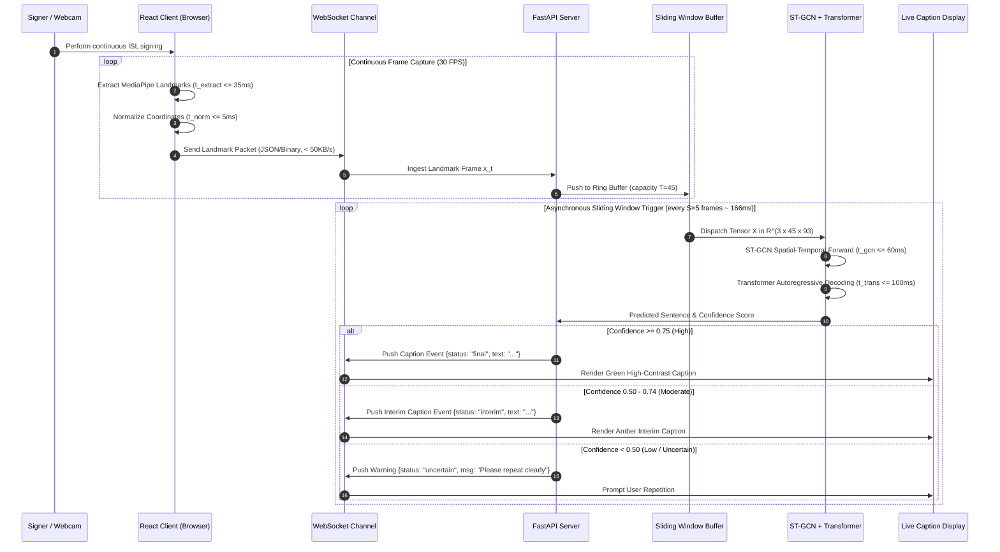

# 03. Real-Time Inference Pipeline & Latency Budgets: SignTalk AI

**Document ID:** STAI-ARCH-003  
**Project Name:** SignTalk AI  
**Document Status:** Approved Engineering Blueprint (Phase 1 — Part 2)  

---

## 1. Real-Time Inference Architecture

The real-time inference engine is designed to operate under strict conversational timing constraints ($\tau_{e2e} \le 500\text{ ms}$). To achieve high responsiveness without dropping frames, the system decouples high-frequency visual ingestion ($\ge 25\text{ FPS}$) from sequence model execution ($3-5\text{ inferences/sec}$) via an asynchronous sliding-window ring buffer.

---

## 2. End-to-End Latency Budget Allocation

Every processing stage is assigned an engineering budget. Cumulative execution must strictly stay within the nominal target bound of $500\text{ ms}$:

| Pipeline Stage | Subsystem | Min Acceptable | Nominal Design Target | Stretch Goal | Measurement Protocol |
| :--- | :--- | :---: | :---: | :---: | :--- |
| **Stage 1: Frame Capture & Transfer** | Browser Web API / OpenCV | $35\text{ ms}$ | **$20\text{ ms}$** | $10\text{ ms}$ | Delta between webcam hardware timestamp and memory array ingestion. |
| **Stage 2: MediaPipe Landmark Tracking** | MediaPipe Holistic | $60\text{ ms}$ | **$35\text{ ms}$** | $20\text{ ms}$ | Wall-clock execution time of `holistic.process()` on CPU/GPU. |
| **Stage 3: Normalization & Ring Buffering**| NumPy / PyTorch Tensor | $15\text{ ms}$ | **$5\text{ ms}$** | $2\text{ ms}$ | Centering, scaling, and rolling tensor insertion duration. |
| **Stage 4: WebSocket Network Transport** | Local / LAN WebSocket | $25\text{ ms}$ | **$10\text{ ms}$** | $5\text{ ms}$ | Network round-trip time (RTT) for landmark packet transmission. |
| **Stage 5: ST-GCN Graph Forward Pass** | PyTorch / ONNX Runtime | $120\text{ ms}$ | **$60\text{ ms}$** | $30\text{ ms}$ | Forward execution of 6 ST-GCN blocks on tensor $(3, 45, 93)$. |
| **Stage 6: Transformer Text Decoding** | Autoregressive Decoder | $160\text{ ms}$ | **$100\text{ ms}$** | $50\text{ ms}$ | Greedy / narrow-beam ($k=3$) sequence token generation duration. |
| **Stage 7: UI Caption Painting** | React DOM / CSS Canvas | $40\text{ ms}$ | **$20\text{ ms}$** | $10\text{ ms}$ | Browser paint lifecycle measured via `performance.now()`. |
| **TOTAL END-TO-END LATENCY ($\tau_{e2e}$)** | **Full Pipeline** | **$< 455\text{ ms}$** | **$\mathbf{\le 250 - 300\text{ ms}}$** | **$< 150\text{ ms}$** | **Physical sign execution $\rightarrow$ readable text on screen.** |

---

## 3. Asynchronous Buffering & Concurrency Strategy

To prevent inference operations from causing frame drops or freezing the visual UI:
1. **Producer-Consumer Architecture:** 
   - The **Producer** (WebSocket frame reader) ingests landmark arrays at $25-30\text{ FPS}$ and appends them to a bounded `collections.deque(maxlen=45)` in memory.
   - The **Consumer** (ML inference task) wakes every $S=5$ frames ($\approx 166\text{ ms}$ interval), snapshots the current buffer tensor, and passes it to the PyTorch inference thread pool.
2. **Non-Blocking Thread Pool:** Heavy neural network matrix operations run inside an asynchronous executor (`asyncio.get_event_loop().run_in_executor()`), ensuring that the FastAPI event loop remains responsive to incoming network traffic.
3. **Temporal Smoothing & Repetition Gating:**
   - Predicted sentences pass through a Levenshtein similarity filter: If a newly decoded sentence is identical to the active caption within a $1.5\text{-second}$ window, duplicate broadcast is suppressed to prevent visual flicker.
