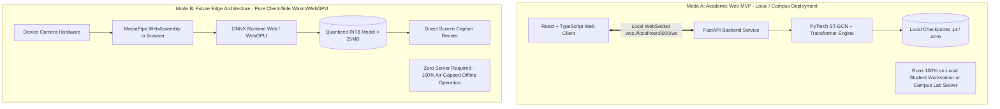
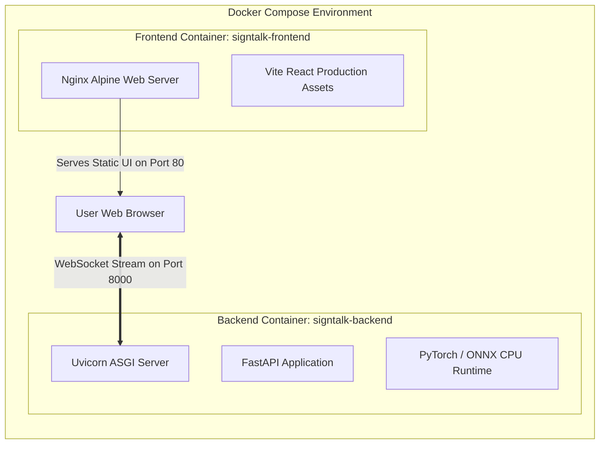

# 05. Deployment Architecture & Runtime Topologies: SignTalk AI

**Document ID:** STAI-ARCH-005  
**Project Name:** SignTalk AI  
**Document Status:** Approved Engineering Blueprint (Phase 1 — Part 2)  

---

## 1. Deployment Topology Overview

SignTalk AI defines two distinct deployment topologies:
1. **Mode A — Academic Local / Web MVP (Current Implementation Target):** A modular client-server architecture where the React frontend runs in a browser and communicates over local WebSockets with a Python FastAPI inference backend.
2. **Mode B — Future Decentralized Edge (Planned / Future Scope):** A fully self-contained edge application where the ST-GCN and Transformer models are compiled to ONNX / WebGPU, running 100% inside client hardware or mobile devices without any backend server dependency.

---

## 2. Comparative Analysis: Mode A vs. Mode B

| Engineering Vector | Mode A: Academic Local / Web MVP (Target) | Mode B: Future Decentralized Edge (Future Scope) |
| :--- | :--- | :--- |
| **Architectural Form** | Decoupled Client + Local FastAPI Modular Monolith | Single Unified Client-Side Static PWA / Native Binary |
| **Inference Runtime** | Python 3.11 + PyTorch 2.x (CUDA or multi-thread CPU) | ONNX Runtime Web / WebGPU / WebAssembly (Wasm) |
| **Hardware Requirement**| Host laptop/desktop with $\ge 8\text{ GB}$ RAM | Modern browser supporting WebGPU / WebGL2 |
| **End-to-End Latency** | **$250 - 450\text{ ms}$** (Includes local WebSocket IPC) | **$< 200\text{ ms}$** (Direct in-memory tensor access) |
| **Data Privacy** | **High:** Coordinates stream over `localhost` or private LAN | **Absolute:** Coordinates never leave client RAM |
| **Internet Dependency** | **Zero:** Fully operational in offline air-gapped environments | **Zero:** Operates without any network hardware |
| **Implementation Complexity** | **Moderate:** Standard Python scientific stack + React | **High:** Requires model quantization, WebGPU kernel tuning |
| **Current Operational Status**| **`PLANNED` (Target for Phase 2 / 3)** | **`FUTURE SCOPE` (Deferred to Post-Academic Roadmap)** |

---

## 3. Containerization Strategy (Docker & Docker Compose)

To ensure consistent execution across Windows, Linux, and macOS development environments, Mode A is packaged using a multi-container Docker Compose template:

### Container Configuration Principles:
1. **Frontend Container:** Lightweight Nginx Alpine image serving compiled static React/TypeScript assets, exposing standard HTTP port 80.
2. **Backend Container:** Python 3.11 slim image containing FastAPI, MediaPipe, PyTorch CPU/CUDA, and pinned scientific dependencies, exposing port 8000.
3. **Volume Mounts:** Read-only bind mount for model weights (`./models:/app/models:ro`) to avoid baking multi-megabyte model checkpoints directly into Docker image layers.
