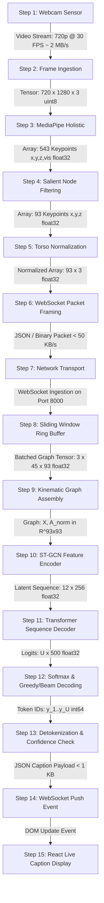

# 06. Detailed Data Flow & Protocol Payloads: SignTalk AI

**Document ID:** STAI-ARCH-006  
**Project Name:** SignTalk AI  
**Document Status:** Approved Engineering Blueprint (Phase 1 — Part 2)  

---

## 1. End-to-End Data Flow Diagram



---

## 2. Transformation Registry & Dimensional Ledger

| Step ID | Processing Node | Input Type & Shape | Operation Executed | Output Type & Shape | Bandwidth / Size | Frequency |
| :---: | :--- | :--- | :--- | :--- | :--- | :--- |
| **01** | Optical Camera Sensor | Photons | Sensor Bayer readout | Raw RGB byte stream | $\approx 2.5\text{ MB/s}$ | $30\text{ FPS}$ |
| **02** | OpenCV / Browser API | Raw RGB stream | BGR/RGB unpack & buffer | `ndarray` $(720, 1280, 3)$ `uint8` | $\approx 2.76\text{ MB/frame}$ | $30\text{ FPS}$ |
| **03** | MediaPipe Holistic | $(720, 1280, 3)$ | Deep landmark regression | $543 \times 4$ $(x, y, z, \text{vis})$ `float32` | $\approx 8.7\text{ KB/frame}$ | $25-30\text{ FPS}$ |
| **04** | Node Filter | $543 \times 4$ | Index extraction $(42 + 11 + 40)$ | $93 \times 3$ $(x, y, z)$ `float32` | $\approx 1.1\text{ KB/frame}$ | $25-30\text{ FPS}$ |
| **05** | Coordinate Normalizer | $93 \times 3$ | Torso centering & scale division | $93 \times 3$ `float32` in range $[-2, 2]$ | $\approx 1.1\text{ KB/frame}$ | $25-30\text{ FPS}$ |
| **06** | WebSocket Transport | $93 \times 3$ Array | JSON serialization | WebSocket text frame | $\approx 35 - 45\text{ KB/s}$ | $25-30\text{ FPS}$ |
| **07** | Sliding Window Buffer | Stream of $(93, 3)$ | Ring buffer accumulation ($T=45$) | Bounded queue (maxlen=45) | $\approx 50\text{ KB}$ resident | Continuous |
| **08** | Tensor Constructor | Buffer frames | Stacking & channel transpose | `torch.Tensor` $(3, 45, 93)$ `float32` | $\approx 50.2\text{ KB}$ | Every $S=5$ frames ($\approx 6\text{ Hz}$) |
| **09** | Kinematic Adjacency | Precomputed $\mathbf{A}$ | Normalization $\mathbf{D}^{-\frac{1}{2}}\mathbf{A}\mathbf{D}^{-\frac{1}{2}}$ | Sparse/Dense Matrix $(93, 93)$ | $\approx 34.6\text{ KB}$ | Static (Loaded once) |
| **10** | ST-GCN Encoder | $(3, 45, 93)$ + $\mathbf{A}$ | 6 spatial-temporal graph blocks | Latent tensor $\mathbf{H} \in (12, 256)$ | $\approx 12.3\text{ KB}$ | $\approx 6\text{ Hz}$ |
| **11** | Transformer Decoder | $\mathbf{H} \in (12, 256)$ | Autoregressive cross-attention | Logits matrix $(U, 500)$ `float32` | $\approx 16\text{ KB}$ | $\approx 6\text{ Hz}$ |
| **12** | Tokenizer / NLP | Logits $(U, 500)$ | $\operatorname{argmax}$ / beam search + text map | Formatted string + float score | $< 250\text{ bytes}$ | $\approx 6\text{ Hz}$ |
| **13** | UI Render Event | String + score | React DOM state update | Screen pixels painted | N/A | $\approx 6\text{ Hz}$ |

---

## 3. Real-Time Protocol Specification (WebSocket Frames)

### 3.1 Client-to-Server Ingestion Frame (`landmark_frame`)
```json
{
  "type": "landmark_frame",
  "session_id": "sess_8f3a9b1c",
  "frame_id": 1420,
  "timestamp_ms": 1729004523120,
  "landmarks": [
    [-0.142, 0.485, -0.021],
    [-0.155, 0.512, -0.019]
  ],
  "hand_detected": {
    "left": true,
    "right": true
  }
}
```

### 3.2 Server-to-Client Broadcast Frame (`translation_caption`)
```json
{
  "type": "translation_caption",
  "session_id": "sess_8f3a9b1c",
  "frame_id": 1420,
  "timestamp_ms": 1729004523310,
  "status": "final",
  "text": "I have had a severe fever since yesterday.",
  "confidence": 0.884,
  "latency_metrics": {
    "gcn_ms": 48.2,
    "transformer_ms": 78.5,
    "total_backend_ms": 132.1
  }
}
```

### 3.3 Server-to-Client Warning Frame (`translation_warning`)
```json
{
  "type": "translation_warning",
  "session_id": "sess_8f3a9b1c",
  "timestamp_ms": 1729004524100,
  "warning_code": "LOW_CONFIDENCE",
  "message": "Confidence below threshold. Please repeat sign clearly.",
  "confidence": 0.382
}
```
