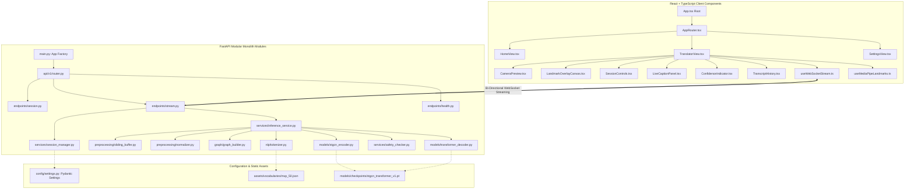

# 07. Component Architecture & System Interfaces: SignTalk AI

**Document ID:** STAI-ARCH-007  
**Project Name:** SignTalk AI  
**Document Status:** Approved Engineering Blueprint (Phase 1 — Part 2)  

---

## 1. Modular Component Hierarchy

SignTalk AI follows a strict **modular monolith architecture** on the backend coupled with a **component-driven UI hierarchy** on the frontend. This ensures high cohesion within functional modules while maintaining loose coupling across system layers.

---

## 2. Frontend Component Specification (React + TypeScript)

| Component Name | File Path | Primary Responsibility | Input Props | State Managed |
| :--- | :--- | :--- | :--- | :--- |
| **`AppRouter`** | `src/routes/AppRouter.tsx` | Declarative client-side routing between Home, Translator, and Settings. | None | Active route location |
| **`TranslatorView`** | `src/views/TranslatorView.tsx` | Master translation screen coordinating webcam, WebSockets, captions, and controls. | None | Session state, active stream, metrics |
| **`CameraPreview`** | `src/components/CameraPreview.tsx` | HTML5 `<video>` element rendering zero-latency webcam preview. | `stream: MediaStream`, `isActive: boolean` | Video resolution, device selection |
| **`LandmarkOverlayCanvas`**| `src/components/LandmarkCanvas.tsx` | HTML5 `<canvas>` element rendering skeletal bones and joints over video. | `landmarks: LandmarkSet`, `visible: boolean` | Canvas dimensions, animation frame |
| **`SessionControls`** | `src/components/SessionControls.tsx` | Start, pause, resume, and stop translation buttons + keyboard triggers. | `sessionStatus: Status`, `onStart: fn`, `onStop: fn` | Button interaction state |
| **`LiveCaptionPanel`** | `src/components/CaptionPanel.tsx` | Large high-contrast live text box rendering translated sentences. | `text: string`, `status: 'final' \| 'interim'`, `confidence: number` | Text history buffer, zoom level |
| **`ConfidenceIndicator`** | `src/components/ConfidenceBar.tsx` | Visual meter displaying model certainty (Green $\ge 0.75$, Amber, Red). | `score: number` | Tooltip visibility |
| **`useWebSocketStream`** | `src/hooks/useWebSocketStream.ts` | Custom hook managing reconnection, ping/pong heartbeats, and serialization. | `url: string`, `onMessage: fn` | Socket connection status, error logs |

---

## 3. Backend Module Specification (FastAPI Monolith)

| Module Name | File Path | Primary Responsibility | Key Classes / Functions |
| :--- | :--- | :--- | :--- |
| **`SessionManager`** | `app/services/session_manager.py` | Tracks active WebSocket sessions, buffer state, and client configurations. | `class SessionManager`, `create_session()`, `destroy_session()` |
| **`SlidingBuffer`** | `app/preprocessing/sliding_buffer.py` | Thread-safe circular deque maintaining rolling landmark frames for sliding windows. | `class SlidingWindowBuffer`, `append_frame()`, `get_window_tensor()` |
| **`Normalizer`** | `app/preprocessing/normalizer.py` | Center landmarks on mid-shoulder anchor and scales by shoulder distance. | `class LandmarkNormalizer`, `normalize_frame()`, `batch_normalize()` |
| **`GraphBuilder`** | `app/graph/graph_builder.py` | Assembles $(C, T, N)$ tensor and normalizes the kinematic adjacency matrix $\mathbf{A}$. | `class KinematicGraphBuilder`, `build_adjacency_matrix()` |
| **`STGCNEncoder`** | `app/models/stgcn_encoder.py` | PyTorch implementation of the 6-block spatial-temporal graph convolutional network. | `class STGCNBackbone(nn.Module)`, `forward()` |
| **`TransformerDecoder`** | `app/models/transformer_decoder.py` | PyTorch 3-layer autoregressive Transformer decoder generating text token logits. | `class SignTransformerDecoder(nn.Module)`, `decode()` |
| **`SafetyChecker`** | `app/services/safety_checker.py` | Evaluates prediction confidence, applies thresholds ($\theta = 0.50$), flags errors. | `class SafetyChecker`, `validate_prediction()` |
| **`VocabTokenizer`** | `app/nlp/tokenizer.py` | Detokenizes discrete model token IDs into formatted natural-language English sentences. | `class ISLTokenizer`, `ids_to_text()` |
