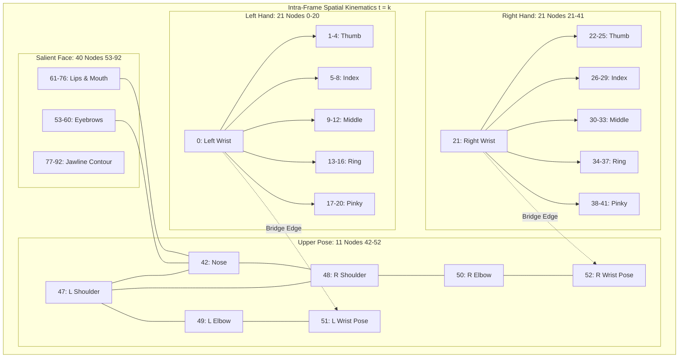

# 08. Kinematic Graph Topology & Mathematical Specification: SignTalk AI

**Document ID:** STAI-ARCH-008  
**Project Name:** SignTalk AI  
**Document Status:** Approved Engineering Blueprint (Phase 1 — Part 2)  

---

## 1. Formal Mathematical Graph Definition

A continuous signing sequence over temporal window $T$ is modeled as a connected spatial-temporal graph $\mathcal{G} = (\mathcal{V}, \mathcal{E})$, where:
- $\mathcal{V} = \{ v_{t, i} \mid t \in \{1, \dots, T\}, i \in \{1, \dots, N\} \}$ represents the set of all anatomical landmark nodes across all temporal frames.
- The edge set $\mathcal{E} = \mathcal{E}_{spatial} \cup \mathcal{E}_{temporal}$ consists of:
  - **Intra-Frame Spatial Edges ($\mathcal{E}_{spatial}$):** Connect anatomical joints within the same temporal frame $t$, representing biological bone connectivity and kinematic chains:
    $$\mathcal{E}_{spatial} = \{ (v_{t, i}, v_{t, j}) \mid (i, j) \in \mathcal{E}_{skeleton}, t \in \{1, \dots, T\} \}$$
  - **Inter-Frame Temporal Edges ($\mathcal{E}_{temporal}$):** Connect identical anatomical joints across consecutive temporal frames, capturing continuous trajectory dynamics:
    $$\mathcal{E}_{temporal} = \{ (v_{t, i}, v_{t+1, i}) \mid t \in \{1, \dots, T-1\}, i \in \{1, \dots, N\} \}$$

---

## 2. Anatomical Node Mapping & Index Registry

SignTalk AI supports two operational node topologies:
- **Topology A (Core Pose + Hands):** $N = 53$ nodes (21 left hand + 21 right hand + 11 upper pose).
- **Topology B (Full Multimodal):** $N = 93$ nodes ($N = 53$ + 40 salient facial markers).

### Detailed Node Index Table ($N = 93$ Multimodal Graph)

| Node Range | Anatomical Subsystem | Keypoint Count | Detailed Landmark Indices & Anatomical Descriptions |
| :---: | :--- | :---: | :--- |
| **0 – 20** | **Left Hand Articulators** | 21 | `0`: Wrist `1-4`: Thumb (CMC, MCP, IP, Tip) `5-8`: Index (MCP, PIP, DIP, Tip) `9-12`: Middle (MCP, PIP, DIP, Tip) `13-16`: Ring (MCP, PIP, DIP, Tip) `17-20`: Pinky (MCP, PIP, DIP, Tip) |
| **21 – 41** | **Right Hand Articulators** | 21 | `21`: Wrist `22-25`: Thumb (CMC, MCP, IP, Tip) `26-29`: Index (MCP, PIP, DIP, Tip) `30-33`: Middle (MCP, PIP, DIP, Tip) `34-37`: Ring (MCP, PIP, DIP, Tip) `38-41`: Pinky (MCP, PIP, DIP, Tip) |
| **42 – 52** | **Upper-Body Pose Anchors** | 11 | `42`: Nose `43`: Left Eye `44`: Right Eye `45`: Left Ear `46`: Right Ear `47`: Left Shoulder `48`: Right Shoulder `49`: Left Elbow `50`: Right Elbow `51`: Left Wrist (Pose) `52`: Right Wrist (Pose) |
| **53 – 92** | **Salient Facial Non-Manuals** | 40 | `53-60`: Left & Right Eyebrows (8 points for question/negation tracking) `61-76`: Lips & Mouth Perimeter (16 points for mouthing cues) `77-92`: Lower Jawline Contour (16 points for head tilt & spatial reference) |

---

## 3. Spatial Adjacency Matrix & Spatial Configuration Partitioning

The binary spatial adjacency matrix $\mathbf{A} \in \{0, 1\}^{N \times N}$ is populated based on anatomical connectivity:
$$\mathbf{A}_{i, j} = \begin{cases} 1 & \text{if } (i, j) \in \mathcal{E}_{spatial} \text{ or } i = j \\ 0 & \text{otherwise} \end{cases}$$

### Spatial Configuration Partitioning (Yan et al., AAAI 2018)
In standard graph convolution, all neighboring nodes are treated identically. In human signing, however, hand movements have directional hierarchy relative to the body center. To capture this, the spatial neighbor set $\mathcal{B}(v_i) = \{ v_j \mid d(v_i, v_j) \le 1 \}$ is partitioned into three subsets:

$$\mathcal{B}(v_i) = \mathcal{B}_{root}(v_i) \cup \mathcal{B}_{centripetal}(v_i) \cup \mathcal{B}_{centrifugal}(v_i)$$

1. **Root Node ($\mathcal{B}_{root}$):** The joint itself ($i = j$).
2. **Centripetal Neighbors ($\mathcal{B}_{centripetal}$):** Neighboring joints closer to the body torso anchor than $v_i$.
3. **Centrifugal Neighbors ($\mathcal{B}_{centrifugal}$):** Neighboring joints further from the body torso anchor than $v_i$ (e.g., finger tips relative to knuckles).

The partitioned graph convolution is mathematically computed as:
$$\mathbf{H}^{(l+1)} = \sum_{k \in \{root, centripetal, centrifugal\}} \mathbf{D}_k^{-\frac{1}{2}} \mathbf{A}_k \mathbf{D}_k^{-\frac{1}{2}} \mathbf{H}^{(l)} \mathbf{W}_k$$
where $\mathbf{W}_k$ represents independent transformation weights for each kinematic direction.
