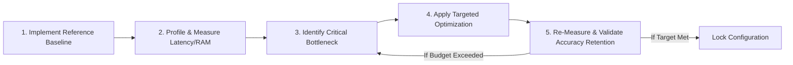

# 09. Performance Engineering & Optimization Strategy: SignTalk AI

**Document ID:** STAI-ARCH-009  
**Project Name:** SignTalk AI  
**Document Status:** Approved Engineering Blueprint (Phase 1 — Part 2)  

---

## 1. Disciplined Optimization Methodology

In accordance with software engineering best practices, SignTalk AI prohibits premature optimization. Performance tuning follows a disciplined 5-stage empirical lifecycle:

---

## 2. Resource Envelopes & Profiling Targets

| Resource Dimension | Minimum Acceptable Threshold | Nominal Operational Target | Extreme Stress Ceiling | Measurement Instrument |
| :--- | :--- | :--- | :--- | :--- |
| **End-to-End Latency** | $< 800\text{ ms}$ | **$< 500\text{ ms}$** | $1000\text{ ms}$ | High-resolution wall-clock timer |
| **Sustained Frame Rate** | $\ge 15\text{ FPS}$ | **$\ge 25\text{ FPS}$** | $10\text{ FPS}$ | Moving average FPS counter |
| **Process RAM (Host)** | $< 3.5\text{ GB}$ | **$< 2.0\text{ GB}$** | $4.0\text{ GB}$ | Python `psutil.Process().memory_info().rss` |
| **GPU VRAM (If Active)** | $< 4.0\text{ GB}$ | **$< 2.0\text{ GB}$** | $6.0\text{ GB}$ | `torch.cuda.memory_allocated()` |
| **CPU Utilization (4 Cores)**| $\le 85\%$ | **$\le 60\%$** | $95\%$ | Operating system thread profiler |

---

## 3. Targeted Optimization Techniques

### 3.1 Temporal Stride Tuning ($S$)
- **Problem:** Running ST-GCN + Transformer decoding on every single camera frame ($30\text{ times/sec}$) overloads consumer CPUs and is linguistically redundant because human signs span multiple frames.
- **Solution:** Decouple window ingestion from inference triggering. Maintain a sliding window buffer of $T=45$ frames, but execute inference only once every $S=5$ frames ($\approx 166\text{ ms}$ interval, $\approx 6\text{ inferences/sec}$). This reduces computational load by $83\%$ while preserving continuous tracking.

### 3.2 Model Quantization & ONNX Runtime Compilation
- **Problem:** PyTorch FP32 models introduce memory bandwidth bottlenecks during continuous inference on consumer laptops.
- **Solution:** Convert trained PyTorch ST-GCN and Transformer checkpoints into Open Neural Network Exchange (ONNX) format with dynamic INT8/FP16 quantization:
  $$\mathbf{W}_{INT8} = \operatorname{clamp}\left( \operatorname{round}\left( \frac{\mathbf{W}_{FP32}}{\text{scale}} \right) + \text{zero\_point}, -128, 127 \right)$$
  - Expected speedup: $2.0\times - 3.5\times$ latency reduction on Intel/AMD CPUs via AVX-512 / VNNI vector instructions.
  - Model footprint reduction: ST-GCN model weight size shrinks from $\approx 15\text{ MB}$ (FP32) to $< 4\text{ MB}$ (INT8).

### 3.3 Zero-Copy Tensor Buffering
- **Problem:** Frequent allocations of NumPy arrays and PyTorch tensors inside the real-time loop trigger garbage collection pauses, causing latency spikes.
- **Solution:** Pre-allocate a contiguous static memory buffer $\mathbf{B} \in \mathbb{R}^{3 \times 45 \times 93}$ during application initialization. Update buffer frames in-place using pointer indexing and circular slicing without dynamic reallocation.
