# 10. Model Interfaces & Subsystem Contracts: SignTalk AI

**Document ID:** STAI-ARCH-010  
**Project Name:** SignTalk AI  
**Document Status:** Approved Engineering Blueprint (Phase 1 — Part 2)  

---

## 1. Interface Boundary Overview

To ensure modularity and facilitate independent unit testing, strict input/output contracts are established between all pipeline components:

```mermaid
graph LR
    I1[1. Landmark Extractor] -->|RawKeypointDict| I2[2. Preprocessor & Normalizer]
    I2 -->|NormalizedFrameArray| I3[3. Graph Builder]
    I3 -->|SpatialTemporalGraph| I4[4. ST-GCN Encoder]
    I4 -->|LatentSequenceTensor| I5[5. Transformer Decoder]
    I5 -->|TokenLogitsTensor| I6[6. NLP Tokenizer & Safety]
    I6 -->|CaptionPayloadDict| I7[7. WebSocket Broadcaster]
```



---

## 2. Detailed Interface Contracts

### Contract 1: Landmark Extractor $\longrightarrow$ Preprocessor
* **Interface Function:** `preprocess_landmarks(raw_landmarks: RawLandmarkPacket) -> NormalizedLandmarkArray`
* **Input Data Type:** Dictionary containing raw MediaPipe landmark protobufs or nested float arrays:
  - `hands`: `Dict[str, Optional[List[Tuple[float, float, float]]]]` (Left and Right, each 21 points $(x, y, z)$).
  - `pose`: `List[Tuple[float, float, float]]` (33 points).
  - `face`: `Optional[List[Tuple[float, float, float]]]` (468 points).
* **Output Data Type:** `numpy.ndarray` of shape `(93, 3)` with `dtype=np.float32`.
* **Error Behavior:** If hands are completely undetected in the frame, the hand landmark indices are filled with zeros, and a boolean flag `hand_present=False` is passed to the temporal buffer manager.

---

### Contract 2: Preprocessor $\longrightarrow$ Graph Builder
* **Interface Function:** `build_spatial_temporal_graph(window_buffer: Deque[np.ndarray]) -> Tuple[torch.Tensor, torch.Tensor]`
* **Input Data Type:** Circular buffer of $T=45$ normalized landmark frames: `Sequence[np.ndarray(shape=(93, 3), dtype=np.float32)]`.
* **Output Data Type:** Tuple of PyTorch Tensors:
  - Graph Coordinate Tensor $\mathbf{X}$: `torch.Tensor` of shape `(1, 3, 45, 93)` (`dtype=torch.float32`).
  - Normalized Adjacency Tensor $\mathbf{A}_{norm}$: `torch.Tensor` of shape `(3, 93, 93)` (`dtype=torch.float32`).
* **Error Behavior:** Raises `BufferUnderflowError` if buffer contains fewer than minimum required initialization frames ($T_{min} = 15$).

---

### Contract 3: Graph Builder $\longrightarrow$ ST-GCN Encoder
* **Interface Function:** `stgcn_encoder.forward(x: torch.Tensor, a_norm: torch.Tensor) -> torch.Tensor`
* **Input Data Type:**
  - $\mathbf{X} \in \mathbb{R}^{B \times C_{in} \times T \times N}$ (`dtype=torch.float32`, default $(1, 3, 45, 93)$).
  - $\mathbf{A}_{norm} \in \mathbb{R}^{K \times N \times N}$ (`dtype=torch.float32`, $K=3$ spatial partitions).
* **Output Data Type:** Latent kinematic sequence tensor $\mathbf{H} \in \mathbb{R}^{B \times T' \times d_{model}}$ (`dtype=torch.float32`, default $(1, 12, 256)$).
* **Error Behavior:** Validates input tensor dimensions via assertions; raises `InvalidTensorShapeError` on dimension mismatch.

---

### Contract 4: ST-GCN Encoder $\longrightarrow$ Transformer Decoder
* **Interface Function:** `transformer_decoder.decode(memory: torch.Tensor, max_len: int = 20) -> Tuple[torch.Tensor, torch.Tensor]`
* **Input Data Type:**
  - `memory`: Encoder latent representations $\mathbf{H} \in \mathbb{R}^{B \times T' \times d_{model}}$.
  - `max_len`: Maximum token decoding horizon (`int`, default 20).
* **Output Data Type:** Tuple:
  - `predicted_token_ids`: `torch.Tensor` of shape `(B, U)` (`dtype=torch.int64`).
  - `token_probabilities`: `torch.Tensor` of shape `(B, U)` (`dtype=torch.float32`).
* **Error Behavior:** Handles sequence termination cleanly upon emitting the `<EOS>` (End-of-Sequence) token ID.

---

### Contract 5: Transformer Decoder $\longrightarrow$ NLP & Safety Checker
* **Interface Function:** `format_and_validate_caption(token_ids: List[int], token_probs: List[float]) -> CaptionResult`
* **Input Data Type:**
  - `token_ids`: `List[int]` representing generated vocabulary indices.
  - `token_probs`: `List[float]` representing softmax likelihoods per generated token.
* **Output Data Type:** Dataclass `CaptionResult`:
  ```python
  @dataclass
  class CaptionResult:
      text: str                      # Formatted natural-language sentence
      confidence: float              # Geometric mean token confidence in [0.0, 1.0]
      is_valid: bool                 # True if confidence >= threshold (0.50)
      warning_msg: Optional[str]     # Diagnostic prompt if is_valid is False
  ```
* **Error Behavior:** If `confidence < 0.50`, sets `is_valid=False`, suppresses raw text from client display, and populates `warning_msg = "Low confidence. Please repeat sign clearly."`.
