# 02. Project Vision and Objectives: SignTalk AI

**Document ID:** STAI-DOC-P1P1-002  
**Project Name:** SignTalk AI  
**Academic Context:** B.Tech Computer Science & Engineering (AI/ML) Final Year Project | GLA University  
**Document Status:** Approved Research Specification (Phase 1 — Part 1)  

---

## 1. Project Vision

### 1.1 Vision Statement
> **To establish an inclusive, privacy-preserving, and accessible digital ecosystem where Deaf and hard-of-hearing individuals can communicate effortlessly and independently with the hearing world in real time, eliminating visual-linguistic communication barriers across healthcare, education, civic services, and daily life through ethical, edge-capable artificial intelligence.**

### 1.2 Mission Statement
> **To design, build, and experimentally validate an open, low-latency, and technically rigorous sign-to-text translation platform that transforms continuous Indian Sign Language (ISL) signing into fluent natural-language captions using lightweight computer vision landmark extraction, spatial-temporal graph neural networks, and Transformer sequence modeling on accessible computing hardware.**

---

## 2. Communications & Presentation Profiles

### 2.1 The One-Line Project Pitch
> *"SignTalk AI is an AI-powered assistive communication platform that translates continuous Indian Sign Language into fluent text captions in real time using spatial-temporal graph convolution and Transformer sequence modeling."*

### 2.2 The 30-Second Elevator Explanation
*(Optimized for: College Project Synopsis, Viva Introduction, Quick Panel Review)*
> "SignTalk AI is a real-time assistive translation system developed for Indian Sign Language (ISL). While most existing solutions focus only on static isolated alphabet gestures, SignTalk AI tackles the real-world challenge of continuous, fluid signing. Our system uses a standard webcam to extract skeletal coordinates of the hands, body pose, and facial markers via MediaPipe without transmitting raw video. These landmarks are modeled as a spatial-temporal graph using an ST-GCN network to capture joint relationships and movement dynamics over time, and translated into coherent natural-language sentences using a Transformer. Designed to run with sub-500 ms latency targets, SignTalk AI preserves user privacy while enabling seamless communication in healthcare, civic desks, and daily interactions."

### 2.3 The 1-Minute Comprehensive Technical Explanation
*(Optimized for: Technical Viva Examination, Conference Poster Defense, Research Colloquium)*
> "Indian Sign Language (ISL) is a visually articulated, grammatically autonomous natural language used by millions of Deaf citizens in India. Traditional sign language recognition suffers from two critical bottlenecks: treating signing as isolated static gesture classification, and relying on heavy, privacy-invasive 3D-CNNs that require high-bandwidth video streaming to cloud servers. 
> 
> SignTalk AI introduces a lightweight, privacy-preserving, two-stage architectural pipeline designed for continuous ISL translation. First, the vision frontend leverages MediaPipe Holistic to extract 3D skeletal landmarks from the hands, upper-body pose, and salient facial markers in real time. Second, instead of flattening these coordinates into unstructured vectors, we model the human kinematic structure as a dynamic spatial-temporal graph. A Spatial-Temporal Graph Convolutional Network (ST-GCN) simultaneously learns intra-frame spatial joint hierarchies and inter-frame motion trajectories. These spatial-temporal feature representations are subsequently decoded by a Transformer sequence-to-sequence network that maps continuous sign sequences into grammatically structured natural-language text.
> 
> By keeping processing at the edge or within a lightweight local service, SignTalk AI eliminates the need for raw-video cloud storage, enforces data privacy in sensitive clinical and banking environments, and targets an end-to-end latency of under 500 milliseconds on accessible consumer hardware."

---

## 3. High-Level Project Objectives

The project execution is organized into five verifiable pillars across its academic lifecycle:

```mermaid
graph TD
    A[SignTalk AI Strategic Pillars] --> B[1. Linguistic & Data Rigor]
    A --> C[2. ML & Architectural Rigor]
    A --> D[3. System Engineering & Latency]
    A --> E[4. Accessibility & User Experience]
    A --> F[5. Academic & Ethical Integrity]

    B --> B1[Define realistic ISL vocabulary]
    B --> B2[Rigorous dataset curation & validation]

    C --> C1[Spatial-temporal graph modeling via ST-GCN]
    C --> C2[Sequence translation via Transformer]
    C --> C3[Ablation & baseline benchmarking]

    D --> D1[Sub-500ms end-to-end latency target]
    D --> D2[Client-side landmark extraction]
    D --> D3[Modular FastAPI + React architecture]

    E --> E1[High-contrast readable live captions]
    E --> E2[Explicit confidence and uncertainty states]

    F --> F1[Truthfulness in status reporting]
    F --> F2[Privacy-by-design & zero raw-video storage]
```

### Pillar 1: Linguistic and Data Rigor
- Select a linguistically grounded, well-defined vocabulary subset of Indian Sign Language focused on high-priority domains (emergency, healthcare, administrative assistance, daily interaction).
- Establish reproducible data pipelines leveraging verified public ISL datasets (e.g., INCLUDE, ISLTranslate, iSign, ISL-CSLTR) and structured supplementary collection protocols.

### Pillar 2: Machine Learning & Architectural Rigor
- Maintain clear baseline progression: Evaluate a linear/LSTM baseline before benchmarking the proposed ST-GCN and Transformer hybrid models.
- Conduct thorough ablation studies to quantify the specific empirical contribution of hand landmarks, body pose, facial non-manual cues, and graph convolutions.
- Implement principled evaluation metrics including Word Error Rate (WER), BLEU score, ROUGE, and classification F1-scores on held-out, signer-independent test splits.

### Pillar 3: System Engineering & Latency Targets
- Maintain a strict performance budget with a target end-to-end latency below 500 ms and a frame processing rate $\ge 20$ FPS.
- Separate landmark extraction from cloud inference to ensure bandwidth efficiency and facilitate future edge/offline deployment using ONNX runtime quantization.

### Pillar 4: Accessibility & User-Centered UX
- Provide an intuitive, low-friction web interface featuring large high-contrast live captions, visible model confidence indicators, and unambiguous error states.
- Accommodate diverse lighting conditions, varying distances, and signing speeds with explicit user-feedback prompts.

### Pillar 5: Academic & Ethical Integrity
- Strictly separate `IMPLEMENTED`, `PLANNED`, `PROPOSED`, and `FUTURE SCOPE` capabilities.
- Guarantee privacy-by-design by eliminating mandatory raw-video retention or transmission.
