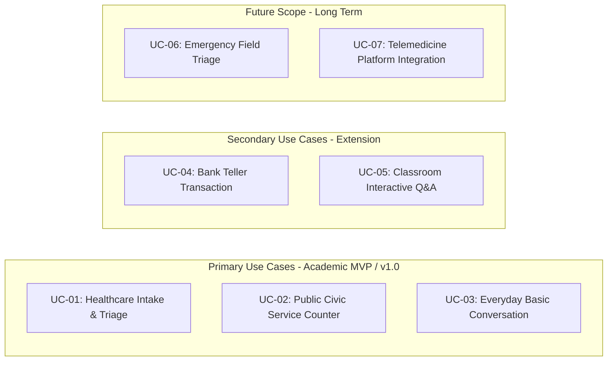

# 03. Target Users and Use Cases: SignTalk AI

**Document ID:** STAI-DOC-P1P1-003  
**Project Name:** SignTalk AI  
**Document Status:** Approved Research Specification (Phase 1 — Part 1)  

---

## 1. User Personas

To ensure that the engineering requirements reflect authentic operational constraints rather than abstract assumptions, six distinct user personas have been analyzed across social, professional, and emergency contexts.

---

### Persona 1: Deaf / Hard-of-Hearing Native ISL Signer
* **Profile:** Rajesh Kumar, 24 years old, primary communication via Indian Sign Language. Moderate literacy in written English and Hindi, but experiences severe cognitive strain and frustration when forced to communicate solely through typing or writing.
* **User Goal:** Express medical symptoms, complete banking procedures, or interact with public service personnel independently without relying on an accompanying family member or an expensive human interpreter.
* **Problem Faced:** Inability to communicate rapidly in spoken language; encountering non-signers who lack patience for pen-and-paper communication; feeling stripped of personal autonomy and privacy in confidential interactions.
* **How SignTalk AI Could Help:** Allows natural visual signing in front of a standard webcam; generates real-time, readable text captions directly for the conversational partner.
* **Expected Interaction:** Opens web browser on a laptop or desktop terminal at a counter, positions himself in the camera frame, starts the translation session, and executes continuous signs naturally within a supported domain vocabulary.
* **Accessibility Requirements:**
  - Clear visual feedback indicating that the camera is tracking his hands, pose, and face.
  - Visible confidence status so he knows immediately if a sign was recognized or if he should repeat the phrase.
  - High-contrast visual UI that does not rely on auditory feedback.
* **Possible Limitations:** System accuracy depends on signing at moderate speeds within the supported vocabulary; unfamiliar regional dialect variations or atypical hand placements may result in low-confidence flags.

---

### Persona 2: Hearing Person (Non-Signer)
* **Profile:** Anita Sharma, 32 years old, customer service supervisor or retail administrator. Speaks fluent Hindi and English; has zero proficiency in Indian Sign Language.
* **User Goal:** Understand the requests, inquiries, or complaints of Deaf customers efficiently and respectfully without causing delays or misunderstandings.
* **Problem Faced:** Inability to comprehend sign language; awkwardness and confusion when trying to decipher improvised pantomime; excessive time spent reading handwritten notes.
* **How SignTalk AI Could Help:** Converts the customer's signing into clear, continuous natural-language sentences displayed on a counter-facing monitor.
* **Expected Interaction:** Looks at the live caption display as the customer signs; responds verbally or via simple counter displays (with future two-way speech/text-to-sign modules).
* **Accessibility Requirements:**
  - Large, highly legible typography that can be read from across a 1.5-meter service desk.
  - Clear indicators distinguishing between finalized sentences and interim, in-progress sign recognition.
* **Possible Limitations:** May mistakenly assume the AI is a 100% universal human-level interpreter; needs clear onboarding emphasizing that the system currently covers supported domain vocabularies.

---

### Persona 3: Healthcare Worker (Doctor / Triage Nurse)
* **Profile:** Dr. Vikram Sen, 41 years old, Emergency Room Physician in a public district hospital. Constantly operates under extreme time pressure and cognitive load.
* **User Goal:** Rapidly obtain patient medical history, chief complaints, pain location/severity, and known drug allergies from an incoming Deaf patient during triage.
* **Problem Faced:** Inability to perform timely triage when no interpreter is present; critical delays while waiting for family members; severe clinical risk of misinterpreting symptoms through improvised gestures.
* **How SignTalk AI Could Help:** Translates supported medical ISL signs (e.g., "severe chest pain", "fever since two days", "allergy to penicillin", "vomiting") into live captions on the hospital terminal.
* **Expected Interaction:** Activates the hospital intake terminal; guides the patient to stand/sit before the camera; reads the translated clinical symptoms in the live caption box.
* **Accessibility Requirements:**
  - Fast, one-click session activation (zero complex onboarding steps).
  - Explicit low-confidence alarms: If the model is uncertain about a clinical symptom or dosage number, it must conspicuously flag it rather than outputting a false-positive guess.
* **Possible Limitations:** Medical vocabulary in the MVP is restricted to primary triage terms; cannot be used for nuanced psychological evaluations or complex surgical consent without a certified human medical interpreter.

---

### Persona 4: Government / Public-Service Desk Employee
* **Profile:** Sunita Devi, 48 years old, desk officer at a municipal civic services counter (e.g., Aadhaar card updates, voter registration, pension desks).
* **User Goal:** Process civic identity documentation, pension applications, and address changes for Deaf citizens swiftly and accurately.
* **Problem Faced:** High queue volume; strict procedural timelines; extreme difficulty explaining required documentation or understanding applicant grievances without an interpreter.
* **How SignTalk AI Could Help:** Facilitates transactional communication at the counter, translating structured queries regarding forms, application status, certificate requirements, and fee payment.
* **Expected Interaction:** The municipal counter workstation features a shared screen setup; the citizen signs to the camera, and verified captions populate the officer's interaction window.
* **Accessibility Requirements:**
  - Robust performance under standard institutional fluorescent lighting and modest webcams.
  - Session privacy: Absolute guarantee that citizen biometric video is not stored or transmitted to external servers.
* **Possible Limitations:** Legal documents and sworn affidavits exceed the MVP translation scope and continue to require certified institutional interpretation protocols.

---

### Persona 5: Educator / Hearing Student in an Inclusive Classroom
* **Profile:** Prof. Rakesh Nair, 38 years old, university lecturer teaching inclusive STEM classes with both hearing and Deaf students.
* **User Goal:** Enable Deaf students to ask spontaneous questions or deliver short presentations during seminars without requiring full-time interpreter presence for every lecture hour.
* **Problem Faced:** Deaf students remain passive observers during peer discussions and Q&A sessions because typing questions into chat is slow and interrupts interactive class discussions.
* **How SignTalk AI Could Help:** Deaf students sign from their desk or podium; the system displays real-time subtitles on the seminar screen or lecture display.
* **Expected Interaction:** Student activates the webcam on their laptop; continuous signing is translated and projected or passed to the classroom collaboration software.
* **Accessibility Requirements:**
  - High resilience to background clutter (e.g., other students walking behind, variable lecture hall lighting).
  - Low-latency output so questions align temporally with ongoing classroom slides.
* **Possible Limitations:** Technical discipline-specific academic jargon (e.g., specialized calculus or chemistry terminology) is outside the initial MVP vocabulary.

---

### Persona 6: Emergency / First Responder Personnel
* **Profile:** Inspector Amit Patil, 35 years old, ambulance paramedic / police patrol officer. Responds to roadside accidents, domestic emergencies, and public distress calls.
* **User Goal:** Quickly assess whether an uninjured or injured Deaf individual at an emergency scene requires urgent medical attention, has witnessed an incident, or is trapped.
* **Problem Faced:** Extreme environmental noise; high adrenaline; complete breakdown of communication when the individual cannot speak or hear and paper is unavailable.
* **How SignTalk AI Could Help:** An edge-capable or mobile-accessible tablet interface translates critical emergency signs ("help", "fire", "bleeding", "accident", "trapped", "family") into audible speech or text.
* **Expected Interaction:** First responder points tablet/laptop camera toward the individual; translations appear instantly with high visual clarity.
* **Accessibility Requirements:**
  - Offline capability: In disaster or emergency zones, cellular data may be disrupted; the core inference pipeline must execute locally on the device.
  - Large tactile controls suitable for outdoor, high-stress environments.
* **Possible Limitations:** Rapid erratic movements, poor night-time illumination, and physical trauma/injury to limbs can impair landmark detection.

---

## 2. Structured Use Cases

The proposed use cases are categorized into **Primary** (target for initial prototype and academic evaluation), **Secondary** (planned for subsequent platform extensions), and **Future** (exploratory long-term goals).

### 2.1 Primary Use Cases (Target for Academic Scope)

#### UC-01: Healthcare Intake & Triage Screening
* **Primary Actor:** Deaf Patient and Hospital Triage Nurse / Receptionist.
* **Operational Setting:** Hospital registration or initial nursing assessment room.
* **Input Modality:** Video stream from a desktop/laptop 720p webcam at 30 FPS.
* **AI Processing Pipeline:**
  1. MediaPipe captures hand, pose, and face keypoints in real time.
  2. Coordinate normalization cancels out patient distance and lateral offset.
  3. ST-GCN extracts spatial-temporal kinematic dynamics over a sliding temporal window of 30–60 frames.
  4. Transformer sequence decoder generates English text for supported medical signs (e.g., *"I have severe stomach pain since yesterday"*).
* **System Output:** Live text captions rendered in real-time on the intake screen.
* **Expected Benefit:** Reduces triage assessment time from 15+ minutes of manual writing to under 2 minutes; prevents dangerous medical misunderstandings.
* **Technical Difficulty:** Medium-High (requires continuous sequence modeling and domain-specific medical phrase evaluation).
* **Priority:** **P1 (Highest / Core Evaluation Scenario)**.

#### UC-02: Public Civic Service Counter (Identity & Documentation Desk)
* **Primary Actor:** Deaf Citizen and Municipal Desk Officer.
* **Operational Setting:** Civic service kiosk (e.g., municipal office, postal bank, transport office).
* **Input Modality:** Standard USB webcam mounted at the counter.
* **AI Processing Pipeline:** Frame landmark capture $\rightarrow$ spatial-temporal graph embedding $\rightarrow$ Transformer translation $\rightarrow$ confidence-gated caption update.
* **System Output:** Dual-display caption feed; green confidence indicator for validated phrases, amber indicator prompting repetition if confidence falls below threshold $\theta_{conf}$.
* **Expected Benefit:** Enables Deaf citizens to independently check application status, inquire about required certificates, and pay fees without third-party assistance.
* **Technical Difficulty:** Medium (well-defined, constrained vocabulary of procedural inquiry terms).
* **Priority:** **P1 (Core Evaluation Scenario)**.

#### UC-03: Everyday Basic Conversation & Social Interaction
* **Primary Actor:** Deaf Student/Peer and Hearing Acquaintance.
* **Operational Setting:** University common area, cafeteria, or workplace break room.
* **Input Modality:** Personal laptop webcam.
* **AI Processing Pipeline:** Full continuous pipeline recognizing foundational social phrases (greetings, introductions, queries, affirmations, directions).
* **System Output:** High-contrast live subtitle box beneath the video preview window.
* **Expected Benefit:** Lowers social isolation and fosters spontaneous interaction in academic and workplace settings.
* **Technical Difficulty:** Medium (accommodates conversational pace, casual signing styles, and diverse backgrounds).
* **Priority:** **P1 (Core Academic Demo Scenario)**.

---

### 2.2 Secondary Use Cases (Planned Platform Extensions)

#### UC-04: Bank Teller Routine Transactions
* **Primary Actor:** Deaf Account Holder and Bank Cashier/Officer.
* **Operational Setting:** Bank counter behind protective glass.
* **Input Modality:** Kiosk-mounted camera.
* **AI Processing:** Continuous phrase recognition for banking operations: deposit, withdrawal, balance check, ATM block, passbook update.
* **System Output:** Clear procedural text on teller terminal.
* **Expected Benefit:** Eliminates the privacy violation of writing account details and transaction amounts on scrap paper visible to surrounding customers.
* **Technical Difficulty:** High (handling numerical quantities, account action verbs, and specialized banking terminology).
* **Priority:** **P2 (Planned Extension)**.

#### UC-05: Classroom Interactive Q&A
* **Primary Actor:** Deaf Student and University Professor.
* **Operational Setting:** Academic classroom or lecture hall.
* **Input Modality:** Laptop webcam at student's desk.
* **AI Processing:** Recognition of classroom interaction phrases (*"I have a question", "Could you repeat that?", "What is the deadline?", "I agree with the point"*).
* **System Output:** Subtitles broadcast to the classroom collaborative video monitor or chat channel.
* **Expected Benefit:** Enables active classroom participation and immediate instructor engagement.
* **Technical Difficulty:** High (greater distance from camera, potential background student movement).
* **Priority:** **P2 (Planned Extension)**.

---

### 2.3 Future Scope Use Cases (Long-Term Exploratory Goals)

#### UC-06: Emergency Field Response & Paramedic Assistance
* **Primary Actor:** Injured/Distressed Signer and First Responder (Ambulance / Police).
* **Operational Setting:** Outdoor accident scene, roadside, or disaster area.
* **Input Modality:** Rugged tablet or smartphone camera.
* **AI Processing:** Fully offline, quantized on-device inference model processing urgent distress signs.
* **System Output:** High-contrast text and automated text-to-speech voice output over device speaker.
* **Expected Benefit:** Saves lives in critical situations where no network connectivity exists and no interpreter is available.
* **Technical Difficulty:** Extreme (variable outdoor sunlight/darkness, jittery handheld camera, injured physical postures, offline compute constraints).
* **Priority:** **P3 (Future Scope)**.

#### UC-07: Telemedicine & Remote Consultation Platform Integration
* **Primary Actor:** Remote Deaf Patient and Online Specialist Physician.
* **Operational Setting:** WebRTC-based telehealth consultation.
* **Input Modality:** Browser video stream over WebRTC.
* **AI Processing:** Server-side or client-side WebAssembly/WebGPU real-time translation stream integrated into video call layout.
* **System Output:** Synced closed-caption stream embedded in WebRTC video player.
* **Expected Benefit:** Expands specialized medical access for Deaf citizens residing in rural areas.
* **Technical Difficulty:** Very High (network packet jitter, browser WebAssembly/WebGPU optimization, synchronization with audio/video tracks).
* **Priority:** **P3 (Future Scope)**.
