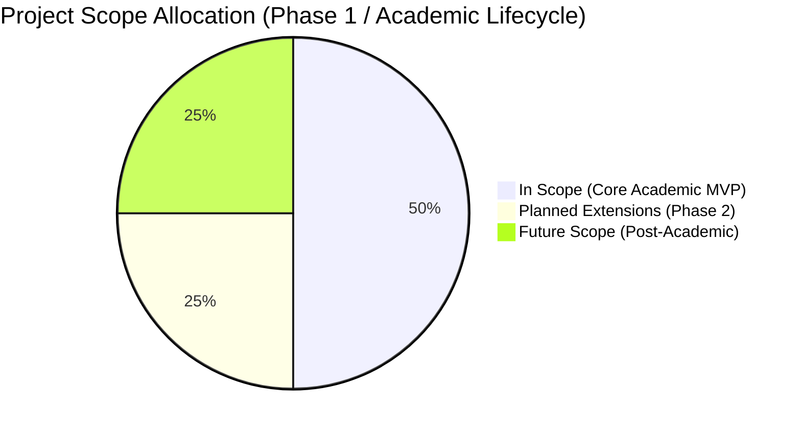

# 04. Project Scope Specification: SignTalk AI

**Document ID:** STAI-DOC-P1P1-004  
**Project Name:** SignTalk AI  
**Document Status:** Approved Research Specification (Phase 1 — Part 1)  

---

## 1. Scope Overview & Engineering Discipline

To guarantee academic rigor and ensure that the engineering milestones remain feasible within university research timelines and compute constraints, SignTalk AI enforces a strictly partitioned project scope.

The project explicitly rejects the trap of claiming "unlimited universal translation of all sign languages." Instead, it defines bounded, verifiable boundaries across all technical dimensions:

---

## 2. In Scope (Target Academic Implementation)

The following modules and capabilities constitute the formal deliverable scope for SignTalk AI:

### 2.1 Language and Modality Scope
* **Primary Target Sign Language:** **Indian Sign Language (ISL)** exclusively.
  *(American Sign Language [ASL], British Sign Language [BSL], and Australian Sign Language [Auslan] are strictly excluded from the active implementation).*
* **Input Modality:** Monocular 2D RGB video stream captured via a standard consumer webcam (720p/1080p at $\ge 20$ FPS).
* **Output Modality:** Natural-language English text captions displayed in real time. (Architectural design supports Hindi/regional text mapping as a token vocabulary extension).
* **Signing Regimes:**
  - **Continuous ISL Translation (Primary Focus):** Sliding temporal sequence interpretation of multi-sign phrases.
  - **Isolated Sign Recognition (Baseline / Modular Pretraining):** Reference benchmarking and feature extractor validation.

### 2.2 Computer Vision & Feature Engineering
* **Landmark Detection:** Integration of Google MediaPipe Holistic framework (extracting 21 landmarks per hand, 33 body pose landmarks, and a filtered subset of salient facial markers).
* **Feature Normalization & Preprocessing:**
  - Torso-relative spatial coordinate centering (using the mid-point of the shoulders as the origin $(0, 0, 0)$).
  - Scale invariance normalization (normalizing joint distances against torso length or shoulder width).
  - Temporal windowing (generating uniform sliding tensors across $T \in [30, 60]$ frames with configurable step stride).

### 2.3 Machine Learning Architectures
* **Baseline Reference Model:** Lightweight LSTM / Bi-LSTM sequence classifier trained on flattened landmark coordinates to establish benchmark accuracy and latency.
* **Spatial-Temporal Graph Convolutional Network (ST-GCN):** Custom graph construction representing human physical joint connectivity (spatial edges) and inter-frame temporal linkages (temporal edges).
* **Transformer Sequence-to-Sequence Translation Module:** Multi-head self-attention encoder-decoder mapping ST-GCN spatial-temporal latent embeddings into word-level natural-language tokens.
* **Ablation Matrix:** Systematic experimental evaluation comparing Hand-only vs. Hand+Body vs. Hand+Body+Face configurations.

### 2.4 System & Interface Scope
* **Application Architecture:** Decoupled client-server architecture:
  - **Frontend:** Modern responsive Web UI built with HTML5, CSS3, and JavaScript/TypeScript providing camera rendering, real-time live captions, confidence meters, and session controls.
  - **Backend:** High-performance Python FastAPI service managing landmark normalization, tensor formatting, model inference, and caption generation.
* **Communication Protocol:** Low-latency bi-directional WebSocket streaming (`/api/translate/stream`) for transmitting landmark frames and receiving real-time caption updates.
* **Local / Edge Deployment Capability:** The prototype must execute end-to-end entirely on the local development machine (laptop/workstation) without requiring third-party cloud compute or paid external APIs.

---

## 3. Out of Scope (Explicitly Excluded from Current Phase)

The following features and claims are strictly **OUT OF SCOPE** for the academic implementation. They must not be claimed in project demonstrations, viva presentations, or progress reports:

1. **Universal Unrestricted ISL Translation:** The system will not recognize the entire official ISL dictionary (which exceeds 10,000 signs). It operates strictly within a curated, documented domain vocabulary.
2. **Non-ISL Sign Languages:** ASL, BSL, French Sign Language (LSF), and German Sign Language (DGS) are out of scope. (Cross-lingual datasets like PHOENIX14T are used solely for algorithmic methodology reference in literature reviews, never as primary evaluation data).
3. **Specialized Hardware Sensors:** Depth cameras (Microsoft Kinect, Intel RealSense), infrared illuminators, radar, and sensor data gloves are explicitly excluded. The system relies entirely on standard RGB video.
4. **Bidirectional Avatar Generation (Text-to-Sign):** 3D avatar animation, virtual signer rendering, or text-to-gesture synthesis is completely out of scope. SignTalk AI is strictly a **Sign-to-Text** platform.
5. **Certified Medical / Legal Interpretation:** The platform is an assistive research prototype and is not certified for legally binding court proceedings, psychiatric evaluations, or autonomous medical diagnoses.
6. **Native Mobile App Builds:** Native compilation for iOS (Swift) or Android (Kotlin) is excluded from the initial deliverable. The primary client is a standard web browser application.
7. **Cloud Video Archival:** Storing, archiving, or streaming continuous raw user video to cloud storage buckets is prohibited by design to protect user privacy.

---

## 4. Future Scope (Long-Term Architectural Roadmap)

The following capabilities are architecturally anticipated but deferred to subsequent phases:

* **Multilingual Target Generation:** Expanding the Transformer vocabulary to directly output Hindi, Marathi, Bengali, or Tamil text alongside English.
* **Edge ONNX / TensorRT Quantization:** Converting trained PyTorch ST-GCN and Transformer models to INT8/FP16 ONNX formats for native execution in browser runtimes via WebAssembly (Wasm) or WebGPU.
* **Bidirectional Speech-to-Sign Synthesis:** Integrating a 3D animated signing avatar to translate hearing responses back into visual ISL for complete two-way conversational parity.
* **Multi-Signer Conversational Disambiguation:** Upgrading the spatial tracker to support two or more signers interacting within the same camera frame.
* **Mobile App Distribution:** Packaging the responsive web client into cross-platform mobile binaries (React Native or PWA) for smartphone accessibility.
* **Continuous Active Learning Feedback Loop:** Allowing certified ISL users to flag mistranslated phrases and submit anonymized skeletal landmark traces to incrementally expand model vocabulary.

---

## 5. Scope Boundary Summary Table

| System Dimension | In Scope (Academic MVP) | Out of Scope (Current Release) | Future Scope |
| :--- | :--- | :--- | :--- |
| **Language Target** | Indian Sign Language (ISL) | ASL, BSL, DGS, LSF | Regional ISL dialect variants |
| **Translation Direction** | Sign $\rightarrow$ Text | Text $\rightarrow$ Sign (Avatar) | Two-way (Sign $\leftrightarrow$ Speech/Avatar) |
| **Sign Continuity** | Continuous (Phrases) + Isolated (Baseline) | Unrestricted open-vocabulary dialogue | Conversational discourse modeling |
| **Vocabulary Size** | Curated domain set (50–100 signs/phrases) | Full ISL lexicon (10,000+ words) | 1,000+ continuous phrase vocabulary |
| **Sensor Requirements** | Standard monocular RGB webcam (720p) | Depth sensors, data gloves, IR cameras | Multi-camera stereoscopic setups |
| **Client Interface** | Web application (React / Vanilla JS) | Native iOS / Android application | Progressive Web App (PWA) / Mobile |
| **Inference Target** | Local CPU/GPU via FastAPI server | Remote cloud-cluster dependency | On-device WebGPU / Edge TPU |
| **Target Latency** | $< 500$ ms end-to-end design target | Unbounded offline batch processing | $< 250$ ms ultra-low-latency pipeline |
| **User Privacy** | Skeletal extraction only; zero video storage | Raw video cloud streaming | Fully decentralized local edge sandbox |
