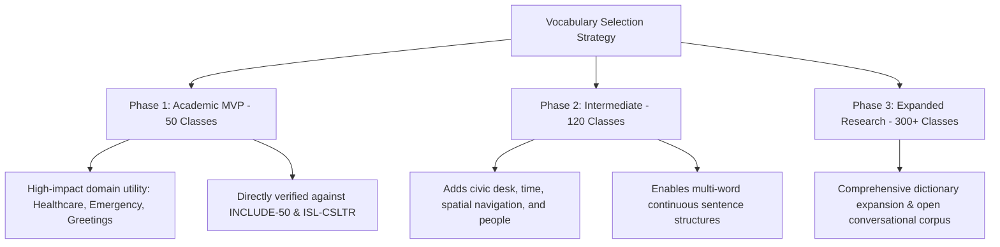

# 05. Vocabulary Strategy: SignTalk AI

**Document ID:** STAI-DOC-P1P1-005  
**Project Name:** SignTalk AI  
**Document Status:** Approved Research Specification (Phase 1 — Part 1)  

---

## 1. Vocabulary Selection Principles

Selecting an academic vocabulary for Indian Sign Language (ISL) requires balancing three competing constraints:
1. **Linguistic Authenticity:** Ensuring selected signs reflect standard ISL conventions as documented by the Indian Sign Language Research and Training Centre (ISLRTC) rather than arbitrary invented gestures.
2. **Dataset Alignment:** Prioritizing sign classes and phrase combinations that exist in verified, publicly accessible academic datasets (such as INCLUDE-50, ISLTranslate, and ISL-CSLTR) to avoid impossible training bottlenecks.
3. **Domain Utility:** Concentrating lexical choices on high-impact scenarios—specifically healthcare triage, emergency assistance, civil service interaction, and daily greetings.

> [!WARNING]
> **Dataset Verification Notice:** Specific signs listed below are proposed based on academic utility and standard ISL curricula. Signs marked `[Verified in INCLUDE]` or `[Verified in ISL-CSLTR]` have confirmed occurrences in published academic corpora. Signs marked `[Requires Verification]` must be verified against exact dataset splits prior to training partition lock in Phase 1 Part 2.

---

## 2. Recommended Academic MVP Vocabulary (50 Core Signs / Phrases)

The Phase 1 Academic MVP focuses on **50 foundational signs**, organized into 7 cohesive thematic categories. These signs allow the construction of meaningful, multi-word continuous phrases for healthcare triage, emergency distress, and everyday administrative communication.

| No. | Category | Sign Class / Gloss | Semantic Meaning / Context | Dataset Verification Status | Rationale for Inclusion |
| :---: | :--- | :--- | :--- | :--- | :--- |
| 1 | **Greetings & Politeness** | `HELLO` / `NAMASTE` | Standard greeting | Verified in INCLUDE (Class: Hello) | Essential conversation opener |
| 2 | Greetings & Politeness | `THANK_YOU` | Expression of gratitude | Verified in INCLUDE (Class: Thank you) | Foundational conversational closing |
| 3 | Greetings & Politeness | `PLEASE` | Polite request marker | Verified in INCLUDE (Class: Please) | Essential for civil service interactions |
| 4 | Greetings & Politeness | `SORRY` | Apology / clarification | Verified in INCLUDE (Class: Sorry) | Used during communication resets |
| 5 | Greetings & Politeness | `WELCOME` | Welcoming response | Verified in INCLUDE (Class: Welcome) | Service counter exchange |
| 6 | Greetings & Politeness | `GOOD_MORNING` | Formal morning greeting | Verified in INCLUDE (Class: Good morning) | Standard institutional opening |
| 7 | **Responses & Queries** | `YES` | Affirmation | Verified in INCLUDE (Class: Yes) | Critical decision response |
| 8 | Responses & Queries | `NO` | Negation | Verified in INCLUDE (Class: No) | Critical decision response |
| 9 | Responses & Queries | `WHAT` | Interrogative question | Verified in INCLUDE (Class: What) | Key syntactic question marker |
| 10 | Responses & Queries | `WHERE` | Spatial inquiry | Verified in INCLUDE (Class: Where) | Key question marker for navigation |
| 11 | Responses & Queries | `WHEN` | Temporal inquiry | Verified in INCLUDE (Class: When) | Vital for appointments and history |
| 12 | Responses & Queries | `WHY` | Causal inquiry | Verified in INCLUDE (Class: Why) | Explanatory inquiry marker |
| 13 | Responses & Queries | `HELP` | Call for assistance | Verified in INCLUDE (Class: Help) | Core distress / service keyword |
| 14 | **Pronouns & People** | `I` / `ME` | First person singular | Verified in INCLUDE (Class: I / Me) | Essential sentence subject |
| 15 | Pronouns & People | `YOU` | Second person singular | Verified in INCLUDE (Class: You) | Essential sentence addressee |
| 16 | Pronouns & People | `WE` | First person plural | Verified in INCLUDE (Class: We) | Collective reference |
| 17 | Pronouns & People | `DOCTOR` | Medical professional | Verified in INCLUDE (Class: Doctor) | Vital healthcare anchor |
| 18 | Pronouns & People | `NURSE` | Healthcare worker | Requires Verification | Essential clinical triage actor |
| 19 | Pronouns & People | `FAMILY` / `PARENT` | Kinship reference | Verified in INCLUDE (Class: Family) | Emergency contact identification |
| 20 | Pronouns & People | `POLICE` | Law enforcement | Verified in INCLUDE (Class: Police) | Core civic / emergency actor |
| 21 | **Healthcare & Medical** | `PAIN` | Physical distress | Verified in ISL-CSLTR | Primary symptom descriptor |
| 22 | Healthcare & Medical | `HOSPITAL` | Healthcare facility | Verified in INCLUDE (Class: Hospital) | Navigation and referral anchor |
| 23 | Healthcare & Medical | `MEDICINE` | Pharmacological treatment | Verified in INCLUDE (Class: Medicine) | Prescription / treatment tracking |
| 24 | Healthcare & Medical | `FEVER` | High body temperature | Verified in ISL-CSLTR | Essential vital sign symptom |
| 25 | Healthcare & Medical | `HEADACHE` | Cranial pain | Verified in ISL-CSLTR | Common triage chief complaint |
| 26 | Healthcare & Medical | `STOMACH_PAIN` | Abdominal distress | Verified in ISL-CSLTR | Common triage chief complaint |
| 27 | Healthcare & Medical | `BLEEDING` | Hemorrhage / wound | Requires Verification | Acute emergency triage sign |
| 28 | Healthcare & Medical | `BREATHING_DIFFICULTY`| Respiratory distress | Requires Verification | Critical triage red-flag sign |
| 29 | Healthcare & Medical | `ALLERGY` | Hypersensitivity | Requires Verification | Medication safety prerequisite |
| 30 | Healthcare & Medical | `WATER` | Hydration requirement | Verified in INCLUDE (Class: Water) | Basic physiological need |
| 31 | **Emergency & Urgent** | `EMERGENCY` | Urgent crisis | Verified in ISL-CSLTR | Overall triage prioritization |
| 32 | Emergency & Urgent | `ACCIDENT` | Vehicular / physical crash| Verified in INCLUDE (Class: Accident) | Trauma intake identifier |
| 33 | Emergency & Urgent | `FIRE` | Fire hazard | Verified in INCLUDE (Class: Fire) | Immediate life-safety warning |
| 34 | Emergency & Urgent | `DANGER` | Hazard alert | Verified in INCLUDE (Class: Danger) | Safety alert sign |
| 35 | Emergency & Urgent | `STOP` | Halt action | Verified in INCLUDE (Class: Stop) | Critical command directive |
| 36 | **Daily Actions & Verbs** | `COME` | Directive motion | Verified in INCLUDE (Class: Come) | Procedural instruction |
| 37 | Daily Actions & Verbs | `GO` | Directional departure | Verified in INCLUDE (Class: Go) | Procedural instruction |
| 38 | Daily Actions & Verbs | `WAIT` | Temporal pause | Verified in INCLUDE (Class: Wait) | Queue and desk management |
| 39 | Daily Actions & Verbs | `EAT` / `FOOD` | Ingestion / nourishment | Verified in INCLUDE (Class: Food) | Intake questions / dietary logs |
| 40 | Daily Actions & Verbs | `DRINK` | Fluid consumption | Verified in INCLUDE (Class: Drink) | Medication instructions |
| 41 | Daily Actions & Verbs | `SLEEP` | Rest | Verified in INCLUDE (Class: Sleep) | Patient assessment symptom |
| 42 | Daily Actions & Verbs | `WANT` | Expression of desire | Verified in INCLUDE (Class: Want) | Core grammatical modal verb |
| 43 | Daily Actions & Verbs | `UNDERSTAND` | Cognitive comprehension | Verified in INCLUDE (Class: Understand)| Validates communication clarity |
| 44 | **Time & Temporality** | `TODAY` | Current day | Verified in INCLUDE (Class: Today) | Temporal anchor for symptoms |
| 45 | Time & Temporality | `YESTERDAY` | Preceding day | Verified in INCLUDE (Class: Yesterday) | Onset duration tracking |
| 46 | Time & Temporality | `TOMORROW` | Subsequent day | Verified in INCLUDE (Class: Tomorrow) | Appointment scheduling |
| 47 | Time & Temporality | `NOW` | Present moment | Verified in INCLUDE (Class: Now) | Immediate urgency marker |
| 48 | Time & Temporality | `TIME` | Clock / schedule | Verified in INCLUDE (Class: Time) | Scheduling and duration marker |
| 49 | **Navigation & Location** | `RIGHT` | Directional indicator | Verified in INCLUDE (Class: Right) | Wayfinding within institutions |
| 50 | Navigation & Location | `LEFT` | Directional indicator | Verified in INCLUDE (Class: Left) | Wayfinding within institutions |

---

## 3. Continuous Phrase Composition from MVP Vocabulary

The selected 50-sign vocabulary is specifically designed to evaluate continuous multi-sign sentence generation. Unlike disjoint vocabulary lists, these classes support authentic syntactic compositions commonly observed in ISL-English parallel corpora:

1. **Medical Intake Query:**  
   `I` + `FEVER` + `SINCE` + `YESTERDAY` $\rightarrow$ *"I have had a fever since yesterday."*
2. **Acute Emergency Directive:**  
   `HELP` + `ACCIDENT` + `HOSPITAL` + `GO` $\rightarrow$ *"Please help, an accident occurred, take me to the hospital."*
3. **Clinical Examination Dialogue:**  
   `YOU` + `PAIN` + `WHERE` $\rightarrow$ *"Where are you experiencing pain?"*
4. **Administrative Assistance:**  
   `I` + `WANT` + `DOCTOR` + `MEET` $\rightarrow$ *"I want to see the doctor."*
5. **Procedural Instruction:**  
   `PLEASE` + `WAIT` + `HERE` $\rightarrow$ *"Please wait here."*

---

## 4. Intermediate Vocabulary Roadmap (120 Classes)

In Phase 2, the vocabulary will be expanded to **120 classes** by incorporating civic administrative terms, financial operations, and expanded physiological symptoms:

* **Civic & Banking Additions (25 Classes):** `BANK`, `MONEY`, `ACCOUNT`, `DEPOSIT`, `WITHDRAW`, `CARD`, `SIGNATURE`, `AADHAAR`, `DOCUMENT`, `FORM`, `OFFICE`, `PAY`, `FEE`, `NAME`, `ADDRESS`, `NUMBER`, `PHONE`, `VERIFY`, `RECEIPT`, `OFFICER`, `GOVERNMENT`, `PENSION`, `CERTIFICATE`, `STAMP`, `INQUIRY`.
* **Expanded Medical Symptoms (25 Classes):** `COUGH`, `COLD`, `VOMITING`, `DIZZY`, `FRACTURE`, `INJECTION`, `BLOOD_TEST`, `SUGAR`, `BP` (Blood Pressure), `HEART`, `LUNGS`, `EYE`, `EAR`, `THROAT`, `SKIN`, `PREGNANT`, `CHILD`, `TABLET`, `DAILY`, `MORNING`, `NIGHT`, `BEFORE_FOOD`, `AFTER_FOOD`, `DOSAGE`, `IMPROVEMENT`.
* **Connectors & Spatial Modifiers (20 Classes):** `NEAR`, `FAR`, `UP`, `DOWN`, `INSIDE`, `OUTSIDE`, `HOW_MUCH`, `HOW_MANY`, `BECAUSE`, `BUT`, `OR`, `FIRST`, `LAST`, `AGAIN`, `SLOW`, `FAST`, `READY`, `FINISHED`, `PROBLEM`, `CORRECT`.

---

## 5. Research Scale & Future Expansion (300+ Classes)

The long-term research goal aligns with the full AI4Bharat INCLUDE dataset (263 classes) and the ISLRTC foundational dictionary (3,000+ signs). This phase will support:
- Fine-grained fingerspelling for proper nouns, Indian names, and unique alphanumeric transaction IDs.
- Complex morphological inflections, spatial verb agreements, and classifier predicates (depicting verbs in ISL).
- Domain-specific sub-vocabularies for judicial courtrooms, engineering universities, and industrial safety.
