# 06. Research Gap and Academic Foundations: SignTalk AI

**Document ID:** STAI-DOC-P1P1-006  
**Project Name:** SignTalk AI  
**Document Status:** Approved Research Specification (Phase 1 — Part 1)  

---

## 1. Literature Review

Sign language processing has evolved across three major technological paradigms:
1. **Sensor & Glove-Based Approaches (Early Era):** Utilizing wired data gloves, inertial measurement units (IMUs), and flex sensors. While offering direct joint angle measurements, they impose severe physical discomfort, are costly, and disrupt natural signing articulation.
2. **Dense RGB & 3D-CNN Video Approaches (Deep Learning Era):** Leveraging 3D Convolutional Neural Networks (e.g., C3D, I3D, SlowFast) directly on raw pixel video tensors. While achieving strong benchmark accuracy on large datasets (e.g., PHOENIX14T, WLASL), they require massive compute clusters, suffer severe performance drops when visual backgrounds or signer clothing change, and expose complete biometric facial video to cloud servers.
3. **Skeleton & Graph-Based Approaches (Current Frontier):** Extracting keypoint coordinate sequences (via OpenPose, MediaPipe) and modeling their topology using Graph Convolutional Networks (ST-GCN).

Despite rapid advancements, sign language research remains disproportionately concentrated on American Sign Language (ASL), German Sign Language (DGS), and Chinese Sign Language (CSL). Indian Sign Language (ISL) remains an under-resourced language domain characterized by severe training data scarcity and unique linguistic properties.

---

## 2. Research Landscape & Gap Analysis Matrix

The table below contrasts established paradigms against the specific opportunities addressed by SignTalk AI:

| Research Area | Existing Academic Approaches | Documented Limitations | Opportunity & Focus for SignTalk AI |
| :--- | :--- | :--- | :--- |
| **ISL Recognition** | Isolated alphabet/number classification using CNNs (ResNet, VGG) or MobileNet on cropped hand images. | Ignores natural continuous sentence dynamics; fails to model movement between signs; cannot handle co-articulation. | Evaluate continuous phrase translation on verified ISL continuous corpora (e.g., ISLTranslate, ISL-CSLTR) using temporal sequence modeling. |
| **Feature Representation** | Flattened coordinate vectors (e.g., concatenating $x, y, z$ coordinates into a 1D vector passed to an LSTM/GRU). | Destroys natural anatomical topology; fails to capture multi-joint spatial hierarchies (e.g., finger tip $\leftrightarrow$ knuckle $\leftrightarrow$ wrist $\leftrightarrow$ elbow). | Model the human signing articulators as an anatomical graph where physical bone linkages define spatial edges $\mathcal{E}_{spatial}$. |
| **Spatial-Temporal Modeling** | 2D/3D CNNs applied to raw video frames, or basic Temporal Convolutional Networks (TCNs) on landmark vectors. | Massive parameter footprint ($>25\text{M}$ parameters); high inference latency ($>100\text{ ms}$ per frame); high sensitivity to lighting and backgrounds. | Deploy Spatial-Temporal Graph Convolutional Networks (ST-GCN) that explicitly convolve along both spatial skeletal edges and temporal trajectories with lightweight parameter overhead. |
| **Sign-to-Text Sequence Decoding** | CTC-based gloss classification or beam-search decoding on isolated gloss labels without language generation. | Generates disjoint gloss sequences (e.g., `"I" + "HOSPITAL" + "GO"`) lacking grammatical fluency; fails to bridge ISL (SOV) to English (SVO) syntax. | Couple the spatial-temporal graph encoder with an autoregressive Transformer decoder trained to synthesize grammatically fluent natural-language sentences. |
| **Multimodal Non-Manual Integration** | Hand-only tracking (21 keypoints), occasionally adding torso pose. Complete facial mesh (468 keypoints) is typically avoided due to computational overhead. | Omits vital grammatical markers (questions, negation, conditional clauses encoded in eyebrows and mouth); using all 468 face points causes latency spikes. | Construct a targeted multimodal graph combining 42 hand keypoints, 11 upper-body pose joints, and a curated salient subset of 40 facial markers (eyebrows, mouth, jawline). |
| **System Latency & Edge Inference** | Cloud-based offline batch translation pipelines where complete pre-recorded video clips are uploaded and processed post-hoc. | Incompatible with live conversational interaction; latency often exceeds several seconds; fails in low-bandwidth network environments. | Architect an asynchronous, sliding-window streaming pipeline targeting an end-to-end latency budget $< 500\text{ ms}$ capable of local execution. |
| **Privacy & Video Data Ethics** | Cloud streaming of uncompressed RGB frames to remote vision servers for processing. | Severe privacy invasion in confidential environments (medical examinations, banking desks, civic inquiries); violates DPDP guidelines. | Enforce privacy-by-design: Extract skeletal landmarks locally in the client runtime; never transmit or store raw facial/environmental video frames. |

---

## 3. Formal Research Gap Statement

> **Current Indian Sign Language recognition systems remain overwhelmingly constrained to isolated static gestures or single-word classifications, relying either on computationally heavy and privacy-invasive 3D-CNNs or on flattened landmark vectors that discard skeletal kinematic topology. Furthermore, existing research rarely bridges the structural gap between continuous spatial-temporal graph representations and autoregressive natural-language translation under strict sub-500 ms real-time latency budgets on consumer-grade hardware.**

---

## 4. Proposed Academic Research Contributions

It is vital to maintain academic precision: **Merely connecting two well-known deep learning blocks (ST-GCN + Transformer) does not constitute an automatic research contribution.** The scholarly contribution of SignTalk AI lies in the empirical design, domain adaptation, and rigorous comparative evaluation of the following hypotheses:

### Contribution 1: Anatomically Grounded Multimodal Graph Topology for ISL
* **Investigation:** Designing and evaluating a specialized graph schema tailored for Indian Sign Language, which integrates dual-hand articulators (42 nodes), upper-body kinematic chains (11 nodes), and a linguistically salient subset of facial non-manual keypoints (40 nodes) while discarding redundant facial mesh points.
* **Scholarly Question:** Does a curated multimodal graph topology provide statistically significant improvements in continuous ISL translation fluency (measured by BLEU-4 and WER) over hand-only or unconstrained dense facial meshes, while remaining within real-time latency bounds?

### Contribution 2: Structural Inductive Bias vs. Low-Resource Overfitting
* **Investigation:** Benchmarking the inductive bias of Spatial-Temporal Graph Convolutions against standard sequence architectures (Bi-LSTM, GRU, Temporal Convolutional Networks) on low-resource continuous ISL datasets.
* **Scholarly Question:** In an under-resourced sign language domain like ISL with limited training samples, does explicit spatial-temporal graph convolution act as an effective regularizer that prevents the catastrophic overfitting observed in unstructured vector encoders and dense 3D-CNNs?

### Contribution 3: Two-Stage Hybrid Translation Architecture under Latency Constraints
* **Investigation:** Implementing and validating a decoupled architecture where a spatial-temporal graph encoder compresses high-frequency kinematic trajectories into dense semantic tokens, which are decoded by a lightweight Transformer into natural language.
* **Scholarly Question:** Can a joint or two-stage ST-GCN + Transformer architecture achieve acceptable translation quality (BLEU score) while satisfying an end-to-end latency constraint of $\le 500\text{ ms}$ on non-GPU consumer hardware?

### Contribution 4: Privacy-Preserving Edge Landmark Pipeline
* **Investigation:** Evaluating a privacy-first architecture where the entire visual feature extraction stage (MediaPipe) runs locally, transmitting only compact coordinate tensors ($< 50\text{ KB/s}$) over WebSockets rather than continuous high-definition video ($> 2\text{ MB/s}$).
* **Scholarly Question:** What is the quantitative trade-off between inference accuracy, network transmission bandwidth, and end-to-end latency when moving from centralized video streaming to decentralized landmark streaming?

---

## 5. Architectural Distinction of SignTalk AI

SignTalk AI differs fundamentally from standard hobbyist projects and legacy academic prototypes:

```mermaid
graph TD
    subgraph Legacy Approaches [Traditional / Hobbyist Systems]
        L1[Raw Video Frames] --> L2[Flattened Coordinate Vector / Heavy 3D-CNN]
        L2 --> L3[Isolated Classification / SVM / MLP]
        L3 --> L4[Single Static Character Output e.g., 'A']
        L4 -.-> L5[Severe Limitations: No motion, no grammar, cloud video privacy risk]
    end

    subgraph SignTalk AI [SignTalk AI Academic Architecture]
        S1[Webcam Stream] --> S2[MediaPipe Local Landmark Extraction]
        S2 --> S3[Normalization & Spatial-Temporal Graph G]
        S3 --> S4[ST-GCN: Intra-frame Bone Topology + Inter-frame Trajectories]
        S4 --> S5[Transformer Sequence-to-Sequence Translation Module]
        S5 --> S6[Fluent Natural-Language Sentence Captions < 500ms]
        S2 -.-> S7[Zero Raw Video Stored: Privacy Guaranteed]
    end
```

By grounding the engineering in verifiable academic literature, SignTalk AI establishes a methodical experimental baseline that advances the state of assistive language technology for Indian Sign Language.
