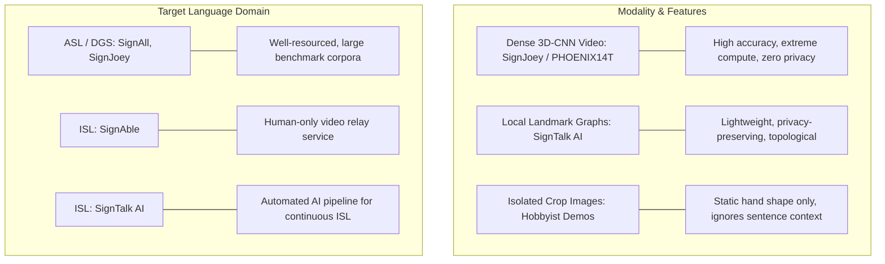

# 07. Existing Systems and Competitive Landscape: SignTalk AI

**Document ID:** STAI-DOC-P1P1-007  
**Project Name:** SignTalk AI  
**Document Status:** Approved Research Specification (Phase 1 — Part 1)  

---

## 1. Landscape Overview

A comprehensive, objective review of existing sign language technologies was conducted across commercial products, academic research prototypes, and open-source initiatives. In accordance with strict academic guidelines, systems are analyzed factually on their documented technical characteristics without subjective rankings or promotional terminology.

The landscape divides into four operational categories:
1. **Human-in-the-Loop Remote Video Interpretation (VRI)**
2. **Commercial Automated Sign-to-Text Platforms**
3. **Academic Continuous Sign Language Translation (SLT) Frameworks**
4. **Educational & Government Lexical Lookup Applications**

---

## 2. Comparative Systems Analysis Matrix

The table below summarizes verified public and academic systems across technical, architectural, and operational dimensions:

| System Name | Type / Sector | Target Sign Language | Input Modality | Output Modality | Continuity Mode | Real-Time Latency | Offline Inference | Underlying Technology Stack | Major Documented Limitation | Reference / Primary Source |
| :--- | :--- | :--- | :--- | :--- | :--- | :--- | :--- | :--- | :--- | :--- |
| **SignAble** | Commercial Service | Indian Sign Language (ISL) | Live Video Stream (App) | Human Audio / Video | Continuous Live Interaction | Human response latency (~seconds) | No (Requires high-speed cellular data) | WebRTC video streaming connecting human certified interpreters | Relies entirely on human interpreters; does not utilize automated AI translation; operational cost scales with interpreter hours; privacy limited by third-party human presence. | [SignAble Official Portal](https://signable.live) |
| **Ishaara** | Commercial / Startup Prototype | Indian Sign Language (ISL) | Monocular RGB Webcam | Text / Speech and 3D Avatar | Phrase / Isolated Gestures | Near real-time (Browser) | No (Cloud backend dependency) | Computer vision gesture recognition + Web-based 3D signing avatar | Two-way translation is primarily demonstrated on curated demonstrative gestures; cloud-dependent architecture; documentation of continuous phrase translation accuracy is proprietary. | [Ishaara Platform](https://ishaara.app) |
| **SignAll (SignAll Chat / Learn Lab)** | Commercial Product | American Sign Language (ASL) | Multi-camera / Depth array / 2D RGB | English Text / Transcripts | Continuous ASL Signing | Near real-time (< 1 second) | Yes (In dedicated kiosk hardware installations) | Multi-camera computer vision, skeletal tracking, statistical NLP language model | Restricted exclusively to American Sign Language (ASL); hardware installations require specialized multi-sensor kiosks or calibrated multi-camera rigs; proprietary closed architecture. | [SignAll Technologies / Gallaudet Collab](https://www.signall.us) |
| **SignJoey (Camgoz et al., CVPR 2020)** | Academic Research Framework | German Sign Language (DGS) | RGB Video Sequences | German Text Translations | Continuous Sign Translation | Batch / Offline research evaluation | Research script execution (GPU required) | Joint CTC-Attention Transformer, 2D/3D CNN feature extractor (Inception/ResNet) | Evaluated exclusively on German Sign Language (PHOENIX14T); relies on heavy 2D/3D CNN visual backbones requiring high-end server GPUs; not packaged for real-time live webcam deployment. | [Camgoz et al., CVPR 2020 / GitHub](https://github.com/neccam/slt) |
| **Sign Learn** | Government / Institutional App | Indian Sign Language (ISL) | Text / Audio search query | Recorded ISL Video Clips | Isolated Dictionary Lookup | Pre-recorded playback | Partial (Downloaded video assets) | Mobile Android/iOS database application created by ISLRTC | A unidirectional dictionary lookup tool for human learning; performs zero automated sign recognition or sign-to-text translation from camera input. | [ISLRTC / Government of India](https://islrtc.nic.in) |
| **Bhashini (National Language Mission)** | Government / R&D Platform | 22 Scheduled Indian Languages | Speech, Text, Document Images | Multilingual Text / Speech | Continuous Spoken/Textual | Variable depending on microservice | No (Cloud API service) | Deep learning speech-to-text, neural machine translation (NMT), text-to-speech (TTS) | Focused predominantly on spoken and written vernacular languages of India; automated computer vision sign-to-text translation is not yet deployed as a mature production service. | [Digital India Bhashini](https://bhashini.gov.in) |
| **Open-Source MediaPipe ISL Demos** | Open-Source Hobbyist / Student Projects | ISL (Various ad-hoc subsets) | Monocular RGB Webcam | Static English Character / Label | Isolated Gestures | Real-time (15–30 FPS on CPU) | Yes (Local Python / OpenCV script) | MediaPipe Hands + Scikit-Learn Random Forest / MLP or Keras LSTM | Limited to isolated static alphabet/number classification; lacks continuous sentence grammar; ignores facial non-manuals; lacks reproducible multi-signer evaluation. | Various GitHub Repositories (e.g., Priyanjali Gupta et al.) |

---

## 3. Structural Comparison: Existing Architectures vs. SignTalk AI

An architectural breakdown reveals key engineering differentiators across five functional vectors:

### 3.1 Sign Language Target & Linguistic Autonomy
- **Existing Limitation:** The vast majority of deep learning continuous translation research is conducted on American Sign Language (ASL) or German Sign Language (DGS). Systems like SignAll and SignJoey cannot be directly used for Indian Sign Language due to complete divergence in grammatical rules, spatial reference frames, and manual vocabularies.
- **SignTalk AI Implementation:** Focuses directly and exclusively on the linguistic syntax, continuous co-articulation, and lexicon of Indian Sign Language (ISL).

### 3.2 Visual Processing Footprint and Privacy
- **Existing Limitation:** Academic continuous translation models traditionally feed raw RGB video frames into compute-intensive 3D CNNs (e.g., I3D, ResNet-3D). These models cannot run on client laptops without dedicated enterprise GPUs, and streaming raw camera footage to cloud servers introduces unacceptable privacy risks in medical, financial, and civic contexts.
- **SignTalk AI Implementation:** Performs edge landmark extraction via Google MediaPipe, converting high-bandwidth video into lightweight $(x, y, z)$ skeletal graphs. Only abstract geometric landmarks are passed to the inference engine, ensuring zero transmission or retention of personal visual video.

### 3.3 Static Recognition vs. Temporal Sequence Translation
- **Existing Limitation:** Existing open-source ISL implementations on developer platforms (such as GitHub) are overwhelmingly limited to isolated static hand classification (identifying whether a hand pose is 'A', 'B', or 'C'). They cannot translate connected sentences or handle movement epenthesis.
- **SignTalk AI Implementation:** Incorporates a two-stage spatial-temporal pipeline (ST-GCN for graph-based kinematic trajectory extraction followed by a Transformer sequence model for natural-language decoding), enabling continuous phrase translation.
