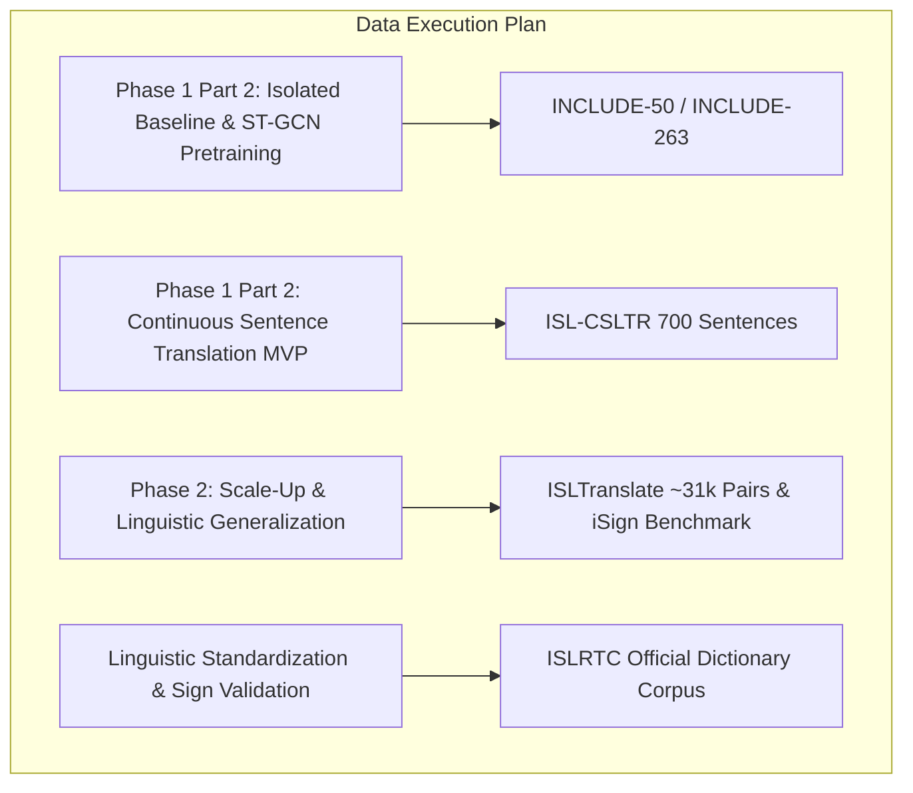

# 08. Dataset Research and Evaluation: SignTalk AI

**Document ID:** STAI-DOC-P1P1-008  
**Project Name:** SignTalk AI  
**Document Status:** Approved Research Specification (Phase 1 — Part 1)  

---

## 1. Dataset Evaluation Methodology

A machine learning system for sign language translation is only as reliable as the empirical foundation upon which it is trained. In Indian Sign Language (ISL), researchers face historic data fragmentation, varying annotation qualities, and licensing constraints. 

To determine the training strategy for SignTalk AI, candidate datasets were evaluated against seven strict academic criteria:
1. **Linguistic Relevance:** Strictly native Indian Sign Language (ISL). Non-ISL datasets (ASL, DGS) are excluded from the primary training pool.
2. **Signing Continuity:** Capability to support continuous multi-sign sentence translation rather than exclusively isolated gesture classification.
3. **Signer Diversity:** Inclusion of multiple independent signers to enable signer-independent (unseen signer) cross-validation splits.
4. **Landmark Extraction Compatibility:** Video clarity, frame rate ($\ge 25$ FPS), and framing that permit reliable extraction of hands, upper-body pose, and facial markers via MediaPipe Holistic.
5. **Topological Modeling Suitability (ST-GCN):** Unobstructed visual joints across continuous temporal sequences suitable for spatial-temporal graph construction.
6. **Sequence Translation Suitability (Transformer):** High-quality parallel sentence-level text transcriptions supporting end-to-end sequence-to-sequence training.
7. **Licensing & Ethical Access:** Verified open research licensing or transparent institutional access procedures with zero fabricated data claims.

---

## 2. Comprehensive Candidate Dataset Comparison

The following table provides a rigorous, verified comparative analysis of candidate datasets:

| Dataset Name | Official Source / Publication | Language | Continuity Mode | Verified Size / Samples | Number of Signers | Video Format & Resolution | Annotation Format | Access Method & URL | License Status | Landmark & ST-GCN Compatibility | Transformer Translation Suitability | Recommended Strategic Classification |
| :--- | :--- | :--- | :--- | :--- | :--- | :--- | :--- | :--- | :--- | :--- | :--- | :--- |
| **INCLUDE / INCLUDE-50** | Sridhar et al., ACM Multimedia 2020 (AI4Bharat) | Indian Sign Language (ISL) | **Isolated** (Word level) | 4,287 videos (263 word signs across 15 categories); INCLUDE-50 has 50 word signs | 7 native Deaf signers (St. Louis School, Chennai) | MP4, variable resolution, recorded in natural school environments | Isolated class labels (English word glosses) | Public research download via [AI4Bharat GitHub / Zenodo](https://github.com/ai4bharat/INCLUDE) | Academic Research License (Requires verification of commercial terms) | **High:** Frontal framing enables clear MediaPipe tracking; ideal for graph construction | **Moderate:** Excellent for pretraining ST-GCN isolated representations, but lacks sentence-level parallel text | **Primary Candidate (Phase 1 Baseline & ST-GCN Pretraining)** |
| **ISL-CSLTR** | R. Elakkiya & B. Natarajan, Mendeley Data (2021) | Indian Sign Language (ISL) | **Continuous** (Sentence level) | 700 fully labeled continuous video sequences; 1,036 word vocabulary | Multiple signers (Controlled laboratory setup) | AVI / MP4, standard 720p/1080p framing | Sentence-level text transcriptions and word-level gloss sequence alignments | Direct download via [Mendeley Data Repository](https://data.mendeley.com/datasets/k5k4c2xp7b/1) | **CC BY 4.0** (Open access with academic attribution) | **High:** Controlled studio lighting guarantees reliable MediaPipe landmark extraction | **High:** Aligned sentence transcripts directly map to Transformer sequence training | **Primary Candidate (Local Academic MVP & Continuous Evaluation)** |
| **ISLTranslate** | Abhinav Joshi et al., Findings of ACL 2023 (IIT Kanpur) | Indian Sign Language (ISL) | **Continuous** (Sentence / Phrase level) | ~31,117 video-sentence pairs across diverse topics | Multi-signer corpus (Diverse natural and studio signers) | MP4 / Web video clips, variable resolution | Parallel English sentence translations and gloss transcriptions | Open academic access via [Exploration-Lab GitHub / Project Portal](https://github.com/Exploration-Lab/ISLTranslate) | Academic Research Use (Access request / form verification required) | **High:** Broad continuous sequences suitable for temporal sliding window graphs | **Exceptional:** Specifically engineered and benchmarked for Transformer sign-to-text translation | **Primary Candidate (Continuous Translation & Scaling Target)** |
| **iSign Benchmark** | Abhinav Joshi et al., Findings of ACL 2024 (IIT Kanpur) | Indian Sign Language (ISL) | **Continuous** (Multi-domain) | 118,000+ video-sentence pairs; includes SignVideo2Text and SignPose2Text tracks | Large diverse signer pool | Video files and pre-extracted pose coordinate sequences | Aligned natural-language English sentences and pose coordinates | Academic release via [Exploration-Lab / Hugging Face](https://arxiv.org/abs/2407.05404) | Academic Research License (Requires verification) | **Native / High:** Contains pre-extracted pose tracks and raw video compatible with ST-GCN | **Exceptional:** State-of-the-art benchmark for sequence modeling and large-scale translation | **Secondary Candidate (High-Performance Scaling / Benchmark Reference)** |
| **ISLRTC Open Dictionary** | Indian Sign Language Research & Training Centre (ISLRTC) | Indian Sign Language (ISL) | **Isolated** (Lexical lookup) | 3,000+ to 10,000+ standard lexical sign demonstrations | Professional ISL interpreters and certified Deaf instructors | MP4 video clips, uniform studio background | Official lexical word and phrase definitions | Available via [ISLRTC Official Portal](https://islrtc.nic.in) / Hugging Face mirrors | Open Government Data (OGD) India / Educational non-commercial | **High:** Studio lighting yields pristine landmark extraction | **Low:** Single lexical words; cannot train continuous sequence grammar | **Supplementary Candidate (Lexical Validation & Sign Standard Reference)** |
| **RWTH-PHOENIX-Weather-2014T** | Camgoz et al., CVPR 2018 / 2020 (RWTH Aachen) | German Sign Language (DGS) | **Continuous** (Weather broadcast domain) | 8,257 video sequences; parallel German sentences and glosses | 9 different hearing interpreters | MP4, broadcast TV resolution (210x260) | Aligned glosses and German translations | Academic access via [RWTH Aachen Media Computing Group](https://www-i6.informatik.rwth-aachen.de/~koller/RWTH-PHOENIX/) | Non-commercial Academic License | High for DGS, but irrelevant for ISL | High for DGS, but irrelevant for ISL | **Not Suitable (Non-ISL; Methodological Literature Reference Only)** |
| **WLASL / ASLLVD** | Li et al., WACV 2020 / Neidle et al., LREC | American Sign Language (ASL) | **Isolated / Lexicon** | 2,000 ASL words, 21,083 videos | 100+ signers (YouTube web scrape) | Variable MP4 web video clips | Isolated English word glosses | Public download via GitHub / Boston University | Research Use License | High for ASL, but irrelevant for ISL | Irrelevant for ISL | **Not Suitable (Non-ISL Language Target)** |

---

## 3. Dataset Strategic Classification & Phased Adoption Plan

### 3.1 Primary Candidate for Isolated Baseline & Feature Pretraining: INCLUDE / INCLUDE-50
* **Strategic Role:** Used to validate the MediaPipe landmark extraction pipeline, test normalization functions, and train the baseline isolated sign classifiers (Bi-LSTM vs. ST-GCN).
* **Justification:** Published in ACM Multimedia 2020 with verified train/test splits. Contains native Deaf signers from Chennai. The curated **INCLUDE-50** subset (50 words) provides a lightweight, highly reproducible benchmark for quick iteration without excessive GPU requirements.

### 3.2 Primary Candidate for Continuous Academic MVP: ISL-CSLTR
* **Strategic Role:** Primary dataset for building and evaluating the continuous sign-to-text pipeline (ST-GCN temporal graph encoder + Transformer text decoder) in the local academic development environment.
* **Justification:** Published on Mendeley Data under CC BY 4.0. Contains 700 fully labeled continuous video sequences spanning a 1,036-word vocabulary. Its compact size allows complete local training and rapid iterative evaluation on academic hardware while directly modeling continuous co-articulation and sentence grammar.

### 3.3 Scaling Candidate for Continuous Translation: ISLTranslate
* **Strategic Role:** Extended evaluation and high-capacity sequence-to-sequence translation benchmarking in Phase 2.
* **Justification:** Published at ACL 2023 by researchers at IIT Kanpur. Provides ~31,000 video-sentence pairs, offering the statistical volume necessary to train larger Transformer sequence decoders without synthetic overfitting.

### 3.4 Supplementary Candidate for Lexical Ground Truth: ISLRTC Dictionary
* **Strategic Role:** Linguistic ground truth to ensure that all class definitions, handshapes, and spatial orientations adhere strictly to official national standards established by the Government of India.
