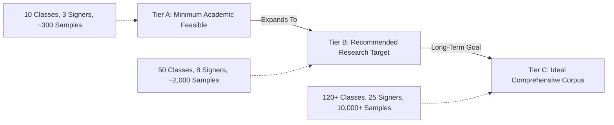

# 09. Supplementary Data Collection Protocol: SignTalk AI

**Document ID:** STAI-DOC-P1P1-009  
**Project Name:** SignTalk AI  
**Document Status:** Approved Research Specification (Phase 1 — Part 1)  

---

## 1. Rationale for Supplementary Data Collection

While public datasets (such as INCLUDE and ISL-CSLTR) provide an invaluable foundation, they present specific domain gaps when applied to real-time interactive systems:
1. **Domain-Specific Phrase Gaps:** Public corpora often emphasize general conversational vocabulary or school-curriculum terms, leaving critical emergency triage or specific civic counter phrases underrepresented.
2. **Environmental & Sensor Distribution Shift:** Lab-recorded videos feature pristine studio lighting and uniform solid backgrounds, creating domain shift when an interactive webcam runs in cluttered rooms under fluorescent or uneven lighting.
3. **Continuous Co-articulation Transitions:** Additional recorded continuous transitions between target MVP vocabulary signs are needed to fine-tune sliding-window transition dynamics.

> [!NOTE]
> **Planning Target Declaration:** The sample sizes, signer counts, and repetition quotas specified below represent **planning and collection targets**. They do **not** represent completed, currently collected data.

---

## 2. Tiered Data Collection Targets

To ensure flexibility during project execution, data collection targets are defined across three realistic tiers:



| Dimension | Tier A: Minimum Feasible (Fallback) | Tier B: Recommended Target (Academic MVP) | Tier C: Ideal Research Scale |
| :--- | :--- | :--- | :--- |
| **Target Vocabulary Classes** | 15 core high-priority classes | **50 classes** (Full MVP vocabulary) | 120+ classes (Extended domain lexicon) |
| **Number of Unique Signers** | 3 independent participants | **6 to 8 signers** (including Deaf consultants) | 20 to 25 diverse signers |
| **Repetitions per Signer** | 5 repetitions per class | **8 to 10 repetitions per class** | 15 repetitions per class |
| **Total Target Samples** | $\approx 225$ video sequences | **$\approx 2,400$ to $4,000$ sequences** | $\ge 15,000$ sequences |
| **Continuous Phrase Sequences** | 30 continuous phrase clips | **150 continuous phrase clips** | 500+ continuous conversational dialogues |
| **Signer Gender Balance** | At least 1 male, 1 female | Balanced gender representation | Balanced gender and age distribution |
| **Hand Dominance** | Right-hand dominant only | Both right-handed and left-handed signers | Statistically balanced handedness |

---

## 3. Environmental and Operational Variation Protocol

To prevent deep models from latching onto background artifacts or single-signer quirks, recordings will systematically vary across eight operational axes:

1. **Background Environments:**
   - Solid / neutral backdrop (plain wall or curtain).
   - Typical indoor office / classroom environment (bookshelves, desk, natural interior).
   - Cluttered or dynamic indoor space (subtle background activity, varying furniture).
2. **Lighting Variations:**
   - Standard diffuse daylight (near window, indirect natural light).
   - High-intensity artificial fluorescent / LED office lighting.
   - Low-light / dim conditions ($\approx 150 - 200\text{ lux}$) to evaluate landmark degradation.
   - Directional side-lighting (creating partial facial/hand shadows).
3. **Camera Distances & Framing:**
   - Standard desktop distance ($0.6\text{ m} - 0.8\text{ m}$, typical laptop webcam distance; upper torso and head visible).
   - Extended counter distance ($1.2\text{ m} - 1.5\text{ m}$, standing counter setup; mid-torso to head visible).
4. **Camera Angles:**
   - Frontal eye-level ($0^\circ$ direct view).
   - Slight elevated angle ($+15^\circ$, standard laptop screen tilted back).
   - Slight lateral angle ($\pm 15^\circ$ off-center).
5. **Signing Velocities:**
   - Deliberate / instructional pace (clear articulation, slower transitions).
   - Natural conversational pace ($\approx 1.5 - 2.5\text{ signs/sec}$).
   - Rapid signing pace to test motion blur tolerance.
6. **Clothing Variations:**
   - Contrasting clothing (dark top against light background).
   - Low-contrast clothing (light top against light background).
   - Short-sleeved vs. long-sleeved garments (evaluating skin-tone segmentation resilience in MediaPipe).
7. **Intentional Physical Occlusions:**
   - Crossed-hand signs (e.g., bilateral signs where hands overlap in the 2D camera plane).
   - Partial face occlusions (hands passing directly across chin/mouth).
8. **Non-Manual Facial Expressiveness:**
   - Neutral baseline facial expression.
   - Natural linguistic facial markers (eyebrow raises during questions, head shakes during negation).

---

## 4. Metadata Schema & Recording Specification

Every collected video clip and corresponding extracted landmark sequence will be indexed with a machine-readable JSON/CSV manifest conforming to the schema below:

```json
{
  "$schema": "http://json-schema.org/draft-07/schema#",
  "title": "SignTalkAI_Recording_Metadata",
  "type": "object",
  "required": [
    "recording_id",
    "signer_id",
    "sign_id",
    "gloss_label",
    "continuous_phrase",
    "handedness",
    "lighting_condition",
    "background_type",
    "camera_distance_meters",
    "fps",
    "resolution",
    "consent_verified"
  ],
  "properties": {
    "recording_id": { "type": "string", "example": "REC_20261015_S03_C022_R04" },
    "signer_id": { "type": "string", "example": "SIGNER_03" },
    "sign_id": { "type": "integer", "minimum": 1, "maximum": 263, "example": 22 },
    "gloss_label": { "type": "string", "example": "HOSPITAL" },
    "is_continuous": { "type": "boolean", "example": false },
    "continuous_phrase": { "type": "string", "example": "I GO HOSPITAL TODAY" },
    "parallel_english_text": { "type": "string", "example": "I am going to the hospital today." },
    "handedness": { "type": "string", "enum": ["right", "left", "ambidextrous"], "example": "right" },
    "environment": { "type": "string", "enum": ["lab", "office", "classroom", "home"], "example": "classroom" },
    "lighting_condition": { "type": "string", "enum": ["natural_daylight", "fluorescent", "low_light", "side_lit"], "example": "fluorescent" },
    "background_type": { "type": "string", "enum": ["plain_neutral", "cluttered_office", "dynamic_indoor"], "example": "plain_neutral" },
    "camera_distance_meters": { "type": "number", "minimum": 0.4, "maximum": 3.0, "example": 0.8 },
    "camera_angle_degrees": { "type": "integer", "minimum": -45, "maximum": 45, "example": 0 },
    "signing_speed": { "type": "string", "enum": ["slow", "normal", "fast"], "example": "normal" },
    "video_format": { "type": "string", "example": "mp4" },
    "resolution": { "type": "string", "example": "1280x720" },
    "fps": { "type": "integer", "example": 30 },
    "total_frames": { "type": "integer", "example": 68 },
    "landmark_extracted": { "type": "boolean", "example": true },
    "landmark_file_path": { "type": "string", "example": "data/landmarks/REC_20261015_S03_C022_R04.parquet" },
    "consent_verified": { "type": "boolean", "example": true },
    "timestamp_utc": { "type": "string", "format": "date-time", "example": "2026-10-15T14:32:00Z" }
  }
}
```

---

## 5. Landmark Feature Storage Specification

Extracted landmarks will be saved directly in Apache Parquet or HDF5 format to eliminate video storage overhead:
- **Tensors:** Extracted array of shape $(T, N, D)$, where $T$ is the number of frames, $N = 93$ nodes (42 hand joints + 11 upper pose keypoints + 40 face points), and $D = 3$ $(x, y, z)$ coordinates.
- **Normalization:** Centered on the mid-shoulder anchor point with torso-length scaling applied prior to persistence.
