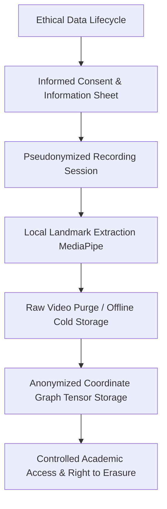

# 10. Data Ethics, Privacy, and Participant Consent: SignTalk AI

**Document ID:** STAI-DOC-P1P1-010  
**Project Name:** SignTalk AI  
**Document Status:** Approved Research Specification (Phase 1 — Part 1)  

---

## 1. Ethical Governance and Institutional Review

Because assistive AI research directly touches members of the Deaf and hard-of-hearing community and involves recording human physical and facial biometrics, SignTalk AI adheres to strict research ethics standards.

> [!IMPORTANT]
> **Regulatory Disclaimer:** The policies detailed herein represent academic research guidelines and engineering best practices. They do not constitute formal legal advice. Prior to commencing supplementary human participant recordings, the study protocol, informed consent forms, and data handling workflows must be formally reviewed and approved by the university **Institutional Ethics Committee (IEC)** or **Institutional Review Board (IRB)** in accordance with the Indian Council of Medical Research (ICMR) Ethical Guidelines and India's Digital Personal Data Protection (DPDP) Act.

---

## 2. Participant Informed Consent Protocol

No video recording, keypoint extraction, or user evaluation may take place without explicit, documented informed consent.

### 2.1 Accessible Communication of Consent
Standard complex legalistic forms are often inaccessible. In accordance with ethical norms for working with Deaf signers:
- An **ISL Video Information Sheet** presented by a fluent, certified ISL interpreter must accompany any written English or Hindi participant information document.
- Participants must be given adequate time to review the explanation, ask questions through an interpreter, and voluntarily decide whether to participate.
- Consent must be granular, allowing participants to opt-in or opt-out of specific components:
  1. *Consent for internal model training (mandatory for participation).*
  2. *Consent for publishing anonymized skeletal landmark traces in academic papers.*
  3. *Optional consent for displaying short demonstrative video clips in academic conference presentations.*

### 2.2 Freedom to Withdraw & Right to Erasure
Participants possess the unconditional right to withdraw from the research study at any time without providing a reason and without academic or financial penalty. Upon receiving a withdrawal request:
- All raw video recordings linked to the participant's pseudonymized ID (`signer_id`) will be permanently deleted from all storage media within 14 calendar days.
- If models have already been trained on aggregated landmark coordinates, the participant's individual records will be purged from all active training and testing splits for future model releases.

---

## 3. Data Ownership and Licensing

* **Participant Autonomy:** Participants retain personal rights over their identifiable biometric likeness. SignTalk AI obtains a non-exclusive, royalty-free, academic research license strictly for training, testing, and demonstrating the assistive platform.
* **Non-Commercial Commitment:** Research datasets generated under the SignTalk AI project will **not** be sold, licensed to advertising networks, or transferred to commercial brokers. Any subsequent academic release of supplementary data will be published under Creative Commons Non-Commercial licenses (e.g., CC BY-NC-SA 4.0).

---

## 4. Anonymization, Pseudonymization, and Biometric Protection

### 4.1 Pseudonymization Pipeline
- Direct personal identifiers (legal name, phone number, email, university enrollment number) must never appear in file names, directory structures, or dataset manifests.
- Each participant is assigned a randomly generated cryptographic pseudonym: `SIGNER_XX`.
- The master lookup key linking `signer_id` to the participant's identity and signed consent document is stored in an encrypted, password-protected volume accessible exclusively to the Faculty Project Guide and Principal Student Investigator.

### 4.2 Facial Data and Non-Manual Marker Privacy
Facial expressions provide indispensable grammatical information in Indian Sign Language (e.g., eyebrow position distinguishes polar questions from statements). However, full-resolution facial video constitutes sensitive personal biometric data.

To resolve this tension:
1. **Geometric Abstraction over Raw Pixels:** The computer vision pipeline rapidly converts raw video into abstract 3D $(x, y, z)$ spatial coordinates. The raw RGB video frame is discarded immediately from volatile memory after landmark extraction.
2. **Decoupled Facial Reconstruction:** Coordinate arrays representing 40 discrete points along the jawline, eyebrows, and lips cannot be readily reverse-engineered to reconstruct high-fidelity photorealistic facial portraits, providing an inherent mathematical layer of privacy.
3. **Selective Mesh Filtering:** Dense interior iris and iris-pupil tracking points (which carry sensitive ocular biometrics) are explicitly omitted from the landmark fusion tensor.

---

## 5. Storage, Retention, and Access Security

* **Local Storage Encryption:** All raw supplementary video footage collected during university recording sessions must reside on AES-256 encrypted drives with restricted multi-factor access.
* **Zero Public Cloud Exposure:** Raw participant recordings will never be uploaded to public Google Drive links, unauthenticated AWS S3 buckets, or public GitHub repositories.
* **Controlled Access:** Access to the training landmark files is granted solely to verified project team members who have signed confidentiality and research ethics agreements.
* **Retention Horizon:** Raw supplementary video assets will be slated for secure deletion three years after formal project completion and academic grading, while derived anonymous coordinate benchmark matrices may be retained indefinitely for reproducible academic verification.

---

## 6. Deaf Community Respect and Cultural Attribution

Sign languages are not merely communication tools; they are the living linguistic heritage and cultural identity of the Deaf community.

SignTalk AI commits to the following ethical principles:
- **Nothing About Us Without Us:** Actively seek feedback, evaluation, and guidance from Deaf ISL signers, special educators, and certified interpreters throughout the design, data collection, and evaluation phases.
- **Accurate Representation:** Avoid depicting sign language as "broken English" or an incomplete miming system. The system treats ISL as a complete, sovereign natural language with rich grammatical morphology.
- **Avoid Exaggerated Savior Tropes:** Frame SignTalk AI strictly as an assistive computational tool designed to bridge situational communication gaps, never as a technology that "cures" or "replaces" human Deaf identity.
