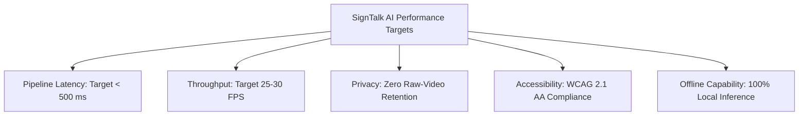

# 12. Non-Functional Requirements Specification: SignTalk AI

**Document ID:** STAI-DOC-P1P1-012  
**Project Name:** SignTalk AI  
**Document Status:** Approved Research Specification (Phase 1 — Part 1)  

---

## 1. Non-Functional Requirements Framework

Non-functional requirements (NFRs) specify the quantitative performance envelopes, security controls, accessibility standards, and operational constraints governing SignTalk AI.

> [!IMPORTANT]
> **Engineering Target Distinction:** In accordance with academic truthfulness, all metrics listed below represent **design targets, minimum acceptable thresholds, and stretch goals**. They do **not** represent measured empirical facts prior to formal benchmarking in Phase 2.

---

## 2. Quantitative Requirements Matrix

| Metric ID | Dimension | Minimum Acceptable Threshold | Nominal Engineering Target | Ambitious Stretch Goal | Measurement Protocol & Tooling |
| :---: | :--- | :--- | :--- | :--- | :--- |
| **NFR-001** | **End-to-End Latency** | $< 800\text{ ms}$ | **$< 500\text{ ms}$** | $< 300\text{ ms}$ | Wall-clock timer from final sign video frame ingestion to text caption render in UI. |
| **NFR-002** | **Frame Capture & Ingestion Latency** | $< 40\text{ ms}$ per frame | **$< 20\text{ ms}$ per frame** | $< 10\text{ ms}$ per frame | High-resolution timestamping of OpenCV/Webcam buffer read. |
| **NFR-003** | **Landmark Extraction Latency** | $< 70\text{ ms}$ per frame | **$< 40\text{ ms}$ per frame** | $< 25\text{ ms}$ per frame | MediaPipe Holistic CPU inference timer per frame. |
| **NFR-004** | **ST-GCN Graph Encoder Latency** | $< 150\text{ ms}$ per window | **$< 80\text{ ms}$ per window** | $< 40\text{ ms}$ per window | PyTorch forward pass duration on sliding window tensor $(C, T, N)$. |
| **NFR-005** | **Transformer Decoder Latency** | $< 250\text{ ms}$ per sentence | **$< 120\text{ ms}$ per sentence**| $< 70\text{ ms}$ per sentence | Autoregressive / beam-search token generation timer. |
| **NFR-006** | **UI Rendering Latency** | $< 60\text{ ms}$ | **$< 30\text{ ms}$** | $< 16\text{ ms}$ (60 Hz) | React DOM update & canvas paint duration. |
| **NFR-007** | **Inference Throughput (FPS)** | $\ge 15\text{ FPS}$ | **$\ge 25\text{ FPS}$** | $\ge 30\text{ FPS}$ | Measured sustained frame processing rate under active translation. |
| **NFR-008** | **Isolated Sign Accuracy (Top-1)** | $\ge 75.0\%$ | **$\ge 85.0\%$** | $\ge 92.0\%$ | Top-1 classification accuracy on held-out test split of INCLUDE-50. |
| **NFR-009** | **Continuous Translation BLEU-4** | $\ge 15.0\text{ BLEU}$ | **$\ge 25.0\text{ BLEU}$** | $\ge 35.0\text{ BLEU}$ | Standard bilingual evaluation understudy score on ISL-CSLTR held-out test set. |
| **NFR-010** | **Continuous Word Error Rate (WER)**| $\le 45.0\%$ | **$\le 30.0\%$** | $\le 20.0\%$ | Levenshtein word error rate on continuous sentence transcripts. |
| **NFR-011** | **Memory Footprint (RAM)** | $< 3.5\text{ GB}$ resident | **$< 2.0\text{ GB}$ resident** | $< 1.0\text{ GB}$ resident | Operating system process resident set size (RSS) during full active inference. |
| **NFR-012** | **CPU Utilization** | $\le 85\%$ across 4 cores | **$\le 60\%$ across 4 cores**| $\le 40\%$ across 4 cores | CPU thread utilization on standard Intel Core i5 / AMD Ryzen 5 processor. |

---

## 3. Qualitative Architectural Requirements

### 3.1 Privacy and Data Protection (NFR-013)
* **Target:** Zero transmission or retention of raw user video.
* **Specification:** All computer vision processing must operate in memory. Video frames read by OpenCV or browser Web APIs must never be written to temporary disk files, uploaded to cloud S3 buckets, or logged in system diagnostic files.
* **Compliance Verification:** Packet inspection (Wireshark) during an active translation session must confirm that only structured JSON/binary landmark coordinates and text strings traverse the network stack.

### 3.2 Security & Authentication (NFR-014)
* **Target:** Secure API communication and environment isolation.
* **Specification:** WebSocket endpoints and REST APIs must support TLS 1.3 (`wss://` and `https://`). System secrets, model paths, and API keys must be loaded exclusively via environment variables (`.env`), never hard-coded in git repositories. Input coordinate tensors must be validated against schema bounds to prevent buffer overflow attacks.

### 3.3 Accessibility Standards (NFR-015)
* **Target:** Compliance with WCAG 2.1 Level AA accessibility standards.
* **Specification:**
  - High-contrast visual palette: Caption text must maintain a minimum contrast ratio of $7:1$ against the background.
  - Font scalability: Captions must support scalable font sizing (minimum 24px default, scalable up to 48px) for comfortable reading at a distance of 1.5 meters.
  - Complete keyboard accessibility: All critical actions (Start, Stop, Mute, Clear History) must be fully navigable via keyboard shortcuts (`Spacebar`, `Esc`, `Tab`).
  - Zero auditory dependency: The system must never convey critical state or errors exclusively through auditory beeps or sound alerts.

### 3.4 Usability & Interaction Friction (NFR-016)
* **Target:** Zero onboarding friction; one-click translation startup.
* **Specification:** A first-time user must be able to initiate translation within 5 seconds of opening the web application (click "Start Session" $\rightarrow$ grant camera permission $\rightarrow$ live captions active).

### 3.5 Maintainability & Software Engineering Hygiene (NFR-017)
* **Target:** Fully reproducible, modular codebase.
* **Specification:** Code must adhere to PEP-8 standards for Python and ESLint/Prettier standards for TypeScript. Model architectures, training hyperparameters, and random seeds must be version-controlled using Git and configuration YAML files to guarantee reproducible academic results.

### 3.6 Offline Capability & Portability (NFR-018)
* **Target:** 100% self-contained local execution.
* **Specification:** The full system (frontend, backend, MediaPipe, ST-GCN, Transformer) must be packaged to execute entirely on a standalone workstation without internet connectivity. Containerization via Docker must be provided to guarantee identical execution across Windows, Linux, and macOS environments.
