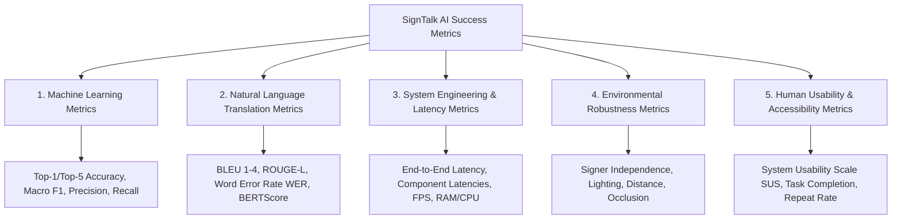

# 13. Comprehensive Success Metrics & Evaluation Protocols: SignTalk AI

**Document ID:** STAI-DOC-P1P1-013  
**Project Name:** SignTalk AI  
**Document Status:** Approved Research Specification (Phase 1 — Part 1)  

---

## 1. Evaluation Framework Overview

To ensure holistic academic evaluation, SignTalk AI establishes five orthogonal metric dimensions. No individual metric is analyzed in isolation; translation accuracy is evaluated strictly alongside latency budgets and environmental robustness.

> [!NOTE]
> **Benchmarking Declaration:** Target values represent pre-experimental performance objectives. Verified empirical results will populate these metrics during the Phase 2 experimental evaluation.

---

## 2. Machine Learning Metrics (Isolated & Segmental Recognition)

For evaluating the isolated sign classifier baseline, ST-GCN spatial feature encoder, and intermediate gloss predictions:

### 2.1 Top-1 and Top-k Classification Accuracy
$$\text{Top-1 Accuracy} = \frac{1}{N_{test}} \sum_{i=1}^{N_{test}} \mathbb{I}\left( \hat{y}_i^{(1)} = y_i \right)$$
$$\text{Top-5 Accuracy} = \frac{1}{N_{test}} \sum_{i=1}^{N_{test}} \mathbb{I}\left( y_i \in \hat{\mathbf{y}}_i^{(1:5)} \right)$$
* **Target (INCLUDE-50 Split):** Top-1 $\ge 85.0\%$, Top-5 $\ge 95.0\%$.

### 2.2 Precision, Recall, and Macro-Averaged F1-Score
Because sign classes exhibit varying frequency distributions, Macro F1 is enforced to penalize models that perform poorly on underrepresented signs:
$$\text{Precision}_c = \frac{TP_c}{TP_c + FP_c}, \quad \text{Recall}_c = \frac{TP_c}{TP_c + FN_c}$$
$$F1_c = \frac{2 \cdot \text{Precision}_c \cdot \text{Recall}_c}{\text{Precision}_c + \text{Recall}_c}$$
$$\text{Macro-F1} = \frac{1}{C} \sum_{c=1}^{C} F1_c$$
* **Target:** Macro-F1 $\ge 82.0\%$ across all supported vocabulary classes.

---

## 3. Translation & NLP Sequence Metrics

For evaluating the end-to-end continuous sign-to-text translation pipeline on continuous datasets (e.g., ISL-CSLTR):

### 3.1 BLEU Scores (Bilingual Evaluation Understudy)
Measures $n$-gram precision of predicted sentences against reference ground-truth translations, penalized for brevity:
$$\text{BLEU-}N = \text{BP} \cdot \exp\left( \sum_{n=1}^{N} w_n \log p_n \right)$$
$$\text{BP} = \begin{cases} 1 & \text{if } c > r \\ \exp(1 - r / c) & \text{if } c \le r \end{cases}$$
where $p_n$ is modified $n$-gram precision, $c$ is candidate length, and $r$ is reference length.
* **Target on ISL-CSLTR:**
  - BLEU-1: $\ge 45.0$
  - BLEU-2: $\ge 35.0$
  - BLEU-3: $\ge 28.0$
  - BLEU-4: $\ge 22.0$

### 3.2 ROUGE-L (Recall-Oriented Understudy for Gisting Evaluation)
Measures the Longest Common Subsequence (LCS) between the candidate translation and reference sentence, reflecting sentence-level structure retention:
$$R_{LCS} = \frac{\text{LCS}(\text{Ref}, \text{Cand})}{m}, \quad P_{LCS} = \frac{\text{LCS}(\text{Ref}, \text{Cand})}{n}$$
$$\text{ROUGE-L} = \frac{(1 + \beta^2) R_{LCS} P_{LCS}}{R_{LCS} + \beta^2 P_{LCS}}$$
* **Target:** ROUGE-L $\ge 40.0$.

### 3.3 Word Error Rate (WER)
Computes minimum edit distance (substitutions $S$, deletions $D$, insertions $I$) relative to total reference words $N_{ref}$:
$$\text{WER} = \frac{S + D + I}{N_{ref}} \times 100\%$$
* **Target:** Continuous sentence WER $\le 30.0\%$.

### 3.4 Semantic Similarity (BERTScore / Embedding Cosine Distance)
Measures semantic preservation even when lexical phrasing diverges slightly:
$$\text{BERTScore-}F1 = \text{Token-level cosine similarity computed over multilingual contextual embeddings}$$
* **Target:** Semantic BERTScore $\ge 0.80$.

---

## 4. System Engineering & Latency Metrics

To guarantee conversational usability, every stage of the real-time pipeline is bound to a strict latency budget:

| Pipeline Stage | Nominal Latency Target | Profiling Methodology | Hard Timeout Deadline |
| :--- | :--- | :--- | :--- |
| **1. Frame Ingestion & Buffer Read** | $\le 20\text{ ms}$ | High-resolution timestamping ($\Delta t = t_1 - t_0$) | $40\text{ ms}$ |
| **2. MediaPipe Landmark Extraction** | $\le 40\text{ ms}$ | `mediapipe.process()` CPU/GPU profiler | $70\text{ ms}$ |
| **3. Normalization & Graph Assembly** | $\le 10\text{ ms}$ | NumPy / PyTorch tensor creation timer | $20\text{ ms}$ |
| **4. ST-GCN Spatial-Temporal Forward Pass** | $\le 80\text{ ms}$ | `torch.cuda.Event` / PyTorch CPU profiler | $150\text{ ms}$ |
| **5. Transformer Autoregressive Decoding** | $\le 120\text{ ms}$ | Beam search / greedy decoding timer | $200\text{ ms}$ |
| **6. WebSocket Transport & UI Canvas Paint**| $\le 30\text{ ms}$ | Browser performance API (`performance.now()`) | $50\text{ ms}$ |
| **Cumulative End-to-End Latency ($\tau_{e2e}$)** | **$\le 300 - 500\text{ ms}$** | Total wall-clock duration from physical sign to caption | **$< 800\text{ ms}$** |

### Additional Operational Metrics:
- **Sustained Throughput:** $\ge 25\text{ frames per second (FPS)}$ on local CPU without frame dropping.
- **Process Memory Footprint:** $\le 2.0\text{ GB}$ peak resident RAM on host workstation.
- **CPU Utilization:** $\le 60\%$ average load across 4 threads on Intel i5 / AMD Ryzen 5 hardware.

---

## 5. Robustness & Generalization Metrics

Robustness is assessed by measuring the percentage relative performance drop ($\Delta_{perf}$) under stressed conditions compared to optimal baseline conditions:

$$\Delta_{perf} = \frac{\text{Metric}_{baseline} - \text{Metric}_{stressed}}{\text{Metric}_{baseline}} \times 100\%$$

| Stress Dimension | Test Condition | Minimum Acceptable Retention Target |
| :--- | :--- | :--- |
| **Signer Independence** | Evaluating on signers unseen during training ($k$-fold signer-independent split) | Accuracy / BLEU degradation $\le 15\%$ |
| **Low Lighting** | Illumination reduced to $150\text{ lux}$ | Accuracy degradation $\le 20\%$ |
| **Camera Distance** | Distance shifted from $0.7\text{ m}$ to $1.5\text{ m}$ | Accuracy degradation $\le 10\%$ (Guaranteed by normalization) |
| **Signing Speed** | Rapid signing pace ($> 3.0\text{ signs/sec}$) | Accuracy degradation $\le 25\%$ |
| **Partial Occlusion** | Bilateral crossing hand gestures | Accuracy degradation $\le 18\%$ |

---

## 6. User Experience & Usability Metrics

Evaluated during controlled user trials involving both Deaf signers and hearing non-signers:

1. **System Usability Scale (SUS):** 10-question standardized usability instrument.
   * **Target:** Average SUS score $\ge 75$ (Classified as "Good" to "Excellent").
2. **Task Completion Rate (TCR):** Percentage of participants who successfully transmit a 3-sentence medical triage query without human intervention.
   * **Target:** $\ge 85\%$ successful task completion.
3. **Communication Repeat Rate:** Percentage of phrases requiring a signer repetition due to low-confidence flags.
   * **Target:** $\le 15\%$ repetition rate under normal indoor lighting.
