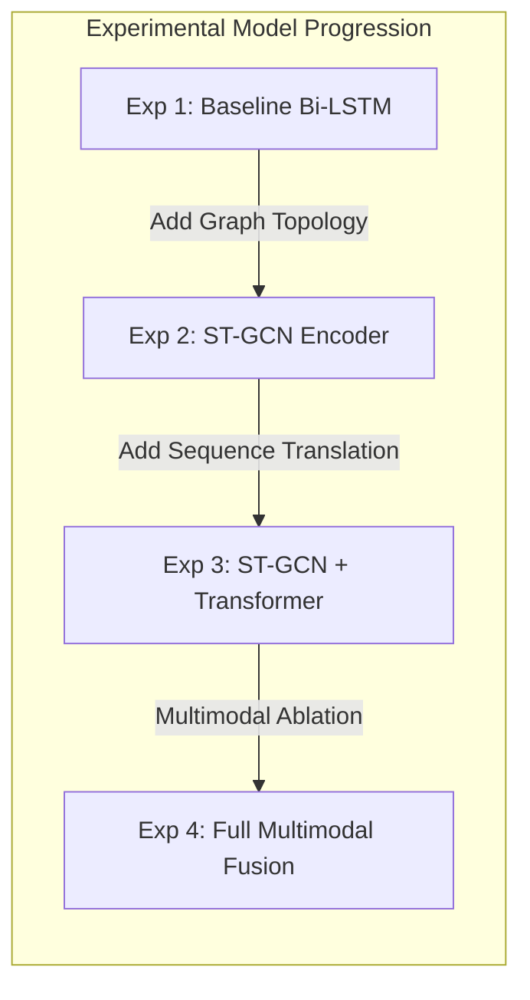

# 14. Baseline and Experimental Strategy: SignTalk AI

**Document ID:** STAI-DOC-P1P1-014  
**Project Name:** SignTalk AI  
**Document Status:** Approved Research Specification (Phase 1 — Part 1)  

---

## 1. Experimental Methodology Overview

In rigorous academic research, advanced deep architectures cannot be asserted as superior without systematic empirical comparison against well-defined baselines. 

SignTalk AI establishes a four-stage experimental progression:
1. **Stage 1 (Baseline Benchmarks):** Flattened landmark feature classification using MLP and Bi-LSTM models.
2. **Stage 2 (Spatial-Temporal Graph Convolution):** Evaluating ST-GCN against non-graph sequence baselines to isolate the contribution of skeletal graph topology.
3. **Stage 3 (Hybrid Graph-Transformer Translation):** Coupling the ST-GCN encoder with a Transformer sequence decoder for continuous sign-to-text translation.
4. **Stage 4 (Multimodal Ablation Analysis):** Quantifying the precise empirical impact of adding upper-body pose and facial non-manual keypoints to hand landmarks.

> [!IMPORTANT]
> **Zero Fabricated Results Policy:** In compliance with project integrity guidelines, all numerical result cells in the experimental matrices below are marked `[To Be Benchmarked in Phase 2]`. No synthetic or speculative numbers are reported.

---

## 2. Model Architecture Progression

### Experiment 1: Baseline Sequence Models (Bi-LSTM & GRU)
* **Architecture:** 
  - Input: Flattened landmark coordinate vector $\mathbf{x}_t \in \mathbb{R}^{D_{flat}}$ per frame over window $T = 45$.
  - Backbone: 2-layer Bidirectional LSTM with hidden dimension $d_h = 256$ and dropout $p = 0.3$.
  - Output Head: Linear classification layer mapped to vocabulary classes with cross-entropy loss.
* **Hypothesis:** Bi-LSTM captures temporal dynamics but struggles with complex inter-joint spatial hierarchies because physical bone connectivity is flattened into an unstructured 1D vector.

### Experiment 2: Spatial-Temporal Graph Convolutional Network (ST-GCN)
* **Architecture:**
  - Input: Skeletal landmark graph tensor $\mathbf{X} \in \mathbb{R}^{C \times T \times N}$ ($C=3, T=45, N=53$).
  - Graph Topology: Biological kinematic adjacency matrix $\mathbf{A} \in \mathbb{R}^{N \times N}$ with self-loops.
  - Backbone: 6 ST-GCN blocks (spatial graph convolution followed by temporal convolution) with residual connections.
  - Output Head: Global average pooling over nodes and time, followed by a linear classification head.
* **Hypothesis:** Preserving spatial bone connectivity via graph convolution provides a strong inductive bias that improves top-1 classification accuracy and reduces overfitting on small sign datasets.

### Experiment 3: ST-GCN Encoder + Transformer Translation Decoder
* **Architecture:**
  - Input: Continuous signing video sequences mapped to spatial-temporal sliding windows.
  - Encoder: ST-GCN backbone producing continuous latent representations $\mathbf{H} \in \mathbb{R}^{T' \times d_{model}}$.
  - Decoder: 3-layer autoregressive Transformer decoder with multi-head cross-attention ($n_{heads} = 4, d_{model} = 256, d_{ff} = 1024$).
  - Target: Natural-language English token sequences trained with smoothed cross-entropy loss.
* **Hypothesis:** Coupling graph-level motion representations with self-attention language decoding produces grammatically fluent sentences, outperforming gloss-concatenation approaches.

### Experiment 4: Multimodal Input & Dynamic Graph Fusion
* **Architecture:**
  - Input: Complete multimodal keypoint graph combining hands (42 nodes), upper body (11 nodes), and facial markers (40 nodes).
  - Graph Construction: Learnable adaptive adjacency matrix $\mathbf{A}_{learned} = \mathbf{A}_{kinematic} + \mathbf{M} \odot \mathbf{B}$, where $\mathbf{B}$ is a data-driven adjacency parameter and $\mathbf{M}$ is a learnable mask.
* **Hypothesis:** Adding non-manual facial markers resolves ambiguities between interrogative and declarative sentences, while adaptive adjacency captures non-physical correlations (e.g., hand approaching mouth).

---

## 3. Systematic Modality Ablation Matrix

To isolate the specific marginal benefit of each anatomical feature group, four ablation configurations will be evaluated under identical training hyperparameters on the continuous benchmark:

| Ablation ID | Hand Landmarks (Left + Right) | Upper-Body Pose Keypoints | Filtered Facial Non-Manual Markers | Total Graph Nodes ($N$) | Theoretical Justification |
| :---: | :---: | :---: | :---: | :---: | :--- |
| **Ablation A** | Yes (21 + 21 = 42 joints) | No (0 joints) | No (0 points) | **42 nodes** | Pure manual articulator baseline. Tests recognition relying solely on finger flexion and hand shape. |
| **Ablation B** | Yes (42 joints) | Yes (11 upper keypoints) | No (0 points) | **53 nodes** | Incorporates spatial anchors (wrists, elbows, shoulders, neck). Distinguishes signs executed at head vs. chest. |
| **Ablation C** | Yes (42 joints) | Yes (11 keypoints) | Yes (40 filtered points) | **93 nodes** | Full multimodal pipeline. Incorporates eyebrow motion, mouth shapes, and head tilts for grammatical modulation. |
| **Ablation D** | Yes (42 joints) | Yes (11 keypoints) | Yes (40 filtered points) | **93 nodes** + Adaptive Adjacency | Full multimodal graph equipped with learnable inter-modality cross-attention edges. |

---

## 4. Master Experimental Results Ledger (Template)

This standardized ledger will be populated during Phase 2 benchmarking on the held-out test splits of INCLUDE-50 and ISL-CSLTR:

| Exp ID | Model Architecture | Modality Configuration | Input Dim $(C, T, N)$ | Top-1 Accuracy (%) | Top-5 Accuracy (%) | BLEU-4 Score | Sentence WER (%) | Inference Latency (ms) | Peak RAM (MB) | Empirical Verification Status |
| :---: | :--- | :---: | :---: | :---: | :---: | :---: | :---: | :---: | :---: | :---: |
| **EXP-01** | Baseline MLP (Flattened) | Hand Only (A) | $(1, 45, 126)$ | *Pending* | *Pending* | N/A (Isolated) | N/A | *Pending* | *Pending* | To Be Benchmarked in Phase 2 |
| **EXP-02** | Baseline Bi-LSTM | Hand Only (A) | $(1, 45, 126)$ | *Pending* | *Pending* | N/A (Isolated) | N/A | *Pending* | *Pending* | To Be Benchmarked in Phase 2 |
| **EXP-03** | Baseline Bi-LSTM | Hand + Body (B) | $(1, 45, 159)$ | *Pending* | *Pending* | N/A (Isolated) | N/A | *Pending* | *Pending* | To Be Benchmarked in Phase 2 |
| **EXP-04** | ST-GCN (Kinematic Graph) | Hand Only (A) | $(3, 45, 42)$ | *Pending* | *Pending* | N/A (Isolated) | N/A | *Pending* | *Pending* | To Be Benchmarked in Phase 2 |
| **EXP-05** | ST-GCN (Kinematic Graph) | Hand + Body (B) | $(3, 45, 53)$ | *Pending* | *Pending* | N/A (Isolated) | N/A | *Pending* | *Pending* | To Be Benchmarked in Phase 2 |
| **EXP-06** | ST-GCN (Kinematic Graph) | Hand + Body + Face (C) | $(3, 45, 93)$ | *Pending* | *Pending* | N/A (Isolated) | N/A | *Pending* | *Pending* | To Be Benchmarked in Phase 2 |
| **EXP-07** | ST-GCN + Transformer | Hand + Body (B) | $(3, 45, 53)$ | *Pending* | *Pending* | *Pending* | *Pending* | *Pending* | *Pending* | To Be Benchmarked in Phase 2 |
| **EXP-08** | ST-GCN + Transformer | Hand + Body + Face (C) | $(3, 45, 93)$ | *Pending* | *Pending* | *Pending* | *Pending* | *Pending* | *Pending* | To Be Benchmarked in Phase 2 |
| **EXP-09** | Adaptive ST-GCN + Transformer | Full Multimodal (D) | $(3, 45, 93)$ | *Pending* | *Pending* | *Pending* | *Pending* | *Pending* | *Pending* | To Be Benchmarked in Phase 2 |

---

## 5. Experimental Controls & Reproducibility Protocol

To ensure academic reproducibility:
1. **Fixed Random Seeds:** All experiments will initialize with fixed pseudo-random seeds (`torch.manual_seed(42)`, `numpy.random.seed(42)`).
2. **Stratified Signer-Independent Splits:** Training, validation, and test splits will be strictly partitioned by `signer_id` to guarantee that the test set evaluates generalization to unseen signers.
3. **Data Leakage Prevention:** Normalization parameters (mean, standard deviation, bounding boxes) will be computed exclusively on the training split and applied transitively to validation and test sets.
4. **Checkpoint Versioning:** Model checkpoints, training loss curves, and tensorboard logs will be archived with git commit hashes in a structured experiment tracking registry.
