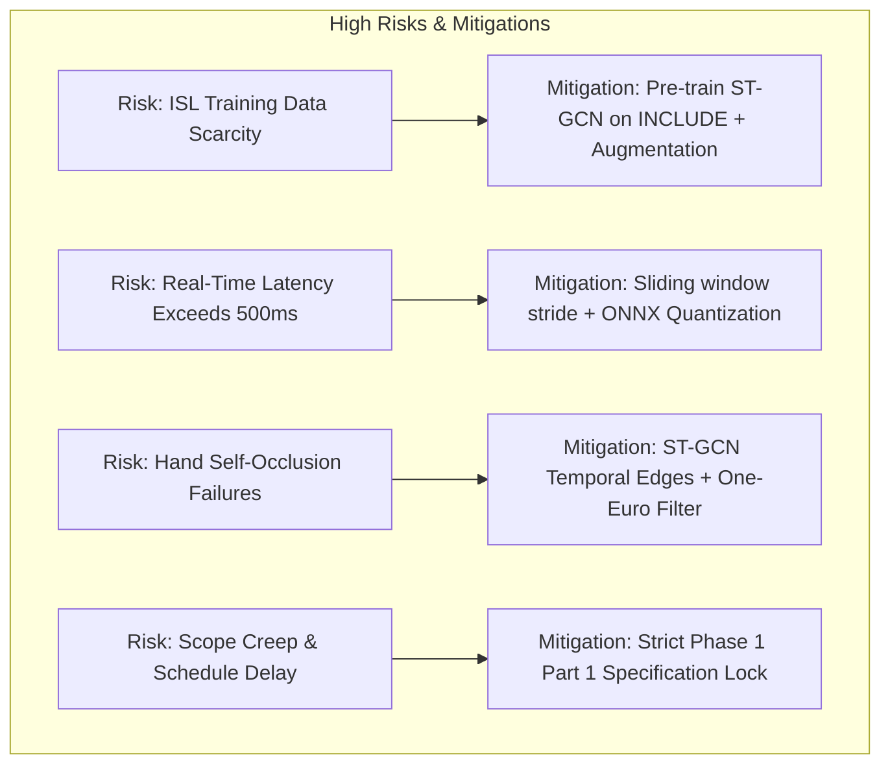

# 15. Assumptions, Constraints, and Risk Management: SignTalk AI

**Document ID:** STAI-DOC-P1P1-015  
**Project Name:** SignTalk AI  
**Document Status:** Approved Research Specification (Phase 1 — Part 1)  

---

## 1. Project Assumptions

The architecture and engineering plan of SignTalk AI rest upon explicit operational and environmental assumptions. Documenting these assumptions ensures transparent project evaluation and establishes clear boundary conditions under which the system is expected to operate.

| ID | Operational Assumption | Technical Context | Potential Impact if Invalidated | Mitigation Strategy |
| :---: | :--- | :--- | :--- | :--- |
| **ASM-01** | **Single Primary Signer Framing** | The user interacts in front of the camera as the sole active signer within the designated interaction cone. | Presence of multiple moving individuals in the background could cause landmark detection jitter or tracking collisions. | Implement a spatial bounding-box anchor that locks tracking onto the largest centrally positioned human torso in the visual field. |
| **ASM-02** | **Adequate Ambient Illumination** | The operational environment provides standard indoor ambient lighting ($\ge 200\text{ lux}$), typical of offices, clinics, and classrooms. | Extreme low light or heavy backlighting degrades MediaPipe landmark confidence and introduces coordinate noise. | Include a real-time visual illumination monitor that warns the user: *"Lighting is too dim for accurate tracking"* before processing. |
| **ASM-03** | **Unobstructed Upper-Body Framing** | The user is positioned between $0.5\text{ m}$ and $1.5\text{ m}$ from the camera with their head, torso, and hands fully within the field of view. | Hands moving outside the camera frame during signing causes truncated landmark sequences and lost signs. | Display an interactive framing guide on the camera preview during session initialization. |
| **ASM-04** | **Reliability of Public ISL Annotations** | Published academic datasets (INCLUDE, ISL-CSLTR, ISLTranslate) have consistent gloss labels and verified video alignments. | Label noise or misalignments in the training set degrades model convergence and translation metrics. | Conduct automated programmatic screening and manual spot-checking on a 10% stratified sample of dataset annotations before training. |
| **ASM-05** | **MediaPipe Coordinate Stability** | MediaPipe Holistic produces mathematically stable, continuous $(x, y, z)$ keypoints across consecutive 30 FPS video frames under normal signing velocities. | High-speed rapid motions could introduce inter-frame coordinate jitter or temporal tracking loss. | Apply a lightweight One-Euro temporal filter or moving-average smoothing filter on raw extracted keypoints before graph assembly. |

---

## 2. Technical and Operational Constraints

SignTalk AI operates under well-defined hardware, linguistic, academic, and computational constraints:

| ID | Constraint Category | Detailed Specification | Risk Level | Direct Engineering Impact | Strategic Mitigation |
| :---: | :--- | :--- | :---: | :--- | :--- |
| **CON-01** | **Dataset Scarcity & Low Resource** | Publicly available continuous ISL datasets are small ($\approx 700$ to $31,000$ sentences) compared to ASL or spoken language translation corpora. | **High** | Risk of model overfitting, limited linguistic coverage, and brittle sequence decoding. | Use topological ST-GCN inductive bias, data augmentation (temporal scaling, coordinate rotation, joint jittering), and transfer learning from isolated INCLUDE pretraining. |
| **CON-02** | **Compute & Hardware Budgets** | Academic workstation compute is constrained to single consumer GPUs (e.g., NVIDIA RTX 3060 / 4060) or multi-core local CPUs. | **Medium** | Inability to train massive multi-billion parameter foundation models or heavy 3D-CNNs. | Rely on lightweight landmark graphs ($< 100$ nodes) rather than raw video pixels; design compact ST-GCN ($< 3\text{M}$ parameters) and 3-layer Transformer. |
| **CON-03** | **Academic Project Timelines** | Final deliverables, documentation, and evaluation must complete within the university academic calendar deadlines. | **High** | Scope creep could jeopardize project completion and comprehensive evaluation. | Enforce strict phase boundaries; lock MVP vocabulary to 50 classes for Phase 1/2; defer non-essential features (e.g., 3D avatars) to Future Scope. |
| **CON-04** | **Complex Joint Self-Occlusions** | Natural signing frequently involves crossed hands, hands touching the face, or one hand occluding the other relative to a monocular 2D lens. | **High** | Temporary disappearance of finger landmarks during overlapping signs. | Utilize temporal graph edges in ST-GCN to propagate historical kinematic trajectory priors across occluded frames; use hand visibility flags. |
| **CON-05** | **Regional Dialect Variation** | Indian Sign Language exhibits regional lexical variations across Northern, Southern, and Western India. | **Medium** | Model trained on Chennai signers (INCLUDE) may exhibit reduced accuracy on Northern ISL variants. | Standardize vocabulary choices against the official national ISLRTC dictionary and explicitly document geographical dataset origins. |
| **CON-06** | **Latency vs. Accuracy Trade-Off** | Real-time conversational constraints require end-to-end processing times $< 500\text{ ms}$. | **High** | Complex beam-search decoding and large ensemble models cause latency budget overruns. | Deploy greedy decoding or narrow beam search ($k=3$); quantize models to FP16/INT8 via ONNX runtime for production serving. |

---

## 3. Comprehensive Risk Mitigation Matrix

### Risk R-01: Insufficient Continuous ISL Data for Transformer Generalization
- **Probability:** High | **Impact:** High | **Severity Score:** Critical (Red)
- **Root Cause:** Continuous sentence translation requires substantial parallel video-text pairs to learn attention weights.
- **Action Plan:** 
  1. Leverage the verified Mendeley ISL-CSLTR continuous dataset (700 sentences) as the primary academic continuous benchmark.
  2. Implement a two-stage training scheme: Pretrain the ST-GCN spatial-temporal feature extractor on the larger isolated INCLUDE dataset (4,287 videos), then freeze or fine-tune lower layers during continuous Transformer translation training.
  3. Apply synthetic temporal stitching (concatenating isolated signs with transition smoothing) to augment continuous training data.

### Risk R-02: Pipeline Latency Exceeds the 500 ms Conversational Budget
- **Probability:** Medium | **Impact:** High | **Severity Score:** High (Amber)
- **Root Cause:** Cumulative delay across frame capture, MediaPipe inference, graph tensor formatting, ST-GCN forward pass, and autoregressive text generation.
- **Action Plan:**
  1. Decouple landmark extraction into a client-side Web Worker or asynchronous process.
  2. Adjust the temporal sliding window stride from $S=1$ to $S=5$ or $S=10$ frames, executing heavy translation decoding only every $150-300\text{ ms}$.
  3. Convert PyTorch model weights to ONNX Runtime format with INT8 quantization, reducing inference latency by $2\times - 3\times$.

### Risk R-03: MediaPipe Tracking Failure Under Hand Occlusions
- **Probability:** High | **Impact:** Medium | **Severity Score:** High (Amber)
- **Root Cause:** When hands overlap in monocular 2D space, MediaPipe can swap left/right hand identity or lose finger joint positions.
- **Action Plan:**
  1. Implement a temporal track manager that preserves joint momentum across brief occlusions ($1 - 3$ frames).
  2. Maintain separate left and right kinematic subgraphs linked to their respective wrist anchors to prevent identity flipping.
  3. Mark low-confidence frames with a dedicated occlusion mask tensor fed directly into the ST-GCN model.
