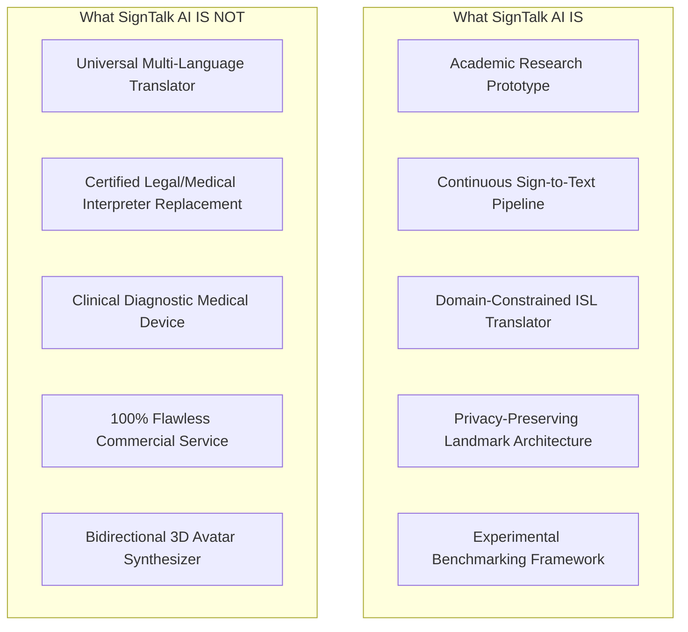

# 16. Project Boundaries and "Do Not Claim" Protocols: SignTalk AI

**Document ID:** STAI-DOC-P1P1-016  
**Project Name:** SignTalk AI  
**Document Status:** Approved Research Specification (Phase 1 — Part 1)  

---

## 1. Defining Project Boundaries

In academic and applied AI research, the boundaries of what a system **is not** are just as critical as the definition of what it is. Overclaiming capabilities undermines scientific credibility, creates false expectations for vulnerable communities, and introduces dangerous clinical or legal liabilities.

SignTalk AI is an academic research platform and assistive proof-of-concept. It operates within carefully demarcated technical and ethical boundaries:

---

## 2. Explicit Boundary Statements: What SignTalk AI is NOT

### 1. Not a Universal Translator for All Global Sign Languages
SignTalk AI is engineered specifically for **Indian Sign Language (ISL)**. It does not understand American Sign Language (ASL), British Sign Language (BSL), Australian Sign Language (Auslan), or French Sign Language (LSF). The system must never be demonstrated or marketed as a universal sign language translator.

### 2. Not an Open-Vocabulary or Unrestricted ISL Engine
Indian Sign Language possesses a vast, dynamic lexicon of over 10,000 signs with diverse regional dialect variations across India. The academic prototype operates strictly within a curated domain vocabulary (50-class MVP). It will not recognize arbitrary, out-of-vocabulary signs, slang, or regional signs outside its documented training distributions.

### 3. Not a Replacement for Certified Professional Interpreters
The platform is designed to provide assistive support in everyday, transitional, or triage contexts where human interpreters are entirely unavailable. It does **not** replace certified legal, judicial, or specialized medical interpreters required by law or institutional compliance protocols (e.g., in courtroom testimony or surgical consent procedures).

### 4. Not an Autonomous Medical Diagnostic or Triage Decision System
While healthcare triage phrases (e.g., "chest pain", "fever", "allergy") are evaluated as a primary use case, SignTalk AI translates linguistic communication only. It does not provide medical diagnoses, suggest pharmacology, evaluate symptom severity, or direct clinical care.

### 5. Not a Hard-Real-Time Certified Emergency Dispatch System
The system is an experimental prototype. While it targets conversational latencies under 500 ms, it does not possess formal life-safety fail-safe certifications (e.g., ISO 13485 or IEC 62304) required for mission-critical 911/112 emergency dispatch infrastructure.

### 6. Not a Bidirectional Speech-to-Sign Avatar Platform
The scope of SignTalk AI is strictly unidirectional: **Visual Sign $\rightarrow$ Natural-Language Text**. It does not convert spoken or written English back into animated 3D sign language avatars or synthetic gestural video.

---

## 3. Authoritative "Do Not Claim" Reference Guide

*(Mandatory compliance guidelines for all project presentations, project synopses, viva defenses, and research publications)*

| Category | Forbidden Inaccurate Claim | Mandated Truthful Formulation | Rationale & Academic Defense |
| :--- | :--- | :--- | :--- |
| **Language Scope** | *"Our platform translates any sign language in the world into text."* | *"SignTalk AI focuses specifically on Indian Sign Language (ISL) within a curated domain vocabulary."* | Global sign languages have completely independent grammars and vocabularies. |
| **Vocabulary Coverage**| *"The system can translate complete, unrestricted Indian Sign Language."* | *"The academic MVP evaluates a 50-class core vocabulary focused on triage, greetings, and emergency phrases."* | Claiming full lexical coverage is impossible on current public ISL datasets. |
| **Translation Accuracy**| *"SignTalk AI translates sign language with 98% (or 100%) accuracy."* | *"The target classification accuracy is $\ge 85\%$ on INCLUDE-50 and target BLEU-4 is $\ge 22.0$ on ISL-CSLTR, subject to formal Phase 2 benchmarking."* | No model achieves 100% accuracy on continuous natural signing; fabricating metrics violates academic integrity. |
| **Latency Performance**| *"Our system has zero latency and runs instantaneously."* | *"The architecture targets an end-to-end latency bound under 500 ms, which will be profiled across hardware configurations."* | Every physical computation has measurable latency; targets must be experimentally verified. |
| **Deployment State** | *"The platform is deployed and currently in active use across Indian hospitals and banks."* | *"The system is an academic research prototype evaluated in controlled laboratory and simulation environments."* | Falsely claiming enterprise deployment is an academic integrity violation. |
| **Interpreter Role** | *"This AI makes human sign language interpreters obsolete."* | *"The tool serves as an assistive bridge for routine communication when certified human interpreters are unavailable."* | Technology cannot replace the nuanced cultural and ethical expertise of certified interpreters. |
| **Biometric Privacy** | *"We send webcam video to cloud servers for state-of-the-art vision processing."* | *"We extract geometric coordinate landmarks locally on client runtimes; raw video frames are never stored or transmitted."* | Transmitting raw biometric video compromises user privacy and violates ethical protocols. |
