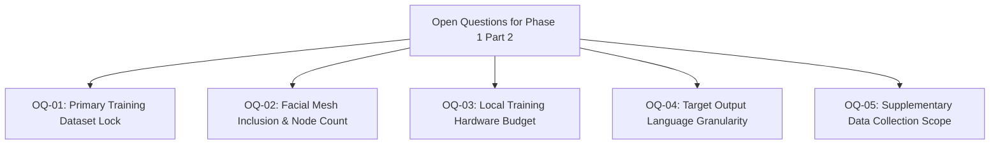

# 17. Open Questions and Pre-Phase 1 Part 2 Decision Matrix: SignTalk AI

**Document ID:** STAI-DOC-P1P1-017  
**Project Name:** SignTalk AI  
**Document Status:** Approved Research Specification (Phase 1 — Part 1)  

---

## 1. Overview of Open Architectural Questions

Before transitioning to **Phase 1 — Part 2: Technical Design & Architecture Specification**, specific engineering and empirical decisions must be formally finalized. To avoid unverified assumptions, these items are tracked as **Open Questions**.

For each question, this document details the engineering impact, evaluated options, recommended decision criteria, and the precise empirical information required from the faculty advisor, project team, or laboratory environment.

---

## 2. Detailed Decision Matrix

### OQ-01: Primary Continuous Dataset Selection Lock
* **Why It Matters:** Determines the vocabulary classes, sentence structures, and tensor dimensions for model training. Changing datasets mid-development causes complete retraining and restructuring of preprocessing pipelines.
* **Evaluated Options:**
  - *Option A:* Combine **INCLUDE-50** (isolated, 50 classes) for spatial-temporal graph pretraining with **ISL-CSLTR** (continuous, 700 sentences) for sequence-to-text fine-tuning.
  - *Option B:* Rely exclusively on the **ISLTranslate** corpus (~31,000 video-sentence pairs from IIT Kanpur).
  - *Option C:* Train exclusively on internally recorded supplementary data.
* **Recommended Decision Criteria:** If local training hardware is limited to consumer laptops with $< 8\text{ GB}$ GPU VRAM, choose **Option A** due to lightweight storage and guaranteed open license (CC BY 4.0). If academic cluster compute with $\ge 24\text{ GB}$ VRAM is approved, adopt **Option B**.
* **Required Information to Finalize:** Confirmation of institutional compute allocation and verification of download access to ISLTranslate repository.

---

### OQ-02: Facial Landmark Topology Scope (Salient Subset vs. Dense Mesh vs. None)
* **Why It Matters:** Non-manual markers (eyebrows, mouth) carry vital ISL grammatical cues, but MediaPipe Face Mesh extracts 468 landmarks per frame. Passing 468 nodes into an ST-GCN increases graph adjacency matrix computation by $16\times$, causing severe latency spikes on CPUs.
* **Evaluated Options:**
  - *Option A (Salient 40-Point Subset):* Extract only eyebrows (8 points), eyes (8 points), outer lips (16 points), and jawline (8 points). Total graph nodes $N = 42 \text{ (hands)} + 11 \text{ (pose)} + 40 \text{ (face)} = 93$ nodes.
  - *Option B (Hands + Pose Only):* Zero facial points ($N = 53$ nodes). Eliminates facial tracking compute entirely.
  - *Option C (Dense Mesh):* Full 468 facial mesh nodes ($N = 521$ nodes).
* **Recommended Decision Criteria:** Implement **Option A** for the primary architecture. Benchmark inference latency on CPU: If landmark extraction exceeds $50\text{ ms}$, fall back immediately to **Option B**.
* **Required Information to Finalize:** Empirical benchmark of MediaPipe Holistic CPU inference time on the project development machine.

---

### OQ-03: Local Hardware Acceleration Specification
* **Why It Matters:** Direct model architecture choices (hidden dimensions, ST-GCN layer depth, Transformer attention heads, and batch size) are constrained by available GPU memory.
* **Evaluated Options:**
  - *Option A:* NVIDIA Dedicated GPU (RTX 3060 / 4060 / 4070 Laptop or Desktop) with CUDA support.
  - *Option B:* Apple Silicon (MPS acceleration via M1/M2/M3).
  - *Option C:* Pure CPU execution (Intel Core i5/i7 or AMD Ryzen) requiring ONNX runtime CPU optimization.
* **Recommended Decision Criteria:** The model architecture must be designed to train on **Option A** (or Google Colab Pro GPU) but must evaluate and deploy locally on **Option C** with $< 500\text{ ms}$ latency via ONNX quantization.
* **Required Information to Finalize:** Explicit confirmation of development workstation hardware specifications from the user.

---

### OQ-04: Target Translation Language Scope (English Only vs. English + Hindi)
* **Why It Matters:** Affects tokenizer vocabulary size, embedding layer dimensions, and BLEU evaluation metrics.
* **Evaluated Options:**
  - *Option A:* English text captions exclusively for initial academic release.
  - *Option B:* Dual English and Hindi (Devanagari script) parallel translation heads.
  - *Option C:* English captions with a secondary rule-based or MarianMT translation service into Hindi.
* **Recommended Decision Criteria:** Adopt **Option A** for Phase 1 and Phase 2 core evaluation. English parallel corpora (ISL-CSLTR and ISLTranslate) have established academic benchmarks. Implement Option C as an optional frontend display setting without complicating the core sign-to-text sequence model.
* **Required Information to Finalize:** Academic review panel preference on whether multilingual output is required for final project grading.

---

### OQ-05: Supplementary Data Collection Necessity and Scope
* **Why It Matters:** Institutional ethical review, participant recruitment, and recording sessions require 3–4 weeks of lead time.
* **Evaluated Options:**
  - *Option A:* Purely rely on verified public datasets (INCLUDE-50 + ISL-CSLTR) for academic defense; collect zero supplementary human video.
  - *Option B (Target Tier B):* Conduct controlled supplementary recordings with 6–8 signers for the 50 MVP vocabulary classes to create a localized test and demonstration set.
  - *Option C (Minimal Fallback Tier A):* Record a minimal validation set of 15 high-priority triage signs with 3 signers to demonstrate live webcam robustness.
* **Recommended Decision Criteria:** If public dataset access and splits are verified and operational by Phase 1 Part 2 kickoff, proceed with **Option C** as a demonstrative sanity check. If public continuous datasets have missing classes for healthcare triage, initiate **Option B**.
* **Required Information to Finalize:** Departmental Ethics Committee approval timeline and availability of native ISL signing participants.

---

## 3. Summary of Decision Ownership

| Question ID | Decision Topic | Designated Decision Maker | Blocking Milestone | Status |
| :---: | :--- | :--- | :--- | :--- |
| **OQ-01** | Primary Dataset Lock | Lead ML Engineer & Project Guide | Phase 1 Part 2 Kickoff | Pending Verification |
| **OQ-02** | Facial Landmark Node Subset | Computer Vision Lead | Landmark Module Prototype | Pending Benchmarking |
| **OQ-03** | Local Hardware Budget | Project Team | Pipeline Configuration Lock | Pending Verification |
| **OQ-04** | Target Language Granularity | Academic Panel / Team | Tokenizer Design | Recommended: English MVP |
| **OQ-05** | Supplementary Data Scope | Project Guide & Ethics Committee | Data Pipeline Lock | Pending Review |
