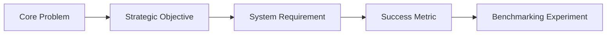

# Requirements Traceability Matrix: SignTalk AI

**Document ID:** STAI-DOC-P1P1-RTM-001  
**Project Name:** SignTalk AI  
**Document Status:** Approved Traceability Specification (Phase 1 — Part 1)  

---

## 1. Traceability Architecture

The Requirements Traceability Matrix (RTM) establishes bidirectional traceability across the entire engineering lifecycle of SignTalk AI:

$$\text{Identified Problem} \longrightarrow \text{Project Objective} \longrightarrow \text{Functional / Non-Functional Requirement} \longrightarrow \text{Evaluation Metric} \longrightarrow \text{Verification Experiment}$$

This guarantees that every software component and machine learning model directly addresses an authentic research challenge and is verified against measurable performance criteria.

---

## 2. Master Traceability Matrix

| Trace ID | Identified Real-World Problem | Strategic Project Objective | Linked Requirement(s) | Measurable Success Metric(s) | Verification Experiment / Test Protocol |
| :---: | :--- | :--- | :--- | :--- | :--- |
| **TR-01** | **Continuous Co-articulation:** Isolated models fail on fluid signing due to lack of movement transitions between signs. | Build a continuous temporal sign recognition model that interprets sliding multi-frame windows. | **FR-006** (Sliding Window) **FR-007** (ST-GCN) **NFR-007** ($\ge 25\text{ FPS}$) | Word Error Rate ($\text{WER} \le 30.0\%$) Continuous Top-1 Accuracy | **EXP-02 vs. EXP-05:** Compare Bi-LSTM baseline against ST-GCN on continuous ISL-CSLTR sequences. |
| **TR-02** | **Kinematic Topology Loss:** Flattening 3D coordinates into 1D vectors destroys skeletal bone connectivity. | Model the human signing body as an anatomical graph where joints are nodes and bones are edges. | **FR-002** (Hands) **FR-003** (Pose) **FR-007** (ST-GCN) | Top-1 Accuracy ($\ge 85.0\%$ on INCLUDE-50) Macro-F1 ($\ge 82.0\%$) | **EXP-01 vs. EXP-04:** Compare flattened coordinate MLP against ST-GCN spatial graph convolutions. |
| **TR-03** | **Grammar & Word Order Mismatch:** ISL follows Subject-Object-Verb (SOV) order; spoken English follows Subject-Verb-Object (SVO). | Implement an autoregressive Transformer decoder that translates continuous sign features into fluent natural language. | **FR-008** (Transformer Translation) **FR-009** (Live Captions) | BLEU-4 ($\ge 22.0$) ROUGE-L ($\ge 40.0$) BERTScore ($\ge 0.80$) | **EXP-05 vs. EXP-07:** Compare ST-GCN gloss output against full ST-GCN + Transformer text generation. |
| **TR-04** | **Grammatical Non-Manual Markers:** Facial expressions encode essential question-marking and negation in ISL. | Incorporate a lightweight, filtered facial landmark graph into the spatial-temporal model. | **FR-004** (Facial Markers) **FR-005** (Feature Fusion) | Question-vs-Statement Classification F1 BLEU-4 Gain | **Ablation Study (EXP-05 vs. EXP-06):** Benchmark Hand+Body graph against Hand+Body+Face multimodal graph. |
| **TR-05** | **Conversational Latency Friction:** High latency ($> 500\text{ ms}$) causes conversational collisions and breaks communication. | Engineer a streamlined pipeline satisfying a strict end-to-end latency budget under 500 ms. | **NFR-001** (Latency $< 500\text{ ms}$) **NFR-004** (ST-GCN $< 80\text{ ms}$) **NFR-005** (Transformer $< 120\text{ ms}$) | End-to-End Latency ($\tau_{e2e} \le 500\text{ ms}$) Processing FPS ($\ge 25\text{ FPS}$) | **System Profiling:** Profile end-to-end wall-clock latency across capture, landmark extraction, GCN, Transformer, and UI render. |
| **TR-06** | **Biometric Privacy Violation:** Uploading raw user video to cloud servers compromises patient and citizen privacy. | Enforce privacy-by-design by extracting skeletal coordinates locally and purging raw video frames immediately. | **FR-015** (Zero Video Storage) **NFR-013** (Local Privacy) **NFR-018** (Offline Viability) | Network packet capture confirming zero video payload ($< 50\text{ KB/s}$ landmark payload only) | **Security Audit:** Wireshark network inspection during an active session to verify zero image/video transmission. |
| **TR-07** | **False-Positive Hallucinations:** AI generating confident false guesses in medical/civic contexts poses severe danger. | Implement confidence calibration and explicit low-confidence threshold gating. | **FR-010** (Confidence Score) **FR-011** (Low-Confidence Flagging) | Calibration Error (ECE $\le 0.08$) Repetition Rate ($\le 15\%$) | **Error-State Evaluation:** Present unsupported and out-of-vocabulary signs to verify that the system flags uncertainty rather than guessing. |
| **TR-08** | **High Cognitive Barrier for Users:** Complex, cluttered software prevents adoption in high-stress triage and counters. | Provide an accessible, low-friction Web UI with high-contrast text and one-click session activation. | **FR-009** (Large Captions) **FR-012** (Session Controls) **NFR-015** (WCAG 2.1 AA) | System Usability Scale ($\text{SUS} \ge 75$) Task Completion Rate ($\ge 85\%$) | **Human Usability Trials:** Structured usability testing with Deaf and hearing participants measuring completion time and SUS scores. |
| **TR-09** | **Domain Shift from Lighting & Distance:** Model fails when user distance or room illumination varies from studio training data. | Implement torso-relative coordinate centering, shoulder-width scaling, and lighting-variation data augmentation. | **FR-005** (Coordinate Normalization) **NFR-016** (Robustness) | Retention Target: $\Delta_{perf} \le 10\%$ over distance shifts ($0.7\text{ m}$ to $1.5\text{ m}$) | **Environmental Robustness Benchmarking:** Evaluate test set performance across 3 camera distances and 3 lighting levels. |
| **TR-10** | **Signer Overfitting (Seen vs. Unseen):** Model memorizes specific signers rather than learning generalized sign morphology. | Enforce stratified signer-independent train/validation/test splits. | **NFR-008** (Accuracy) **NFR-009** (BLEU-4) | Unseen Signer Generalization Drop $\le 15\%$ | **$k$-Fold Signer-Independent Cross-Validation:** Train on signers $S_1 - S_6$, evaluate exclusively on held-out signers $S_7 - S_8$. |
