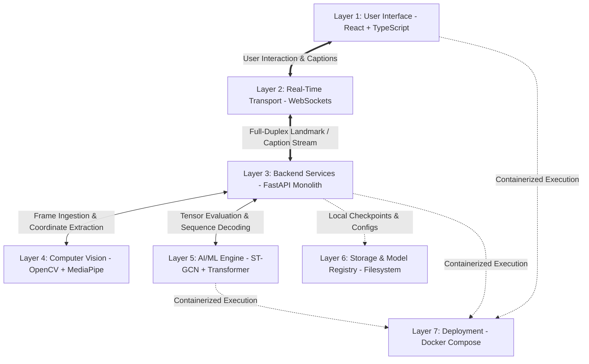

# 02. System Architecture & Seven-Layer Specification: SignTalk AI

**Document ID:** STAI-P1P2-002  
**Project Name:** SignTalk AI  
**Document Status:** Approved Engineering Blueprint (Phase 1 — Part 2)  

---

## 1. System Layer Decomposition

SignTalk AI is partitioned into seven decoupled architectural layers to enforce separation of concerns, optimize performance, and guarantee data privacy.

---

## 2. Comprehensive Layer-by-Layer Architecture

### Layer 1: User Interface (Presentation Layer)
- **Technology Stack:** React 18, TypeScript 5.4, Vite 5.2, CSS Modules / Vanilla CSS.
- **Responsibilities:**
  - Manages browser webcam stream acquisition via `navigator.mediaDevices.getUserMedia()`.
  - Provides session lifecycle controls (Start, Pause, Resume, Stop) with complete keyboard accessibility (WCAG 2.1 AA).
  - Renders a low-latency live camera preview with an optional toggle for landmark skeleton overlay on HTML5 Canvas.
  - Renders large-font, high-contrast live text captions with dynamic visual confidence indicators (Green $\ge 0.75$, Amber $0.50 - 0.74$, Red $< 0.50$).
  - Displays explicit error and repetition prompts when tracking fails or predictions are uncertain.

### Layer 2: Real-Time Communication (Transport Layer)
- **Technology Stack:** Starlette / WebSocket RFC 6455 over TCP.
- **Protocol Evaluation:**
  - *WebSocket vs. WebRTC:* WebRTC was explicitly evaluated and rejected for the academic MVP (see [ADR-006](file:///d:/SignAI/docs/architecture/adr/ADR-006_realtime_transport.md)). WebRTC introduces significant signaling complexity (STUN/TURN/ICE). Because SignTalk AI extracts landmarks client-side and streams lightweight coordinate arrays ($< 50\text{ KB/s}$) rather than raw video, WebSockets provide the ideal transport latency ($< 15\text{ ms}$) without signaling infrastructure.
- **Responsibilities:**
  - Ingests structured JSON/binary landmark frames at $25-30\text{ FPS}$ from the client.
  - Streams real-time translation captions, confidence metrics, and latency diagnostics back to the client.

### Layer 3: Backend & API (Application Layer)
- **Technology Stack:** Python 3.11, FastAPI, Uvicorn ASGI server.
- **Responsibilities:**
  - Exposes RESTful endpoints for health checks (`/healthz`), session lifecycle (`/api/v1/session`), and model metadata (`/api/v1/model/info`).
  - Implements the WebSocket streaming endpoint (`/api/v1/stream/ws`).
  - Coordinates thread-safe sliding window ring buffering.
  - Enforces safety thresholds, low-confidence gating, and Levenshtein temporal duplicate suppression.

### Layer 4: Computer Vision (Perception Layer)
- **Technology Stack:** Google MediaPipe Holistic 0.10.14, OpenCV 4.9.
- **Responsibilities:**
  - Extracts 3D skeletal landmarks: Hands (42 points), Upper Pose (11 points), Salient Face (40 points).
  - Computes torso-relative centering and shoulder-distance scale normalization.
  - Implements immediate in-memory frame purging to guarantee zero persistent raw-video storage.

### Layer 5: AI / Machine Learning (Inference Layer)
- **Technology Stack:** PyTorch 2.3.1, TorchScript, ONNX Runtime.
- **Responsibilities:**
  - Constructs anatomical spatial-temporal graph tensors $\mathbf{X} \in \mathbb{R}^{3 \times 45 \times 93}$ with normalized adjacency $\mathbf{A}_{norm}$.
  - Executes 6-block ST-GCN forward convolutions to produce latent kinematic tokens $\mathbf{H} \in \mathbb{R}^{12 \times 256}$.
  - Autoregressively generates natural-language English tokens via a 3-layer Transformer decoder.
  - Evaluates baseline models (Bi-LSTM) and manages model checkpoints.

### Layer 6: Storage & Model Registry (Persistence Layer)
- **Technology Stack:** Local Filesystem, Apache Parquet, HDF5, JSON configs.
- **Database Evaluation:**
  - A traditional database (PostgreSQL, MongoDB) was explicitly evaluated and rejected (see [ADR-008](file:///d:/SignAI/docs/architecture/adr/ADR-008_storage_strategy.md)). The application processes streaming data transiently in RAM and requires no persistent user accounts or relational transactions.
- **Responsibilities:**
  - Stores versioned model weights (`models/checkpoints/*.pt`, `*.onnx`).
  - Houses vocabulary JSON mappings (`assets/vocabularies/mvp_50.json`).
  - Persists anonymized benchmark coordinate arrays for reproducible evaluation.

### Layer 7: Deployment & Environment (Infrastructure Layer)
- **Technology Stack:** Docker Engine, Docker Compose, Nginx.
- **Responsibilities:**
  - Packages frontend and backend into lightweight, reproducible container images.
  - Manages environment variables and configuration files (`.env`).
  - Provides a self-contained execution environment capable of running 100% offline on standard workstations.
