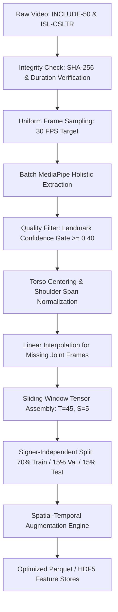

# 03. Data Pipeline & Preprocessing Architecture: SignTalk AI

**Document ID:** STAI-P1P2-003  
**Project Name:** SignTalk AI  
**Document Status:** Approved Engineering Blueprint (Phase 1 — Part 2)  

---

## 1. Data Pipeline Overview

The data pipeline governs the transformation of raw video corpora into normalized, augmented spatial-temporal graph tensors ready for training and real-time inference.

---

## 2. Ingestion & Quality Control Protocol

### 2.1 Video Normalization & Uniform Resampling
- External video clips from INCLUDE and ISL-CSLTR possess varying native frame rates ($25 - 30\text{ FPS}$) and resolutions ($480\text{p} - 1080\text{p}$).
- Videos are resampled to a standardized **$30\text{ FPS}$** using FFmpeg temporal interpolation. Frames are resized to a maximum bounding dimension of $1280 \times 720$ to maintain aspect ratios while standardizing coordinate space.

### 2.2 Landmark Confidence Gating & Interpolation
- MediaPipe outputs a confidence/visibility score $c_i \in [0.0, 1.0]$ for each joint.
- **Drop Threshold:** If the average hand landmark confidence across all 21 hand joints drops below $\bar{c}_{hand} < 0.40$ for more than $40\%$ of a video's duration, the sample is flagged as corrupt/occluded and routed to a quarantine directory for manual inspection.
- **Linear Interpolation:** Brief tracking drops ($\le 3$ consecutive frames) are filled via linear spline interpolation between the preceding and succeeding valid frames:
  $$\mathbf{p}_t = \mathbf{p}_{t-1} + \frac{\mathbf{p}_{t+k} - \mathbf{p}_{t-1}}{k+1}$$

---

## 3. Coordinate Normalization Algorithm

To guarantee scale, translation, and distance invariance across signers of different body sizes and varying camera distances:

1. **Torso Centering (Translation Invariance):**  
   The mid-shoulder point is established as the dynamic spatial origin $(0, 0, 0)$:
   $$\mathbf{p}_{origin} = \frac{\mathbf{p}_{L.Shoulder} + \mathbf{p}_{R.Shoulder}}{2}$$
   All 93 joint coordinates are shifted:
   $$\mathbf{p}'_i = \mathbf{p}_i - \mathbf{p}_{origin}, \quad \forall i \in \{1, \dots, 93\}$$

2. **Torso Span Normalization (Scale Invariance):**  
   The Euclidean distance between the left and right shoulders is computed:
   $$d_{shoulder} = \|\mathbf{p}_{L.Shoulder} - \mathbf{p}_{R.Shoulder}\|_2$$
   If $d_{shoulder} < \epsilon$ (e.g., severe lateral occlusion), the vertical distance between the nose and mid-shoulder is used as a fallback anchor.  
   Coordinates are scaled:
   $$\mathbf{x}_i = \frac{\mathbf{p}'_i}{d_{shoulder}}$$

---

## 4. Sequence Buffering & Temporal Windowing

- **Window Length ($T$):** Fixed at $T = 45\text{ frames}$ ($\approx 1.5\text{ seconds}$ at $30\text{ FPS}$), capturing complete lexical sign movements and transitional co-articulations.
- **Stride ($S$):** Fixed at $S = 5\text{ frames}$ during real-time inference ($\approx 166\text{ ms}$ interval), generating smooth overlapping predictions without computational overloading.
- **Padding:** Sequences shorter than $T$ frames are padded at the end using mirror padding (reflecting initial sign frames) or zero padding with an accompanying binary attention mask $\mathbf{M}_{mask} \in \{0, 1\}^T$.
