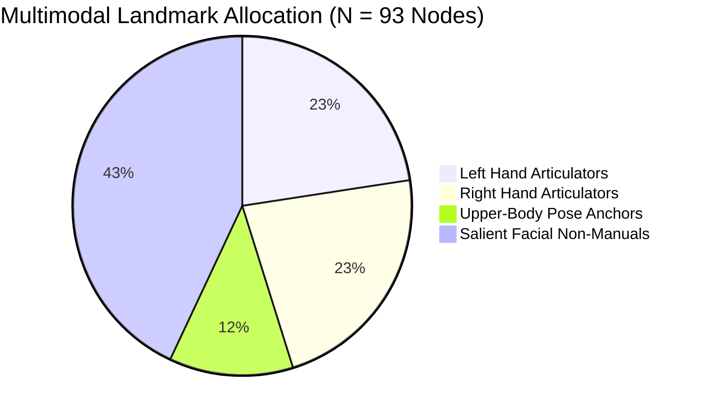

# 04. Landmark Representation & Normalization: SignTalk AI

**Document ID:** STAI-P1P2-004  
**Project Name:** SignTalk AI  
**Document Status:** Approved Engineering Blueprint (Phase 1 — Part 2)  

---

## 1. Landmark Selection & Node Budget

Visual sign language features are extracted using Google MediaPipe Holistic. While MediaPipe outputs 543 total keypoints (468 face, 33 pose, 21 per hand), passing all 543 points into an ST-GCN graph model is computationally prohibitive and counterproductive:
- An adjacency matrix for $N = 543$ nodes contains $543^2 = 294,849$ elements, increasing graph convolution memory and latency by over $34\times$ compared to $N = 93$ nodes.
- Over $80\%$ of face mesh points (cheeks, forehead, iris interior) carry zero linguistic meaning in Indian Sign Language.

SignTalk AI defines a curated **93-Node Multimodal Landmark Budget**:

---

## 2. Anatomical Subsystems Breakdown

### 2.1 Hand Articulators (42 Nodes: Left [0-20], Right [21-41])
Each hand comprises 21 keypoints capturing complete finger flexion, abduction, and palm orientation:
- **Wrist Anchor:** Node 0 (Left), Node 21 (Right).
- **Thumb:** 4 joints (CMC, MCP, IP, Tip).
- **Index Finger:** 4 joints (MCP, PIP, DIP, Tip).
- **Middle Finger:** 4 joints (MCP, PIP, DIP, Tip).
- **Ring Finger:** 4 joints (MCP, PIP, DIP, Tip).
- **Pinky Finger:** 4 joints (MCP, PIP, DIP, Tip).

### 2.2 Upper-Body Pose Anchors (11 Nodes: [42-52])
Provides spatial frame-of-reference anchors for the hands and captures shoulder shifts:
- `42`: Nose (Central facial anchor).
- `43, 44`: Left and Right Eyes (Gaze / head orientation).
- `45, 46`: Left and Right Ears (Head tilt / rotation).
- `47, 48`: Left and Right Shoulders (Primary anatomical baseline and scale anchor).
- `49, 50`: Left and Right Elbows (Arm trajectory linkages).
- `51, 52`: Left and Right Wrist Pose Points (Kinematic bridge to hand subgraphs).

### 2.3 Salient Facial Non-Manual Markers (40 Nodes: [53-92])
Captures essential grammatical markers (questions, negation, emphasis, mouthing):
- **Eyebrow Contours (8 Nodes [53-60]):** 4 points per brow tracking raises (polar questions) and furrows (wh-questions).
- **Lip & Mouth Contours (16 Nodes [61-76]):** 8 outer lip points and 8 inner lip points tracking open/closed mouthing gestures.
- **Lower Jawline Contour (16 Nodes [77-92]):** Tracks jaw drops, head nod negations, and spatial perspective shifts.

---

## 3. Coordinate Representation & Normalization Mathematics

### 3.1 Raw Coordinate Space
MediaPipe outputs raw coordinates $(x_{raw}, y_{raw}, z_{raw}, c_{vis})$ where:
- $x_{raw} \in [0.0, 1.0]$: Horizontal pixel coordinate normalized by image width.
- $y_{raw} \in [0.0, 1.0]$: Vertical pixel coordinate normalized by image height.
- $z_{raw} \approx \mathbb{R}$: Depth relative to the camera sensor (scaled roughly at same scale as $x$).
- $c_{vis} \in [0.0, 1.0]$: Model estimation of joint visibility and confidence.

### 3.2 Torso Centering and Scale Normalization
Let $\mathbf{p}_i = [x_{raw, i}, y_{raw, i}, z_{raw, i}]^T \in \mathbb{R}^3$ denote the raw 3D position of node $i$.

1. **Center Calculation:**
   $$\mathbf{c}_{torso} = \frac{\mathbf{p}_{47} + \mathbf{p}_{48}}{2}$$
   where $\mathbf{p}_{47}$ and $\mathbf{p}_{48}$ are the left and right shoulder coordinates.

2. **Scale Factor Calculation:**
   $$s_{torso} = \|\mathbf{p}_{47} - \mathbf{p}_{48}\|_2$$
   To prevent division by zero in rare cases of severe lateral occlusion:
   $$s = \max(s_{torso}, 1 \times 10^{-4})$$

3. **Normalized Coordinate Formula:**
   $$\mathbf{x}_i = \frac{\mathbf{p}_i - \mathbf{c}_{torso}}{s}, \quad \forall i \in \{0, \dots, 92\}$$

After normalization:
- The mid-shoulder point sits exactly at $(0, 0, 0)$.
- The left shoulder sits at $(+0.5, 0, 0)$ and right shoulder sits at $(-0.5, 0, 0)$.
- All joint positions are completely invariant to whether the user sits $0.5\text{ m}$ or $1.8\text{ m}$ from the webcam.

---

## 4. Missing Landmarks & Hand Dominance Handling

- **Missing Modality Zero-Masking:** If a hand moves outside the camera frame ($c_{vis} < 0.3$), its corresponding 21 coordinate rows in $\mathbf{X}$ are set to $0.0$, and an auxiliary binary visibility tensor $\mathbf{V}_{mask} \in \{0, 1\}^{N}$ is set to $0$ for those nodes.
- **Handedness Invariance:** The system standardizes handedness. During data augmentation, left-handed signing is synthetically mirrored by negating the $x$-coordinates ($\mathbf{x}' = [-x, y, z]^T$) and swapping corresponding left/right node indices (nodes $0-20 \leftrightarrow 21-41$), allowing the model to generalize across both dominant hands.
