# 05. Multimodal Feature Fusion Strategy: SignTalk AI

**Document ID:** STAI-P1P2-005  
**Project Name:** SignTalk AI  
**Document Status:** Approved Engineering Blueprint (Phase 1 — Part 2)  

---

## 1. Multimodal Fusion Architectural Paradigms

Sign language is inherently multimodal: manual articulators (hands) convey primary lexical content, upper-body pose provides spatial grounding and syntax, and facial expressions modulate grammatical tense, interrogative mood, and negation.

Four candidate multimodal fusion architectures were evaluated for SignTalk AI:

```mermaid
graph TD
    subgraph StrategyA [Strategy A: Early Feature Concatenation]
        A_H[Hands 42x3] & A_P[Pose 11x3] & A_F[Face 40x3] --> A_CAT[Vector Flattening & Concatenation]
        A_CAT --> A_ENC[Single Linear / LSTM Encoder]
    end

    subgraph StrategyB [Strategy B: Late Decision Fusion]
        B_H[Hands] --> B_M1[Hand Model] --> B_L1[Logits 1]
        B_P[Pose] --> B_M2[Pose Model] --> B_L2[Logits 2]
        B_F[Face] --> B_M3[Face Model] --> B_L3[Logits 3]
        B_L1 & B_L2 & B_L3 --> B_VOTE[Weighted Average / Voting]
    end

    subgraph StrategyC [Strategy C: Multi-Tower Encoders]
        C_H[Hands] --> C_E1[ST-GCN Tower 1]
        C_P[Pose] --> C_E2[ST-GCN Tower 2]
        C_F[Face] --> C_E3[ST-GCN Tower 3]
        C_E1 & C_E2 & C_E3 --> C_FUSE[Cross-Attention Fusion Layer]
    end

    subgraph StrategyD [Strategy D: Graph-Level Kinematic Fusion - Recommended]
        D_H[Hands: Subgraphs H_L, H_R] --- D_BRIDGE[Kinematic Bridge Edges]
        D_P[Pose: Subgraph P] --- D_BRIDGE
        D_F[Face: Subgraph F] --- D_BRIDGE
        D_BRIDGE --> D_UNIFIED[Unified Multimodal Graph G in R^3xTx93]
        D_UNIFIED --> D_STGCN[Single Unified ST-GCN Encoder]
    end
```

---

## 2. Comparative Evaluation Matrix

| Fusion Strategy | Computational Complexity | Implementation Complexity | Missing Modality Robustness | Real-Time Latency Suitability | Structural Topology Preservation |
| :--- | :--- | :--- | :--- | :--- | :--- |
| **Strategy A: Early Concatenation** | **Low:** Single flat input vector | **Low:** Basic NumPy array concatenation | **Poor:** Missing joint corrupts entire flat feature vector | **High:** Very fast forward pass | **Zero:** Discards spatial bone connectivity and joint hierarchy |
| **Strategy B: Late Decision Fusion** | **High:** Requires training and running 3 separate neural networks | **Moderate:** Ensembling logic and weighted softmax | **High:** If face drops, hand model still emits class logits | **Poor:** Multiple model forwards exceed 500ms budget | **Moderate:** Sub-networks preserve isolated topologies |
| **Strategy C: Multi-Tower Encoders** | **High:** 3 ST-GCN backbones + cross-attention | **High:** Complex multi-branch training and gradients | **High:** Attention weights can zero out absent modality | **Moderate:** High parameter count ($> 8\text{M}$ parameters) | **High:** Preserves sub-topologies, but lacks cross-joint bone edges |
| **Strategy D: Graph-Level Fusion (Recommended)** | **Optimal:** Single unified ST-GCN model ($< 3\text{M}$ params) | **Moderate:** Defined static adjacency matrix $\mathbf{A} \in \mathbb{R}^{93 \times 93}$ | **High:** Zero-masking handles missing modality natively | **Exceptional:** Single forward pass executes in $< 60\text{ ms}$ on CPU | **Complete:** Preserves true anatomical bone chains across joints |

---

## 3. Engineering Recommendation: Graph-Level Kinematic Fusion

SignTalk AI selects **Strategy D: Graph-Level Kinematic Fusion** as the foundational multimodal architecture.

### Architectural Rationale:
1. **Kinematic Realism:** In human signing, hands do not move in isolation from the body; the wrist is physically anchored to the forearm, which anchors to the shoulder, which anchors to the neck and head. Graph-level fusion connects these subgraphs with **explicit kinematic bridge edges**:
   - Edge $(0, 51)$: Connects left hand wrist (Node 0) to left pose wrist (Node 51).
   - Edge $(21, 52)$: Connects right hand wrist (Node 21) to right pose wrist (Node 52).
   - Edge $(42, 53)$: Connects nose anchor (Node 42) to facial eyebrow bridge (Node 53).
2. **Computational Efficiency:** A single forward pass through a 93-node ST-GCN executes within **$45 - 60\text{ ms}$** on commodity CPUs, whereas multi-tower networks (Strategy C) or ensemble pipelines (Strategy B) triple the matrix multiplications and exceed our 500 ms latency budget.
3. **Graceful Degradation:** If facial keypoints degrade due to lighting or occlusion, the corresponding 40 face rows in $\mathbf{X}$ are zeroed out. Because ST-GCN uses normalized adjacency and spatial partitioning, the network gracefully falls back to the intact Hand + Pose subgraph without crashing.
