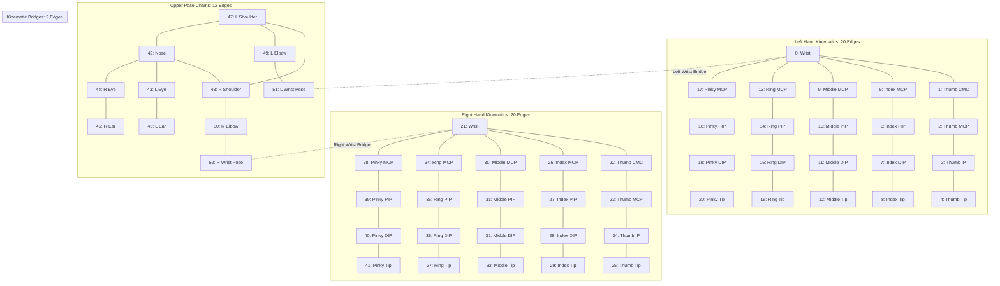

# 06. Graph Definition & Adjacency Mathematics: SignTalk AI

**Document ID:** STAI-P1P2-006  
**Project Name:** SignTalk AI  
**Document Status:** Approved Engineering Blueprint (Phase 1 — Part 2)  

---

## 1. Mathematical Graph Formulation

The signing human skeleton across a sliding temporal window of $T$ frames is modeled as a dynamic spatial-temporal graph:

$$\mathcal{G} = (\mathcal{V}, \mathcal{E})$$

Where:
- $\mathcal{V} = \{ v_{t, i} \mid t \in \{1, \dots, T\}, i \in \{1, \dots, N\} \}$ is the node set containing $N = 93$ joints per frame across $T = 45$ frames ($4,185$ total space-time nodes).
- $\mathcal{E} = \mathcal{E}_{spatial} \cup \mathcal{E}_{temporal}$ is the complete edge set:
  - $\mathcal{E}_{spatial} = \{ (v_{t, i}, v_{t, j}) \mid (i, j) \in \mathcal{E}_{skeleton}, t \in \{1, \dots, T\} \}$ represents intra-frame anatomical connectivity.
  - $\mathcal{E}_{temporal} = \{ (v_{t, i}, v_{t+1, i}) \mid t \in \{1, \dots, T-1\}, i \in \{1, \dots, N\} \}$ represents inter-frame joint trajectory persistence.

---

## 2. Anatomical Edge Connectivity Specification

The spatial graph contains **102 physical and kinematic bone edges** across four interconnected subsystems:

---

## 3. Adjacency Matrix Normalization & Partitioning

To compute spatial graph convolutions, the raw binary adjacency matrix $\mathbf{A} \in \{0, 1\}^{N \times N}$ is partitioned according to **Spatial Configuration Partitioning** into $K = 3$ sub-matrices:

$$\mathbf{A} + \mathbf{I} = \mathbf{A}_{root} + \mathbf{A}_{centripetal} + \mathbf{A}_{centrifugal}$$

1. **Root Partition ($\mathbf{A}_{root} = \mathbf{I}$):** Represents self-loops connecting each node to itself.
2. **Centripetal Partition ($\mathbf{A}_{centripetal}$):** Contains edges $(i, j)$ where joint $j$ is closer to the body torso anchor than joint $i$ (inward kinematic flow).
3. **Centrifugal Partition ($\mathbf{A}_{centrifugal}$):** Contains edges $(i, j)$ where joint $j$ is further from the body torso anchor than joint $i$ (outward kinematic flow to fingertips).

Each partitioned adjacency matrix is symmetrically normalized:
$$\mathbf{\Lambda}_k = \mathbf{D}_k^{-\frac{1}{2}} \mathbf{A}_k \mathbf{D}_k^{-\frac{1}{2}}, \quad k \in \{root, centripetal, centrifugal\}$$
where $\mathbf{D}_k^{i, i} = \sum_j \mathbf{A}_k^{i, j} + \alpha$ is the diagonal degree matrix ($\alpha = 0.001$ avoids division by zero).

The resulting static tensor $\mathbf{\Lambda} \in \mathbb{R}^{3 \times 93 \times 93}$ is precomputed once during model initialization and stored directly in GPU/CPU memory for zero-latency indexing.
