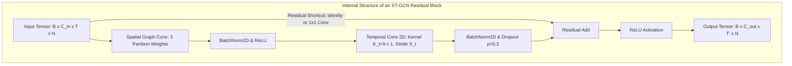
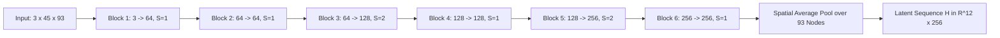

# 08. Spatial-Temporal Graph Convolutional Network (ST-GCN) Architecture

**Document ID:** STAI-P1P2-008  
**Project Name:** SignTalk AI  
**Document Status:** Approved Engineering Blueprint (Phase 1 — Part 2)  

---

## 1. Architectural Overview

The Spatial-Temporal Graph Convolutional Network (ST-GCN) operates as the primary feature extractor of SignTalk AI. Adapting the formulation of Yan et al. (AAAI 2018) to sign language translation, the network alternates between **spatial graph convolutions** (which aggregate joint features along biological bone linkages) and **temporal convolutions** (which capture continuous kinematic trajectories over time).

---

## 2. Multi-Block Stack Architecture

The ST-GCN backbone consists of **6 sequential ST-GCN residual blocks** organized into three computational stages with gradual feature expansion and temporal downsampling:

### Detailed Layer Configuration Table

| Layer / Block | Input Dimension $(C_{in}, T_{in}, N)$ | Output Dimension $(C_{out}, T_{out}, N)$ | Temporal Stride ($S_t$) | Kernel Size $(K_t, K_s)$ | Parameter Count |
| :---: | :---: | :---: | :---: | :---: | :---: |
| **Input Normalization** | $(3, 45, 93)$ | $(3, 45, 93)$ | 1 | N/A | $186$ (BatchNorm) |
| **ST-GCN Block 1** | $(3, 45, 93)$ | $(64, 45, 93)$ | 1 | $(9, 1)$ | $\approx 38,000$ |
| **ST-GCN Block 2** | $(64, 45, 93)$ | $(64, 45, 93)$ | 1 | $(9, 1)$ | $\approx 149,000$ |
| **ST-GCN Block 3** | $(64, 45, 93)$ | $(128, 23, 93)$ | **2** (Downsample) | $(9, 1)$ | $\approx 312,000$ |
| **ST-GCN Block 4** | $(128, 23, 93)$ | $(128, 23, 93)$ | 1 | $(9, 1)$ | $\approx 592,000$ |
| **ST-GCN Block 5** | $(128, 23, 93)$ | $(256, 12, 93)$ | **2** (Downsample) | $(9, 1)$ | $\approx 1,184,000$ |
| **ST-GCN Block 6** | $(256, 12, 93)$ | $(256, 12, 93)$ | 1 | $(9, 1)$ | $\approx 206,000$ |
| **Spatial Mean Pooling**| $(256, 12, 93)$ | $(256, 12, 1)$ | N/A | Pool over $N=93$ | $0$ (Non-parametric) |
| **Dimensional Transpose**| $(256, 12, 1)$ | **$(12, 256)$** | N/A | Squeeze node axis | $0$ |
| **TOTAL BACKBONE** | **Input $(3, 45, 93)$** | **Output $(12, 256)$** | — | — | **$\approx \mathbf{2.48\text{M}}$ Parameters** |

---

## 3. Mathematical Operations within ST-GCN

### 3.1 Spatial Graph Convolution Step
At temporal frame $t$, spatial feature propagation is governed by:
$$\mathbf{Z}_t = \sum_{k=1}^K \mathbf{\Lambda}_k \mathbf{X}_t \mathbf{W}_k \in \mathbb{R}^{C_{out} \times N}$$
where $K=3$ represents the spatial configuration partitions (root, centripetal, centrifugal), $\mathbf{\Lambda}_k \in \mathbb{R}^{N \times N}$ is the pre-normalized adjacency matrix, and $\mathbf{W}_k \in \mathbb{R}^{C_{in} \times C_{out}}$ is the learnable convolution weight matrix.

### 3.2 Temporal Convolution Step
Temporal movement dynamics are extracted by applying standard 2D convolution with a rectangular kernel $(K_t \times 1) = (9 \times 1)$ across the temporal dimension $T$:
$$\mathbf{Y} = \operatorname{Conv2D}\left( \mathbf{Z}, \text{kernel\_size}=(9, 1), \text{stride}=(S_t, 1), \text{padding}=(4, 0) \right)$$

### 3.3 Residual Shortcut
To maintain gradient flow across deep stacks, each block contains a residual shortcut:
$$\mathbf{X}_{out} = \operatorname{ReLU}\left( \operatorname{BatchNorm}(\mathbf{Y}) + \operatorname{Shortcut}(\mathbf{X}_{in}) \right)$$
where $\operatorname{Shortcut}$ is the identity mapping if $C_{in} = C_{out}$ and $S_t = 1$, or a $1 \times 1$ convolution $\operatorname{Conv2D}(\mathbf{X}_{in}, \text{kernel\_size}=(1, 1), \text{stride}=(S_t, 1))$ if dimensions change.
