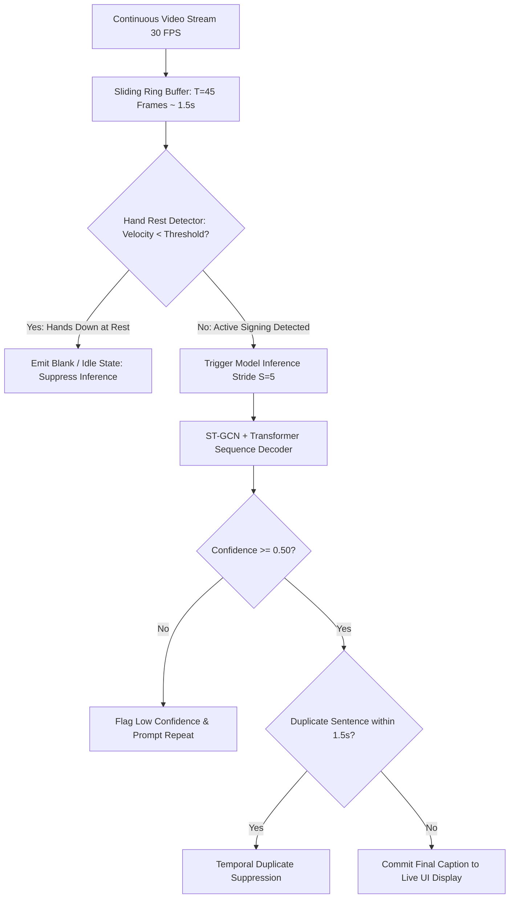

# 10. Continuous Signing Strategy & Stream Segmentation: SignTalk AI

**Document ID:** STAI-P1P2-010  
**Project Name:** SignTalk AI  
**Document Status:** Approved Engineering Blueprint (Phase 1 — Part 2)  

---

## 1. The Challenge of Continuous Sign Language Processing

In isolated sign language recognition, the input video consists of an individual sign starting from rest, articulating, and returning to rest. In continuous natural Indian Sign Language (ISL), however:
1. **Movement Epenthesis:** The hands do not return to rest between words; the trajectory connecting the end of one sign to the beginning of the next (epenthetic transition) can look like a gesture itself.
2. **Absence of Acoustic Pauses:** There are no explicit boundaries or spaces between words.
3. **Temporal Sliding Windows:** The model must process an ongoing video stream without knowing a priori when a phrase begins or ends.

---

## 2. Sliding Window Buffer Architecture

The streaming pipeline maintains an in-memory thread-safe circular buffer:
- **Buffer Capacity ($T$):** Exactly $45\text{ frames}$ ($\approx 1.5\text{ seconds}$ at $30\text{ FPS}$).
- **Inference Stride ($S$):** Evaluated every $S = 5\text{ frames}$ ($\approx 166\text{ ms}$ interval, $\approx 6\text{ predictions/second}$).
- **Overlapping Coverage:** Consecutive windows share $40\text{ frames}$ of temporal context ($88.9\%$ temporal overlap), guaranteeing that fast signs occurring across window boundaries are captured across adjacent inference steps.

---

## 3. Rest State & Boundary Detection (Energy-Based Gating)

To prevent the model from hallucinating signs when a user is simply sitting before the camera or speaking without signing:
1. **Kinematic Velocity Calculation:** The mean velocity of both wrists and all 10 finger tips is computed over the trailing 10 frames:
   $$v_{articulators} = \frac{1}{10} \sum_{t=k-9}^k \sum_{i \in \text{Tips}} \|\mathbf{p}_{t, i} - \mathbf{p}_{t-1, i}\|_2$$
2. **Rest Threshold ($\theta_{rest}$):** If $v_{articulators} < \theta_{rest}$ and hands are positioned below the chest line ($y > 0.4$ in normalized space), the system transitions to an **IDLE / REST** state.
3. **Inference Suppression:** In the IDLE state, computationally heavy ST-GCN and Transformer evaluations are bypassed, reducing idle CPU usage to $< 5\%$.

---

## 4. Temporal Duplicate Suppression & Levenshtein Smoothing

Because sliding windows overlap by $88.9\%$, the model frequently generates identical or near-identical sentence predictions across consecutive strides:
- **Temporal Debounce Filter:** A candidate sentence $\hat{S}_{new}$ is compared against the currently displayed caption $S_{active}$ using normalized Levenshtein token similarity:
  $$\operatorname{Sim}(\hat{S}_{new}, S_{active}) = 1.0 - \frac{\operatorname{LevenshteinDistance}(\hat{S}_{new}, S_{active})}{\max(|\hat{S}_{new}|, |S_{active}|)}$$
- If $\operatorname{Sim} > 0.85$ and the elapsed time since $S_{active}$ was displayed is $< 1.5\text{ seconds}$, the new sentence is treated as a duplicate confirmation and does not trigger visual screen flashing.
- If a new, linguistically distinct sentence is predicted with confidence $\ge 0.75$, the caption area updates immediately and the previous sentence is pushed to the session transcript history.

---

## 5. Dataset-Constrained Continuous Fallback Protocol

> [!IMPORTANT]
> **Academic Honesty Notice:** Continuous sequence translation is heavily constrained by public ISL dataset annotation size. If the primary continuous dataset (ISL-CSLTR, 700 sentences) exhibits high sentence error rates on complex multi-clause sentences during Phase 2 evaluation, the system executes an academically honest fallback:
> 1. It utilizes ST-GCN segmental sign classification over dynamic sliding windows.
> 2. It applies a Connectionist Temporal Classification (CTC) sequence decoder to align contiguous sign tokens into multi-word phrases.
> 3. It formats the phrase using a deterministic grammatical template engine into natural-language English sentences.
