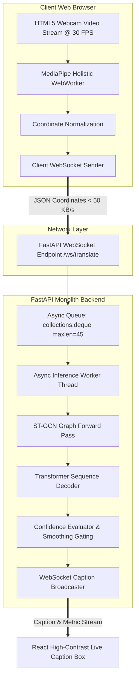

# 11. Real-Time Inference Engine Specification: SignTalk AI

**Document ID:** STAI-P1P2-011  
**Project Name:** SignTalk AI  
**Document Status:** Approved Engineering Blueprint (Phase 1 — Part 2)  

---

## 1. Real-Time Streaming Architecture

The real-time inference engine orchestrates high-frequency webcam frames, coordinate normalization, temporal sliding-window buffering, deep neural network execution, and real-time WebSocket caption broadcasting.



---

## 2. In-Memory Ring Buffer & Producer-Consumer Threading

To prevent inference operations from causing frame drops or freezing the visual UI:
1. **Producer Task (`ws_receiver`):**
   - Continuously receives parsed JSON coordinate packets from the client over WebSockets.
   - Pushes the $(93, 3)$ coordinate array into a thread-safe `collections.deque(maxlen=45)`.
   - Ingestion execution time: $< 2\text{ ms}$ per packet.
2. **Consumer Task (`inference_scheduler`):**
   - Monitors the frame counter. Every $S = 5\text{ frames}$ ($\approx 166\text{ ms}$), the consumer snapshots the current buffer tensor:
     $$\mathbf{X} = \operatorname{torch.from\_numpy}(\operatorname{np.stack}(\text{buffer}, \text{axis}=0)).\operatorname{permute}(2, 0, 1).\operatorname{unsqueeze}(0)$$
   - Offloads tensor forward evaluation to an asynchronous thread-pool executor:
     ```python
     loop = asyncio.get_running_loop()
     prediction = await loop.run_in_executor(
         inference_executor, 
         run_model_forward, 
         tensor_window
     )
     ```
   - This ensures the main FastAPI event loop remains unblocked, maintaining sustained 30 FPS network responsiveness.

---

## 3. Real-Time Latency Budgets & Benchmarking Methodology

Cumulative pipeline latency is evaluated against the strict **$500\text{ ms}$ conversational ceiling**:

$$\tau_{total} = \Delta t_{capture} + \Delta t_{landmark} + \Delta t_{network} + \Delta t_{STGCN} + \Delta t_{Transformer} + \Delta t_{render} \le 500\text{ ms}$$

| Subsystem Component | Target Latency Budget | Hard Maximum Threshold | Benchmarking & Profiling Tool |
| :--- | :---: | :---: | :--- |
| **Webcam Ingestion & Buffer Read** | $\le 20\text{ ms}$ | $35\text{ ms}$ | High-resolution timestamping via `performance.now()` |
| **MediaPipe Holistic Landmark Tracking**| $\le 35\text{ ms}$ | $60\text{ ms}$ | CPU/GPU execution timer on `holistic.process()` |
| **WebSocket Network Transport** | $\le 10\text{ ms}$ | $25\text{ ms}$ | Round-trip ping/pong timestamp evaluation |
| **ST-GCN Graph Encoder Forward Pass** | $\le 60\text{ ms}$ | $120\text{ ms}$ | PyTorch CUDA/CPU Event profiling |
| **Transformer Sequence Decoding** | $\le 100\text{ ms}$ | $160\text{ ms}$ | Greedy autoregressive token loop timer |
| **React UI Render & DOM Paint** | $\le 20\text{ ms}$ | $40\text{ ms}$ | Chrome DevTools Performance Profiler |
| **NOMINAL END-TO-END LATENCY** | **$\le \mathbf{245\text{ ms}}$** | **$< 440\text{ ms}$** | **Total wall-clock duration from sign to screen.** |
