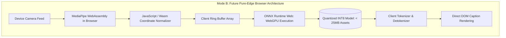

# 13. Edge and Offline Architecture Specification: SignTalk AI

**Document ID:** STAI-P1P2-013  
**Project Name:** SignTalk AI  
**Document Status:** Approved Engineering Blueprint (Phase 1 — Part 2)  

---

## 1. Architectural Distinction: Implemented vs. Planned

> [!WARNING]
> **Truthfulness Declaration:** In accordance with the academic truthfulness protocol:
> - **Mode A (Local Web MVP / FastAPI Monolith):** Classed as **`PLANNED`** for Phase 2/3 implementation.
> - **Mode B (Decentralized On-Device Browser Edge via WebGPU):** Classed as **`FUTURE IMPLEMENTATION`** (deferred to the post-academic development roadmap).
> - Neither mode is claimed as currently implemented in Phase 1 Part 2.

---

## 2. Technical Feasibility & Module Breakdown

| Pipeline Component | Mode A: Local Web MVP (`PLANNED`) | Mode B: Pure On-Device Edge (`FUTURE SCOPE`) | Offline Viability |
| :--- | :--- | :--- | :--- |
| **Video Capture** | HTML5 Browser Web API | HTML5 Browser Web API | 100% Offline |
| **Landmark Extraction** | Client-side MediaPipe JS or Python Backend | Browser WebAssembly (Wasm) | 100% Offline |
| **Graph Construction** | Python NumPy / PyTorch Tensor | JavaScript TypedArrays (`Float32Array`) | 100% Offline |
| **ST-GCN + Transformer** | Python PyTorch / ONNX Runtime CPU | ONNX Runtime Web targeting WebGPU / WebGL2 | 100% Offline |
| **Natural Language Output**| FastAPI WebSocket Push | Direct React State Update | 100% Offline |
| **Network Hardware** | Localhost loopback connection (`127.0.0.1`) | Zero network socket required | 100% Offline |

---

## 3. WebGPU & Progressive Web App (PWA) Roadmap

In future research phases (post-academic release), SignTalk AI can be packaged as a **Progressive Web App (PWA)**:
1. **Model Delivery & Service Worker Caching:** Model weights (`stgcn_int8.onnx` $\approx 4\text{ MB}$, `transformer_int8.onnx` $\approx 3.5\text{ MB}$) are cached in the browser's CacheStorage API during initial visit ($< 10\text{ MB}$ total download).
2. **WebGPU Acceleration:** ONNX Runtime Web leverages the browser's native `navigator.gpu` interface, offloading matrix multiplications directly to integrated graphics (Intel Iris Xe, Apple Metal, AMD Radeon) without requiring dedicated discrete NVIDIA GPUs.
3. **Zero Data Transmission:** Video frames and extracted coordinates never leave the browser sandbox, providing absolute mathematical compliance with privacy guidelines in sensitive medical, judicial, and financial environments.
