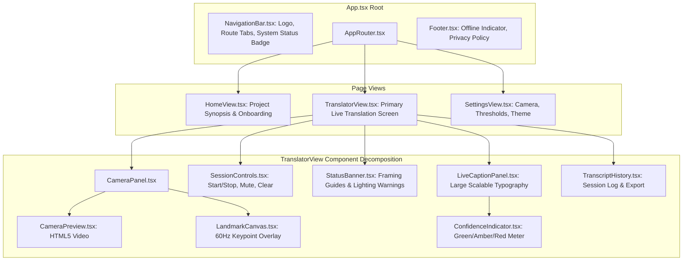

# 14. Frontend Architecture & User Experience: SignTalk AI

**Document ID:** STAI-P1P2-014  
**Project Name:** SignTalk AI  
**Document Status:** Approved Engineering Blueprint (Phase 1 — Part 2)  

---

## 1. Frontend Architectural Philosophy

The SignTalk AI frontend is engineered to minimize cognitive load, guarantee instant accessibility for Deaf and hearing users alike, and deliver real-time visual feedback under WCAG 2.1 Level AA accessibility standards.



---

## 2. Component Hierarchy & State Management

### 2.1 State Management (Lightweight React Context)
State is partitioned into three cleanly isolated contexts to prevent unnecessary re-renders:
1. **`SessionContext`:** Tracks translation status (`IDLE`, `CONNECTING`, `STREAMING`, `PAUSED`, `ERROR`), active session ID, and elapsed time.
2. **`CaptionContext`:** Tracks the latest verified sentence, interim phrase, confidence score ($0.0 - 1.0$), and the session transcript array.
3. **`SettingsContext`:** Tracks camera device ID, resolution, landmark overlay visibility toggle, high-contrast theme, and font size scaling ($24\text{px} - 48\text{px}$).

---

## 3. UI Layout & Accessibility Wireframe

```
+-----------------------------------------------------------------------------------+
|  [SignTalk AI Logo]     (•) Local Engine: Online    [Translator]  [History]  [⚙]  |
+-----------------------------------------------------------------------------------+
|                                        |                                          |
|  +----------------------------------+  |  +------------------------------------+  |
|  |                                  |  |  | LIVE CAPTION DISPLAY               |  |
|  |       CAMERA PREVIEW             |  |  |                                    |  |
|  |     (720p / 30 FPS Stream)       |  |  |  "I have had a severe fever        |  |
|  |                                  |  |  |   since yesterday."                |  |
|  |   [ Landmark Skeleton Overlay ]  |  |  |                                    |  |
|  |                                  |  |  +------------------------------------+  |
|  +----------------------------------+  |  | Certainty: [████████████] 88% (High)  |
|                                        |  +------------------------------------+  |
|  Status: Tracking Both Hands (OK)      |  | Status: Finalized Sentence         |  |
|                                        |  +------------------------------------+  |
+-----------------------------------------------------------------------------------+
|  [ ▶ START TRANSLATION ]   [ ⏸ PAUSE ]   [ ■ STOP ]   |   [ 👁 Toggle Landmarks ]  |
+-----------------------------------------------------------------------------------+
```

### Key Accessibility Controls (WCAG 2.1 AA):
- **Contrast Ratio:** White text on dark navy/black background ($21:1$ contrast ratio, exceeding the $7:1$ standard).
- **Keyboard Navigation:** Full operation without mouse input:
  - `Spacebar`: Toggle Start / Pause translation.
  - `Escape`: Halt session and release camera hardware.
  - `Key L`: Toggle skeletal landmark canvas overlay.
  - `Key C`: Clear active caption transcript.
- **Zero Auditory Dependency:** State changes and errors are indicated exclusively via clear visual badges, colored borders, and textual banners.
