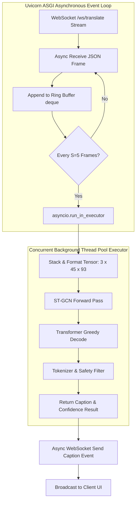

# 15. Backend Architecture & Service Decomposition: SignTalk AI

**Document ID:** STAI-P1P2-015  
**Project Name:** SignTalk AI  
**Document Status:** Approved Engineering Blueprint (Phase 1 — Part 2)  

---

## 1. Modular Monolith Directory Structure

The backend is organized as a high-performance Python FastAPI modular monolith, avoiding microservices overhead while enforcing strict internal modularity:

```
backend/
├── app/
│   ├── main.py                     # FastAPI application factory & lifespan event hooks
│   ├── api/
│   │   ├── router.py               # Aggregated API v1 router
│   │   └── endpoints/
│   │       ├── health.py           # GET /healthz system health check
│   │       ├── session.py          # POST /api/v1/session lifecycle management
│   │       ├── stream.py           # WebSocket /ws/translate streaming endpoint
│   │       └── config.py           # GET /api/v1/config runtime parameters
│   ├── core/
│   │   ├── config.py               # Pydantic v2 BaseSettings environment management
│   │   └── logging.py              # Structured JSON logging configuration
│   ├── services/
│   │   ├── session_manager.py      # In-memory session registry and queue tracker
│   │   ├── inference_service.py    # Async orchestrator connecting buffer to models
│   │   └── safety_checker.py       # Confidence calibration and repetition gating
│   ├── preprocessing/
│   │   ├── normalizer.py           # Torso-centric coordinate centering and scaling
│   │   └── sliding_buffer.py       # Thread-safe ring buffer (maxlen=45)
│   ├── graph/
│   │   ├── graph_builder.py        # Assembles (C, T, N) tensor & coordinates
│   │   └── adjacency.py            # Normalized partitioned kinematic matrices
│   ├── models/
│   │   ├── stgcn_encoder.py        # PyTorch ST-GCN 6-block feature backbone
│   │   ├── transformer_decoder.py  # PyTorch 3-layer autoregressive Transformer
│   │   └── model_loader.py         # Thread-safe model weight caching & ONNX loader
│   └── nlp/
│       └── tokenizer.py            # Vocabulary indexing & English detokenizer
├── tests/                          # PyTest unit, model, and integration tests
├── requirements.txt                # Pinned Python package dependencies
└── Dockerfile                      # Production container build specification
```

---

## 2. Concurrency Model & Lifespan Management



### 2.1 Lifespan Management (`app/main.py`)
Model weights are loaded into memory once during application startup via FastAPI's `@asynccontextmanager` lifespan handler:
```python
@asynccontextmanager
async def lifespan(app: FastAPI):
    # Startup: Load ST-GCN and Transformer checkpoints into CPU/GPU memory
    logger.info("Initializing SignTalk AI model registry...")
    app.state.model_bundle = load_model_bundle(settings.MODEL_CHECKPOINT_PATH)
    app.state.session_manager = SessionManager()
    yield
    # Shutdown: Cleanly free tensor memory and terminate active WebSocket sessions
    logger.info("Terminating active translation sessions and freeing memory...")
    await app.state.session_manager.close_all_sessions()
    del app.state.model_bundle
```

### 2.2 Thread Pool Offloading
Neural network forward passes are computationally intensive CPU/GPU operations. Invoking them directly inside an `async def` route would block the Uvicorn event loop, freezing network I/O. The backend offloads model forward execution to a dedicated `concurrent.futures.ThreadPoolExecutor(max_workers=2)`, ensuring network frames stream at 30 FPS without stutter.
