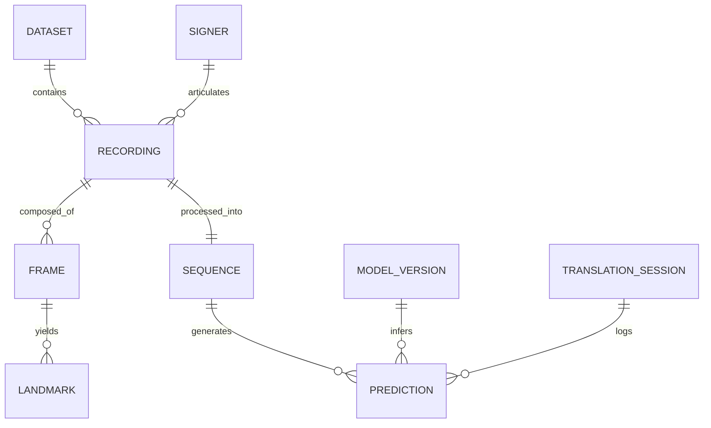

# 18. Master Data Schemas & Entity Definitions: SignTalk AI

**Document ID:** STAI-P1P2-018  
**Project Name:** SignTalk AI  
**Document Status:** Approved Engineering Blueprint (Phase 1 — Part 2)  

---

## 1. Entity-Relationship Conceptual Model



---

## 2. Core JSON Schema Specifications

### 2.1 Recording Metadata Schema (`recording_metadata.json`)
```json
{
  "$schema": "http://json-schema.org/draft-07/schema#",
  "title": "RecordingMetadata",
  "type": "object",
  "required": ["recording_id", "dataset_id", "signer_id", "gloss_label", "is_continuous", "fps", "total_frames"],
  "properties": {
    "recording_id": { "type": "string", "example": "REC_INCLUDE50_S02_C015_R01" },
    "dataset_id": { "type": "string", "enum": ["INCLUDE", "INCLUDE-50", "ISL-CSLTR", "ISLTranslate", "SUPPLEMENTARY"], "example": "INCLUDE-50" },
    "signer_id": { "type": "string", "example": "SIGNER_02" },
    "sign_id": { "type": "integer", "example": 15 },
    "gloss_label": { "type": "string", "example": "DOCTOR" },
    "is_continuous": { "type": "boolean", "example": false },
    "parallel_english_text": { "type": "string", "example": "Doctor" },
    "handedness": { "type": "string", "enum": ["right", "left", "both"], "example": "right" },
    "fps": { "type": "integer", "example": 30 },
    "total_frames": { "type": "integer", "example": 54 },
    "file_path_mp4": { "type": "string", "example": "data/raw/include_50/Doctor/Doctor_02.mp4" },
    "parquet_feature_path": { "type": "string", "example": "data/landmarks/include_50/Doctor_02.parquet" }
  }
}
```

### 2.2 Sequence Tensor Metadata Schema (`sequence_metadata.json`)
```json
{
  "sequence_id": "SEQ_20261015_0042",
  "recording_id": "REC_INCLUDE50_S02_C015_R01",
  "window_length_t": 45,
  "node_count_n": 93,
  "channels_c": 3,
  "start_frame_idx": 5,
  "end_frame_idx": 49,
  "signer_id": "SIGNER_02",
  "split": "train",
  "normalized": true,
  "augmented": false
}
```

### 2.3 Translation Session Log Schema (`session_log.json`)
```json
{
  "session_id": "sess_8f3a9b1c",
  "client_ip_hash": "a1b2c3d4e5f6",
  "started_at_utc": "2026-10-15T10:30:15Z",
  "ended_at_utc": "2026-10-15T10:33:45Z",
  "total_frames_processed": 6240,
  "total_sentences_generated": 14,
  "average_fps": 28.4,
  "average_latency_ms": 242.6,
  "low_confidence_events": 2,
  "model_version": "stgcn-trans-v1.0.0",
  "privacy_verified_no_video_stored": true
}
```
