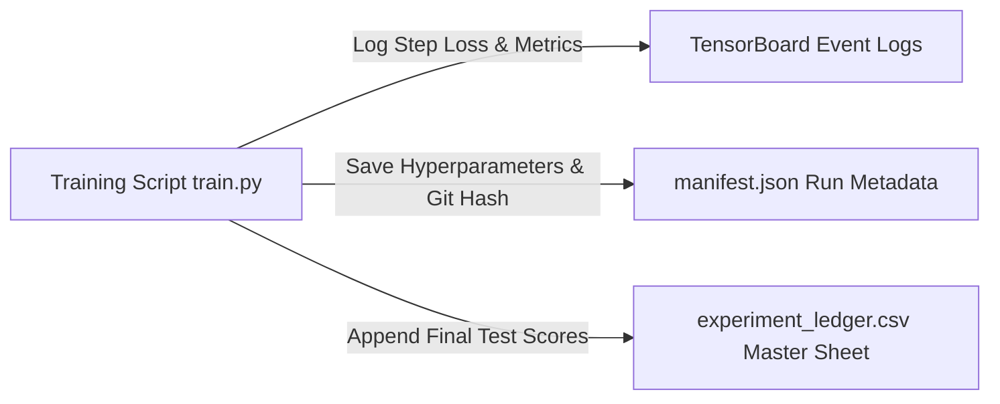

# 20. Experiment Tracking & Evaluation Ledger: SignTalk AI

**Document ID:** STAI-P1P2-020  
**Project Name:** SignTalk AI  
**Document Status:** Approved Engineering Blueprint (Phase 1 — Part 2)  

---

## 1. Local-First Tracking Architecture

To eliminate reliance on paid external cloud SaaS platforms (e.g., Weights & Biases, Comet ML), SignTalk AI deploys a **local-first, file-based experiment tracking system**.

Every training and ablation run automatically writes:
1. A machine-readable run manifest (`experiments/runs/<exp_id>/manifest.json`).
2. Continuous epoch loss and metric histories in TensorBoard format (`experiments/runs/<exp_id>/tensorboard/`).
3. An entry in the master CSV ledger (`experiments/experiment_ledger.csv`).



---

## 2. Standardized Experiment Manifest Schema

```json
{
  "experiment_id": "EXP_20261016_STGCN_ISL_001",
  "author": "Academic Project Team",
  "git_commit": "c3d4e5f6a1b2",
  "timestamp_start": "2026-10-16T08:30:00Z",
  "hardware": {
    "device_name": "NVIDIA GeForce RTX 4060 Laptop GPU",
    "cuda_version": "12.1",
    "cpu_model": "AMD Ryzen 7 7840HS",
    "ram_gb": 16
  },
  "dataset": {
    "name": "ISL-CSLTR",
    "version": "1.0.0",
    "split_protocol": "signer_independent",
    "train_samples": 490,
    "val_samples": 105,
    "test_samples": 105
  },
  "hyperparameters": {
    "batch_size": 32,
    "learning_rate": 0.001,
    "lr_scheduler": "CosineAnnealingLR",
    "weight_decay": 0.0001,
    "epochs_trained": 45,
    "early_stopping_epoch": 45,
    "dropout": 0.2
  },
  "final_metrics": {
    "train_loss": 0.342,
    "val_loss": 0.512,
    "test_bleu1": 46.2,
    "test_bleu4": 23.8,
    "test_wer": 27.4,
    "mean_latency_ms": 52.4
  },
  "artifacts": {
    "best_checkpoint": "models/checkpoints/EXP_20261016_STGCN_ISL_001_best.pt",
    "onnx_export": "models/checkpoints/EXP_20261016_STGCN_ISL_001.onnx"
  }
}
```

---

## 3. Master Experiment Ledger Structure (`experiments/experiment_ledger.csv`)

The authoritative tracking CSV records the following standardized columns:
`experiment_id,date,model_architecture,modality,dataset,batch_size,lr,epochs,top1_acc,bleu4,wer,latency_ms,checkpoint_path,git_hash,notes`
