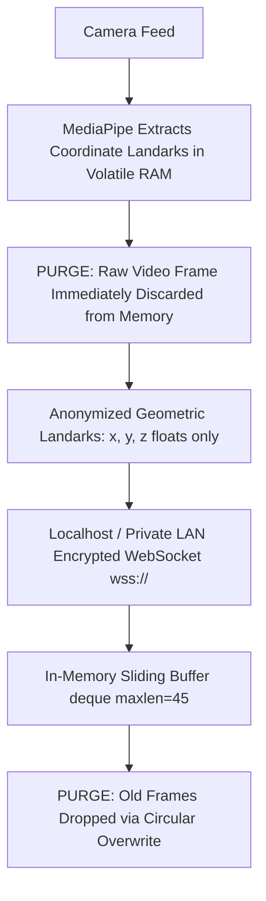

# 21. Security, Privacy & Data Protection Architecture: SignTalk AI

**Document ID:** STAI-P1P2-021  
**Project Name:** SignTalk AI  
**Document Status:** Approved Engineering Blueprint (Phase 1 — Part 2)  

---

## 1. Privacy-by-Design Principles

SignTalk AI enforces a **Privacy-by-Design architecture** aligned with India's Digital Personal Data Protection Act (DPDP Act 2023) and ICMR ethical guidelines for research:

---

## 2. Security Control Policies

### 2.1 Zero Raw-Video Persistence Policy
- Under no operational circumstance is a raw camera video frame, screenshot, or video buffer written to local disk, cached in temporary OS directories (`/tmp`), or uploaded to external servers.
- Computer vision frames exist exclusively in volatile RAM for the duration of the MediaPipe call ($\approx 35\text{ ms}$) and are automatically dereferenced and garbage collected immediately thereafter.

### 2.2 Input Coordinate Sanitization & Bounds Checking
To prevent malicious clients from sending malformed payloads, buffer overflow attacks, or `NaN`/`Inf` injection into PyTorch tensors:
- Incoming coordinate arrays must strictly contain exactly 93 triples of floating-point numbers.
- Each coordinate must lie within the normalized anatomical bounding volume:
  $$-5.0 \le x, y, z \le 5.0$$
- Coordinates with $|x| > 5.0$ or containing `NaN` / `Inf` are clamped or rejected with a `422 Unprocessable Entity` socket error.

### 2.3 Network Transport Encryption
- For production campus deployments, all communication must execute over **TLS 1.3** (`https://` and `wss://`).
- Unencrypted plaintext WebSockets (`ws://`) are permitted solely over `localhost` (`127.0.0.1`) during local offline student development.

### 2.4 Diagnostic Logging Hygiene
- System logs must record operational telemetry only (latency, FPS, connection state, error codes).
- Biometric facial keypoints, patient sign transcripts, or raw image buffers must **never** appear in log files.

---

## 3. Statutory Compliance Summary (DPDP Act 2023)

| Statutory Principle | System Implementation Mechanism | Operational Verification |
| :--- | :--- | :--- |
| **Data Minimization** | Raw video is reduced to 93 geometric points; dense facial iris points omitted. | Code audit confirms zero disk write operations for frames. |
| **Purpose Limitation** | Coordinates are used strictly for real-time sign-to-text translation; zero biometric ad-profiling. | Application architecture contains no user tracking modules. |
| **Storage Limitation** | Transient RAM ring buffer overwrites frames every 45 steps ($\approx 1.5\text{ s}$). | In-memory lifetime capped at $< 2\text{ seconds}$. |
| **Right to Erasure** | Users can close the session, immediately purging the RAM deque and active transcript. | Session cleanup hook deletes all session references upon socket disconnect. |
