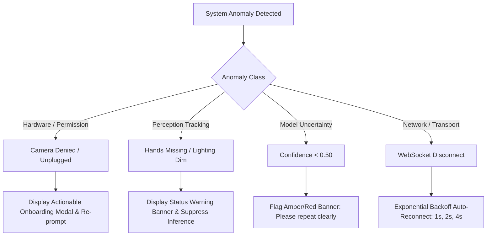

# 22. Fault Tolerance & Error Handling Architecture: SignTalk AI

**Document ID:** STAI-P1P2-022  
**Project Name:** SignTalk AI  
**Document Status:** Approved Engineering Blueprint (Phase 1 — Part 2)  

---

## 1. Error Handling Philosophy

In assistive technology, silent failures or incorrect assumptions can lead to dangerous outcomes (e.g., misinterpreting an allergy or symptom in a hospital). SignTalk AI adheres to three operational tenets:
1. **Explicit Uncertainty:** If the system is uncertain, it conspicuously informs the user and prompts repetition rather than guessing.
2. **Graceful Degradation:** Peripheral tracking failures (e.g., face occluded) do not crash the primary hand-tracking pipeline.
3. **Non-Intrusive Recovery:** Transient network hiccups trigger automatic exponential-backoff reconnects without requiring manual user page reloads.

---

## 2. Master System Error Matrix

| Anomaly / Error State | Detection Mechanism | User-Facing Notification | Automated Recovery Action |
| :--- | :--- | :--- | :--- |
| **Camera Permission Denied** | Browser `NotAllowedError` in `getUserMedia()` catch block. | *"Camera access blocked. Please enable camera permissions in your browser settings."* | Halts session initialization; shows step-by-step browser permission unlocking guide. |
| **Webcam Unplugged / Missing**| Browser `NotFoundError` or OpenCV video read returns `False`. | *"No camera detected. Please connect a webcam and restart."* | Polls `navigator.mediaDevices.enumerateDevices()` every 3 seconds for reconnection. |
| **MediaPipe Tracking Failure** | `holistic.process()` throws internal exception. | *"Visual tracking temporarily disrupted. Resetting..."* | Re-initializes MediaPipe pipeline instance; drops corrupted frame buffer. |
| **Signer Out of Frame** | Hand visibility confidence $< 0.30$ for $\ge 15$ consecutive frames. | *"Hands out of view. Please center yourself in front of the camera."* | Transitions system to `IDLE` state; pauses inference to prevent CPU thermal waste. |
| **Poor Ambient Lighting** | Video frame mean luminance $< 40$ (on $0-255$ scale) and face landmarks unstable. | *"Low lighting detected. Please improve room lighting for optimal accuracy."* | Emits visual warning badge; continues best-effort tracking without crashing. |
| **Low Model Confidence** | Decoded sentence confidence score $\bar{c} < 0.50$. | *"Low confidence. Please repeat your sign phrase clearly."* | Suppresses raw text output; renders amber caution banner; resets temporal buffer. |
| **Unsupported / OOV Sign** | Sequence activates `<UNK>` token with high probability. | *"Unrecognized sign phrase. Please use supported domain vocabulary."* | Discards token; prompts user to check supported vocabulary guide. |
| **WebSocket Disconnect** | Socket `onclose` event with code $\ne 1000$ (clean). | *"Connection to translation server lost. Reconnecting..."* | Executes exponential backoff reconnect ($1\text{s}, 2\text{s}, 4\text{s}$, max $10\text{s}$); preserves UI state. |
| **Backend Unreachable** | REST `/healthz` fails to respond within $2.0\text{ seconds}$. | *"Translation backend offline. Please verify local server is running."* | Displays server startup instructions (`uvicorn app.main:app`). |
| **Latency Budget Overrun** | Pipeline processing time exceeds $500\text{ ms}$ for 3 consecutive windows. | Visual badge: *"High latency detected (Performance throttled)"* | Temporarily increases sliding window stride from $S=5$ to $S=8$; switches to greedy decoding. |
| **PyTorch CUDA Out of Memory** | `torch.cuda.OutOfMemoryError` caught in inference worker. | None (Silent recovery to maintain user experience). | Flushes CUDA cache (`torch.cuda.empty_cache()`); falls back to CPU execution device. |
