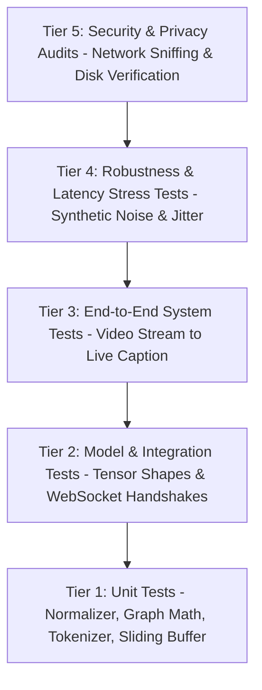

# 23. Testing Architecture & Verification Protocols: SignTalk AI

**Document ID:** STAI-P1P2-023  
**Project Name:** SignTalk AI  
**Document Status:** Approved Engineering Blueprint (Phase 1 — Part 2)  

---

## 1. Testing Pyramid

SignTalk AI establishes a five-tier testing pyramid to guarantee mathematical correctness, real-time performance, and privacy compliance across all academic milestones:

---

## 2. Test Execution Specifications

### Tier 1: Unit Testing (PyTest)
- **Normalizer Tests (`tests/unit/test_normalizer.py`):**
  - Verify that mid-shoulder point maps exactly to $(0.0, 0.0, 0.0)$.
  - Verify that scale division is invariant across simulated camera distances ($0.5\text{ m}$ vs. $1.5\text{ m}$).
  - Verify that missing joints (all zeros) do not trigger division-by-zero crashes.
- **Graph Builder Tests (`tests/unit/test_graph_builder.py`):**
  - Verify spatial adjacency matrix symmetry: $\mathbf{A} = \mathbf{A}^T$.
  - Verify that eigenvalues of normalized adjacency $\mathbf{\Lambda}$ stay within $[-1, 1]$.
  - Verify that bridge edges correctly link wrist nodes $0 \leftrightarrow 51$ and $21 \leftrightarrow 52$.
- **Sliding Buffer Tests (`tests/unit/test_sliding_buffer.py`):**
  - Verify circular overwrite behavior when exceeding $T = 45\text{ frames}$.
  - Verify thread safety under concurrent asynchronous writes.

### Tier 2: Model & Integration Testing
- **Model Tensor Shape Tests (`tests/model/test_model_shapes.py`):**
  - Verify that ST-GCN forward on $(B, 3, 45, 93)$ outputs exactly $(B, 12, 256)$.
  - Verify that Transformer decoder cross-attention handles variable sequence lengths without NaN gradients.
  - Verify that loaded checkpoints match their manifest SHA-256 hash.
- **API & WebSocket Integration Tests (`tests/integration/test_stream_api.py`):**
  - Test WebSocket connection handshake and session validation via `TestClient`.
  - Simulate streaming 45 mock coordinate frames; verify server emits structured `translation_caption` JSON within $< 500\text{ ms}$.

### Tier 3: End-to-End Testing (Playwright & Synthetic Video)
- Load pre-recorded benchmark video clip through browser synthetic media stream (`--use-fake-device-for-media-stream`).
- Verify that live caption text populates the DOM and changes from *interim* to *final*.

### Tier 4: Performance & Latency Benchmarks
- Profile CPU/GPU forward execution over 100 iterations.
- Assert that average end-to-end latency satisfies:
  $$\text{Mean}(\tau_{e2e}) \le 500\text{ ms}, \quad \text{P95}(\tau_{e2e}) \le 750\text{ ms}$$

### Tier 5: Privacy & Zero-Persistence Audit
- Automated disk scanner verifies that after a 5-minute active session:
  - Exactly zero `.mp4`, `.avi`, `.jpg`, or `.png` files were created in local storage or `/tmp`.
  - Network capture verifies that only coordinate arrays and JSON payloads traversed the loopback network.
