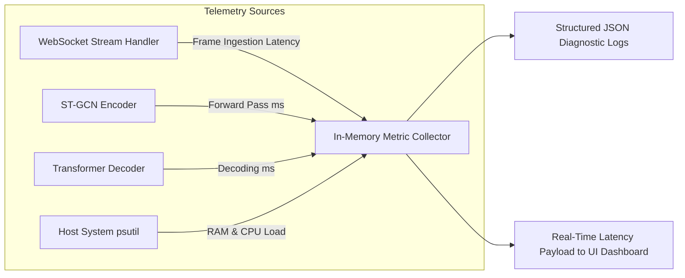

# 24. Observability, Telemetry & Monitoring Architecture: SignTalk AI

**Document ID:** STAI-P1P2-024  
**Project Name:** SignTalk AI  
**Document Status:** Approved Engineering Blueprint (Phase 1 — Part 2)  

---

## 1. Observability Principles & Privacy Guardrails

To monitor real-time system performance without introducing privacy violations, telemetry in SignTalk AI adheres to two fundamental constraints:
1. **Zero Biometric Logging:** Raw video frames, cropped face images, and extracted coordinate arrays are **never** logged to diagnostic log files.
2. **Structured Machine-Readable Output:** All server-side logs are formatted as structured JSON lines (`jsonlines`) to enable rapid parsing and latency regression analysis.



---

## 2. Telemetry Metrics Specification

| Metric Identifier | Metric Type | Units | Target Threshold | Critical Alert Threshold |
| :--- | :--- | :---: | :---: | :---: |
| `signtalk.stream.fps` | Gauge | Frames / Sec | $\ge 25\text{ FPS}$ | $< 15\text{ FPS}$ |
| `signtalk.latency.e2e_ms` | Histogram | Milliseconds | $< 500\text{ ms}$ | $> 800\text{ ms}$ |
| `signtalk.latency.gcn_ms` | Histogram | Milliseconds | $< 60\text{ ms}$ | $> 120\text{ ms}$ |
| `signtalk.latency.transformer_ms` | Histogram | Milliseconds | $< 100\text{ ms}$ | $> 180\text{ ms}$ |
| `signtalk.system.ram_rss_mb` | Gauge | Megabytes | $< 2048\text{ MB}$ | $> 3500\text{ MB}$ |
| `signtalk.system.cpu_percent` | Gauge | Percentage | $\le 60\%$ | $> 90\%$ |
| `signtalk.inference.confidence` | Histogram | Ratio $[0.0, 1.0]$ | $\ge 0.75$ | $< 0.50$ |
| `signtalk.errors.tracking_loss` | Counter | Events / Min | $0$ | $> 5\text{ events/min}$ |

---

## 3. Structured JSON Logging Schema

Every diagnostic log entry written to disk (`logs/signtalk_app.log`) conforms to the following schema:

```json
{
  "timestamp_utc": "2026-10-15T10:31:02.145Z",
  "log_level": "INFO",
  "component": "inference_service",
  "session_id": "sess_8f3a9b1c",
  "event": "inference_completed",
  "metrics": {
    "frame_id": 1420,
    "stgcn_latency_ms": 48.2,
    "transformer_latency_ms": 78.5,
    "total_backend_ms": 132.1,
    "confidence": 0.884,
    "fps": 28.5
  },
  "message": "Sentence decoded successfully: 8 tokens emitted"
}
```

---

## 4. Client-Side Real-Time Diagnostics

The web client includes an optional **Developer Telemetry HUD** (accessible via `Ctrl + Shift + D`) that displays real-time performance graphs:
- Instantaneous capture FPS and WebSocket ping round-trip time.
- Breakdown of server-side forward pass duration vs. client render time.
- Active memory consumption and landmark tracking confidence scores.
