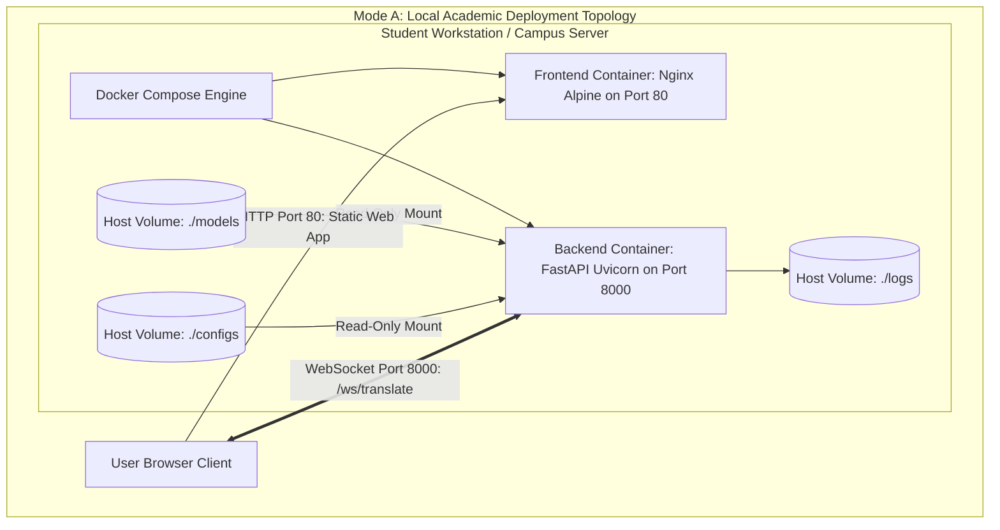

# 25. Deployment Architecture & Infrastructure Topology: SignTalk AI

**Document ID:** STAI-P1P2-025  
**Project Name:** SignTalk AI  
**Document Status:** Approved Engineering Blueprint (Phase 1 — Part 2)  

---

## 1. Multi-Stage Deployment Topologies

SignTalk AI defines two deployment modes suited for academic evaluation and future production release:
1. **Mode A — Academic Local / Web MVP (Current Target):** Client-server architecture running locally or across a campus local area network (LAN).
2. **Mode B — Future Edge PWA (Future Scope):** Completely decentralized client-side Progressive Web App (PWA) executing via WebGPU/Wasm.

---

## 2. Port Allocation & Network Topologies

| Service Component | Internal Container Port | Exposed Host Port | Protocol | Security Standard |
| :--- | :---: | :---: | :---: | :--- |
| **Frontend Static Web Server** | `80/TCP` | `80` (or `3000`) | HTTP / HTTPS | TLS 1.3 in production |
| **Backend REST & WebSocket API**| `8000/TCP` | `8000` | HTTP / WS / WSS | Reverse-proxied or CORS-isolated |
| **Local Metrics / Health** | `8000/TCP` | `8000/healthz` | HTTP | Internal diagnostic check |

---

## 3. Environment Variable Injection

Runtime behavior is configured exclusively via environment variables injected at container startup (`.env` file), ensuring zero hard-coded secrets or paths:

| Environment Variable | Default Value | Description |
| :--- | :--- | :--- |
| `SIGNTALK_ENV` | `development` | Operational environment (`development`, `testing`, `production`). |
| `API_HOST` | `0.0.0.0` | Bind IP address for Uvicorn ASGI server. |
| `API_PORT` | `8000` | Bind TCP port for FastAPI backend. |
| `CORS_ORIGINS` | `http://localhost:3000,http://localhost:80` | Allowed origin domains for browser CORS validation. |
| `MODEL_CHECKPOINT_PATH`| `models/checkpoints/stgcn_trans_v1.pt` | Path to active PyTorch / ONNX model weights. |
| `VOCABULARY_PATH` | `assets/vocabularies/mvp_50.json` | Path to serialized vocabulary mappings. |
| `INFERENCE_DEVICE` | `cpu` | PyTorch execution target (`cpu`, `cuda`, `mps`). |
| `CONFIDENCE_THRESHOLD` | `0.50` | Minimum score threshold below which low-confidence warnings fire. |
| `LOG_LEVEL` | `INFO` | Logging verbosity (`DEBUG`, `INFO`, `WARNING`, `ERROR`). |
