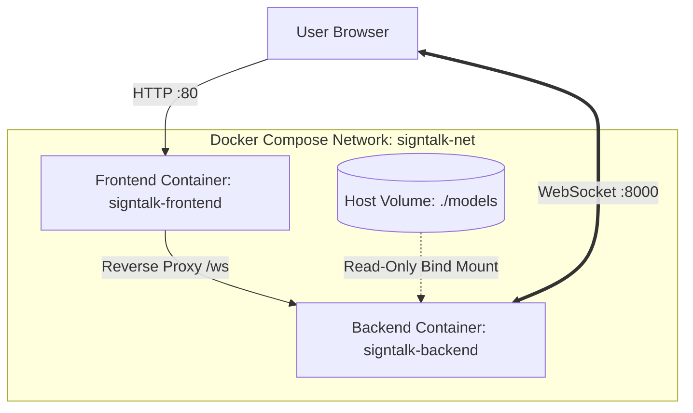

# 29. Containerization & Docker Architecture: SignTalk AI

**Document ID:** STAI-P1P2-029  
**Project Name:** SignTalk AI  
**Document Status:** Approved Engineering Blueprint (Phase 1 — Part 2)  

---

## 1. Container Composition Blueprint

SignTalk AI uses a dual-container architecture managed via Docker Compose:
- **`signtalk-frontend`:** Multi-stage Nginx Alpine container serving optimized React static assets on port 80.
- **`signtalk-backend`:** Hardened Python 3.11 slim container running FastAPI and Uvicorn on port 8000.



---

## 2. Container Build Specifications

### 2.1 Backend Dockerfile Blueprint (`backend/Dockerfile`)
```dockerfile
# Multi-stage hardened Python backend build
FROM python:3.11-slim as builder

WORKDIR /app
RUN apt-get update && apt-get install -y --no-install-recommends \
    build-essential \
    ffmpeg \
    libsm6 \
    libxext6 \
    && rm -rf /var/lib/apt/lists/*

COPY requirements.txt .
RUN pip install --no-cache-dir --user -r requirements.txt

# Final production stage
FROM python:3.11-slim as runner

WORKDIR /app
RUN apt-get update && apt-get install -y --no-install-recommends \
    ffmpeg \
    libsm6 \
    libxext6 \
    curl \
    && rm -rf /var/lib/apt/lists/*

# Create non-root execution user for security
RUN groupadd -r signtalk && useradd -r -g signtalk signtalk

COPY --from=builder /root/.local /home/signtalk/.local
COPY . /app
RUN chown -R signtalk:signtalk /app

USER signtalk
ENV PATH=/home/signtalk/.local/bin:$PATH
ENV PYTHONUNBUFFERED=1

EXPOSE 8000
HEALTHCHECK --interval=30s --timeout=5s --start-period=10s --retries=3 \
  CMD curl -f http://localhost:8000/healthz || exit 1

CMD ["uvicorn", "app.main:app", "--host", "0.0.0.0", "--port", "8000", "--workers", "1"]
```

### 2.2 Frontend Dockerfile Blueprint (`frontend/Dockerfile`)
```dockerfile
# Stage 1: Build React static assets
FROM node:20-alpine as builder
WORKDIR /app
COPY package*.json ./
RUN npm ci
COPY . .
RUN npm run build

# Stage 2: Serve via high-performance Nginx Alpine
FROM nginx:1.25-alpine
COPY --from=builder /app/dist /usr/share/nginx/html
COPY nginx.conf /etc/nginx/conf.d/default.conf
EXPOSE 80
CMD ["nginx", "-g", "daemon off;"]
```

---

## 3. Docker Compose Orchestration (`docker-compose.yml`)

```yaml
version: '3.8'

services:
  backend:
    build:
      context: ./backend
      dockerfile: Dockerfile
    container_name: signtalk-backend
    restart: unless-stopped
    ports:
      - "8000:8000"
    environment:
      - API_HOST=0.0.0.0
      - API_PORT=8000
      - INFERENCE_DEVICE=cpu
      - MODEL_CHECKPOINT_PATH=/app/models/checkpoints/stgcn_trans_v1.pt
    volumes:
      - ./models:/app/models:ro
      - ./configs:/app/configs:ro
      - ./logs:/app/logs:rw
    deploy:
      resources:
        limits:
          cpus: '4.0'
          memory: 4096M
        reservations:
          cpus: '1.0'
          memory: 1024M
    networks:
      - signtalk-net

  frontend:
    build:
      context: ./frontend
      dockerfile: Dockerfile
    container_name: signtalk-frontend
    restart: unless-stopped
    ports:
      - "80:80"
    depends_on:
      - backend
    networks:
      - signtalk-net

networks:
  signtalk-net:
    driver: bridge
```
