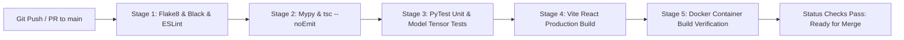

# 30. Continuous Integration & Quality Automation Blueprint: SignTalk AI

**Document ID:** STAI-P1P2-030  
**Project Name:** SignTalk AI  
**Document Status:** Approved Engineering Blueprint (Phase 1 — Part 2)  

---

## 1. Automated Quality Assurance Workflow

To prevent regressions during collaborative development, SignTalk AI establishes an automated GitHub Actions Continuous Integration (CI) pipeline:



---

## 2. GitHub Actions Workflow Blueprint (`.github/workflows/ci.yml`)

```yaml
name: SignTalk AI CI Pipeline

on:
  push:
    branches: [ main, develop ]
  pull_request:
    branches: [ main ]

jobs:
  backend-qa:
    name: Backend Code Quality & Unit Tests
    runs-on: ubuntu-latest
    steps:
      - uses: actions/checkout@v4

      - name: Set up Python 3.11
        uses: actions/setup-python@v5
        with:
          python-version: '3.11'
          cache: 'pip'

      - name: Install Dependencies
        run: |
          python -m pip install --upgrade pip
          pip install flake8 black mypy pytest pytest-asyncio
          pip install -r requirements.txt

      - name: Code Formatting & Linting
        run: |
          black --check src/ backend/ tests/
          flake8 src/ backend/ --max-line-length=100 --extend-ignore=E203,W503

      - name: Static Type Validation (Mypy)
        run: |
          mypy src/ backend/app/ --ignore-missing-imports

      - name: Execute PyTest Suite
        run: |
          pytest tests/unit tests/model -v --durations=10

  frontend-qa:
    name: Frontend Lint & TypeScript Compilation
    runs-on: ubuntu-latest
    steps:
      - uses: actions/checkout@v4

      - name: Set up Node.js 20 LTS
        uses: actions/setup-node@v4
        with:
          node-version: '20'
          cache: 'npm'
          cache-dependency-path: frontend/package-lock.json

      - name: Install NPM Packages
        working-directory: ./frontend
        run: npm ci

      - name: TypeScript Type Checking
        working-directory: ./frontend
        run: npx tsc --noEmit

      - name: Production Webpack/Vite Build
        working-directory: ./frontend
        run: npm run build
```
