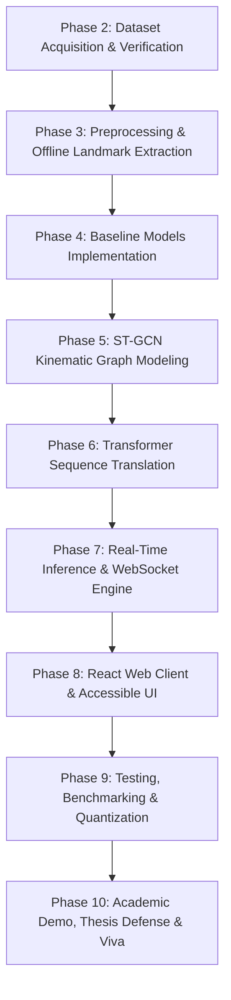

# 31. Phased Implementation Roadmap: SignTalk AI

**Document ID:** STAI-P1P2-031  
**Project Name:** SignTalk AI  
**Document Status:** Approved Engineering Blueprint (Phase 1 — Part 2)  

---

## 1. Academic Lifecycle Roadmap Overview

The subsequent execution of SignTalk AI is organized into **nine structured engineering phases** (Phases 2 through 10). Each phase specifies explicit deliverables, gating criteria, and risk mitigations to guarantee milestone completion within the university academic calendar.

---

## 2. Detailed Phase Specifications

### Phase 2: Dataset Acquisition & Partitioning
* **Objective:** Download, verify, and partition the primary datasets (INCLUDE-50 and ISL-CSLTR) into reproducible signer-independent splits.
* **Inputs:** Dataset URLs, download scripts, checksum manifests.
* **Outputs:** Verified raw video directories in `data/raw/`, `splits/include_50_splits.json`, `splits/isl_csltr_splits.json`.
* **Acceptance Criteria:** 100% of video clips verified via SHA-256; zero signer overlap between train, val, and test splits.
* **Risks:** Broken download links or corrupt video files $\rightarrow$ Mitigated by direct Mendeley / GitHub mirror scripts.

### Phase 3: Preprocessing & Offline Landmark Extraction
* **Objective:** Extract normalized 93-node 3D coordinate arrays from all dataset clips using MediaPipe Holistic.
* **Inputs:** Validated raw video clips from Phase 2.
* **Outputs:** Parquet/HDF5 feature arrays in `data/landmarks/`, quality inspection report.
* **Acceptance Criteria:** Landmark arrays generated for $> 95\%$ of videos; low-confidence clips quarantined.
* **Risks:** MediaPipe landmark jitter under motion blur $\rightarrow$ Mitigated by linear interpolation and One-Euro filtering.

### Phase 4: Baseline Models Implementation
* **Objective:** Implement and train baseline MLP and Bi-LSTM classifiers on flattened landmark sequences to establish reference accuracy.
* **Inputs:** Pre-extracted feature arrays from Phase 3.
* **Outputs:** Trained PyTorch baseline checkpoints in `models/checkpoints/`, baseline evaluation metrics.
* **Acceptance Criteria:** Bi-LSTM converges without NaN loss; baseline Top-1 accuracy and latency logged in ledger.
* **Risks:** Overfitting on training signers $\rightarrow$ Mitigated by dropout ($p=0.3$) and weight decay.

### Phase 5: ST-GCN Kinematic Graph Modeling
* **Objective:** Implement the 6-block ST-GCN encoder, construct normalized spatial adjacency matrices, and train on isolated signs.
* **Inputs:** Coordinate tensors and kinematic graph builder.
* **Outputs:** `models/checkpoints/stgcn_iso_v1.pt`, comparative performance report vs. Bi-LSTM.
* **Acceptance Criteria:** ST-GCN demonstrates statistically significant Top-1 accuracy gain ($\ge 8\%$) over the Bi-LSTM baseline on INCLUDE-50.
* **Risks:** Vanishing gradients in deep graph layers $\rightarrow$ Mitigated by residual shortcuts across all ST-GCN blocks.

### Phase 6: Transformer Decoder & Sequence Translation
* **Objective:** Implement the 3-layer autoregressive Transformer decoder, integrate with ST-GCN, and train on continuous ISL-CSLTR sentences.
* **Inputs:** Pretrained ST-GCN weights, parallel continuous video-text pairs.
* **Outputs:** `models/checkpoints/stgcn_trans_v1.pt`, BLEU 1-4 and WER benchmark scores.
* **Acceptance Criteria:** Target BLEU-4 $\ge 22.0$ achieved on held-out test split of ISL-CSLTR.
* **Risks:** Language decoder emitting repetitive loops $\rightarrow$ Mitigated by repetition penalty and cross-entropy label smoothing.

### Phase 7: Real-Time Inference & WebSocket Engine
* **Objective:** Build the FastAPI modular monolith, sliding window ring buffer, and WebSocket streaming handler.
* **Inputs:** Trained PyTorch model bundle, streaming configuration YAML.
* **Outputs:** Operational backend serving `/ws/translate` and `/healthz`.
* **Acceptance Criteria:** Backend streams at sustained $\ge 25\text{ FPS}$ with backend latency $\le 150\text{ ms}$.
* **Risks:** GIL blocking during model forward pass $\rightarrow$ Mitigated by thread-pool executor offloading.

### Phase 8: React Web Application & Accessible UI
* **Objective:** Build the React + TypeScript frontend, camera acquisition, live caption panel, and landmark canvas overlay.
* **Inputs:** UI component hierarchy and WebSocket API contracts.
* **Outputs:** Functional web client in `frontend/`.
* **Acceptance Criteria:** End-to-end user journey functional (Start $\rightarrow$ Sign $\rightarrow$ Live Caption rendered).
* **Risks:** Browser permission denials or canvas rendering lag $\rightarrow$ Mitigated by `requestAnimationFrame` canvas loops.

### Phase 9: Testing, Benchmarking & Optimization
* **Objective:** Execute full 5-tier test pyramid, profile wall-clock latencies, and export quantized INT8 ONNX binaries.
* **Inputs:** Complete client-server integration.
* **Outputs:** Quantized ONNX weights, comprehensive test suite pass report, latency profiling logs.
* **Acceptance Criteria:** End-to-end latency $< 500\text{ ms}$; zero raw-video files saved to disk; 100% unit tests passing.
* **Risks:** Quantization causing $> 5\%$ drop in BLEU score $\rightarrow$ Mitigated by selective FP16 fallback for attention layers.

### Phase 10: Academic Demo, Thesis Defense & Viva
* **Objective:** Package the final project, assemble the academic demonstration runbook, and prepare viva presentation slides.
* **Inputs:** All project code, validated checkpoints, documentation, and benchmark tables.
* **Outputs:** Live demonstrative presentation, final thesis report, video walkthrough.
* **Acceptance Criteria:** Successful live viva demonstration adhering strictly to the "Do Not Claim" academic integrity rules.
