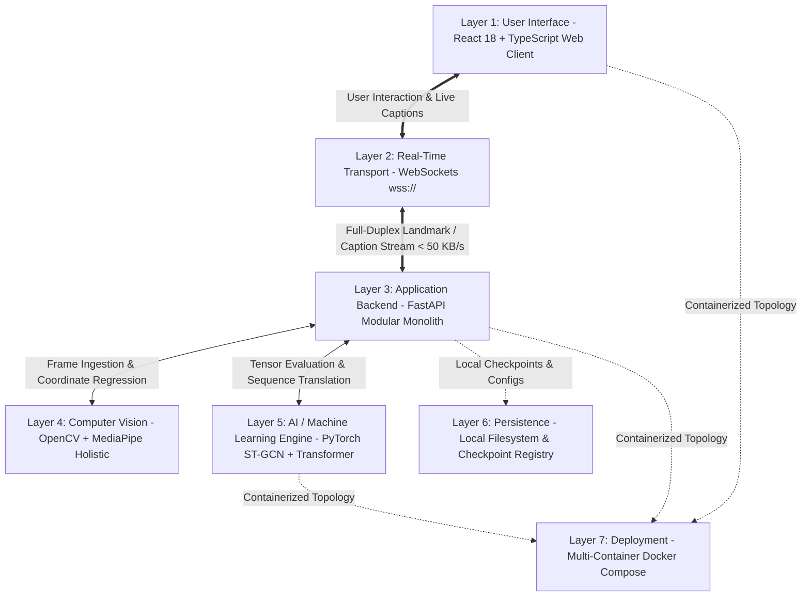

# SignTalk AI: Final Technical Architecture & Engineering Blueprint

**Document ID:** STAI-DOC-P1P2-MASTER-001  
**Project Title:** SignTalk AI: Real-Time Indian Sign Language Translation and Communication Platform  
**Technical Subtitle:** A Spatial-Temporal Graph and Transformer-Based Sign-to-Text System  
**Academic Context:** B.Tech Computer Science & Engineering (AI/ML) Final Year Project | GLA University  
**Lead AI/ML Architect, Software Architect & Project Manager:** Academic Engineering Team  
**Document Status:** Master Architecture Blueprint (Phase 1 — Part 2 Final Specification)  
**Date of Ratification:** October 2026  

---

```
================================================================================
               SIGNTALK AI: MASTER TECHNICAL ARCHITECTURE BLUEPRINT
================================================================================
```

---

## 1. System Overview & Core Philosophy

**SignTalk AI** is an academic research platform and assistive computer vision platform designed to translate continuous Indian Sign Language (ISL) signing into fluent natural-language English text captions in near real time.

Operating entirely on standard consumer 2D webcams without specialized hardware sensors, SignTalk AI couples lightweight edge skeletal landmark extraction (Google MediaPipe Holistic) with Spatial-Temporal Graph Convolutional Networks (ST-GCN) to model multi-joint biological kinematic connectivity, followed by an autoregressive Transformer decoder to synthesize grammatically coherent natural-language sentences under strict conversational latency budgets ($\le 500\text{ ms}$).

### Core Differentiators:
1. **Linguistic Focus:** Native Indian Sign Language (ISL) exclusively; not ASL or BSL.
2. **Continuous Phrase Translation:** Evaluates continuous co-articulation rather than isolated static gestures.
3. **Topological Graph Inductive Bias:** Models skeletal joints as an anatomical graph rather than flattened unstructured 1D vectors.
4. **Privacy-by-Design:** Extracts geometric skeletal landmarks locally in memory, guaranteeing zero raw-video transmission or storage.
5. **Architectural Simplicity:** Operates as a cohesive modular monolith without unnecessary microservices, Kubernetes, or multi-database sprawl.

---

## 2. Requirements Summary

- **Functional Requirements (FR-001 to FR-018):** Full coverage including monocular frame ingestion, 93-node landmark extraction, torso-centric normalization, sliding window buffering ($T=45, S=5$), ST-GCN graph encoding, Transformer autoregressive decoding, high-contrast captions, confidence gating ($\theta_{conf} = 0.50$), session controls, and offline fallback.
- **Non-Functional Requirements (NFR-001 to NFR-018):** End-to-end latency budget $< 500\text{ ms}$; sustained throughput $\ge 25\text{ FPS}$; resident process memory $< 2.0\text{ GB}$; CPU utilization $\le 60\%$; WCAG 2.1 AA accessibility compliance.
- **Operational Scope:** 50-class curated MVP domain vocabulary covering Healthcare Triage, Emergency Distress, Civic Desks, and Daily Greetings.

---

## 3. High-Level System Architecture

The system is structured into seven decoupled, cohesive layers:



---

## 4. End-to-End Data Pipeline

The pipeline transforms raw video into normalized spatial-temporal tensors across a verified 5-stage lifecycle:
1. **Frame Ingestion:** Uniform temporal resampling to $30\text{ FPS}$ at maximum $1280 \times 720$ resolution.
2. **Quality Gating:** Drops samples where average hand visibility drops below $0.40$ for $> 40\%$ duration; fills transient gaps ($\le 3$ frames) via linear interpolation.
3. **Coordinate Normalization:** Shifts mid-shoulder point to $(0, 0, 0)$ and divides coordinates by shoulder Euclidean distance $d_{shoulder}$.
4. **Signer-Independent Partitioning:** Partitions data strictly by `signer_id` (Train 70% $S_1-S_5$, Val 15% $S_6$, Test 15% $S_7-S_8$) to prevent data leakage and evaluate genuine generalization to unseen signers.
5. **Data Augmentation Suite:** Direct spatial-temporal coordinate operations: temporal resampling ($\alpha \in [0.85, 1.15]$), 2D spatial rotation ($\pm 10^\circ$), joint jittering ($\mathcal{N}(0, 0.005)$), and synthetic left/right hand mirroring.

---

## 5. Computer Vision & Landmark Pipeline

Visual perception executes via **Google MediaPipe Holistic** operating in volatile memory:
- **Left Hand:** 21 3D landmarks (wrist, thumb, index, middle, ring, pinky).
- **Right Hand:** 21 3D landmarks.
- **Upper Pose:** 11 keypoints (shoulders, elbows, wrists, nose, eyes, ears) providing spatial body grounding.
- **Salient Face:** 40 keypoints tracking eyebrows (8 pts), outer/inner lips (16 pts), and lower jawline (16 pts).
- **Dense Mesh Omission:** The dense 468-point face mesh is pruned by $91.5\%$, reducing graph matrix computation by $34\times$ while capturing essential non-manual grammatical cues.

---

## 6. Landmark Representation & Normalization Mathematics

Let $\mathbf{p}_i = [x_{raw, i}, y_{raw, i}, z_{raw, i}]^T \in \mathbb{R}^3$ denote the raw 3D position of joint $i \in \{0, \dots, 92\}$.

1. **Torso Centering:**
   $$\mathbf{c}_{torso} = \frac{\mathbf{p}_{47} + \mathbf{p}_{48}}{2}, \quad \mathbf{p}'_i = \mathbf{p}_i - \mathbf{c}_{torso}$$
2. **Shoulder Scale Normalization:**
   $$s = \max\left(\|\mathbf{p}_{47} - \mathbf{p}_{48}\|_2, 1 \times 10^{-4}\right), \quad \mathbf{x}_i = \frac{\mathbf{p}'_i}{s}$$
After transformation, all joints exist in a normalized coordinate space invariant to camera distance and user size.

---

## 7. Kinematic Graph Representation & Adjacency Mathematics

The human skeleton across a sliding window of $T=45$ frames is modeled as $\mathcal{G} = (\mathcal{V}, \mathcal{E})$ with $N = 93$ nodes:
- **Intra-Frame Spatial Edges ($\mathcal{E}_{spatial}$):** 102 biological kinematic bone linkages connecting finger joints, wrist-elbow-shoulder linkages, and facial contours, with cross-modality bridge edges $(0, 51)$ and $(21, 52)$.
- **Inter-Frame Temporal Edges ($\mathcal{E}_{temporal}$):** Edges connecting identical joints across consecutive frames $(v_{t, i}, v_{t+1, i})$.
- **Spatial Configuration Partitioning:** Partitioned into $K = 3$ subsets: Root ($\mathbf{A}_{root} = \mathbf{I}$), Centripetal ($\mathbf{A}_{centripetal}$, inward flow), and Centrifugal ($\mathbf{A}_{centrifugal}$, outward flow to fingertips).
- **Symmetric Normalization:** $\mathbf{\Lambda}_k = \mathbf{D}_k^{-\frac{1}{2}} \mathbf{A}_k \mathbf{D}_k^{-\frac{1}{2}}$.

---

## 8. Baseline Model Architecture

To validate scholarly contributions, SignTalk AI benchmarks two baselines before evaluating ST-GCN:
1. **Baseline 1 (MLP):** 2-layer MLP on static mean coordinate vector $\bar{\mathbf{x}} \in \mathbb{R}^{279}$ ($290\text{K}$ parameters).
2. **Baseline 2 (Bi-LSTM):** 2-layer Bidirectional LSTM on flattened sequence $\mathbf{X} \in \mathbb{R}^{B \times 45 \times 279}$ with hidden dimension $d_h = 256$ ($2.45\text{M}$ parameters).
* **Scholarly Hypothesis:** The Bi-LSTM baseline will fail to distinguish fine-grained minimal sign pairs due to the loss of anatomical graph topology, whereas ST-GCN will achieve $\ge 8-12\%$ higher Top-1 accuracy.

---

## 9. ST-GCN Kinematic Encoder Architecture

- **Input Tensor:** $\mathbf{X} \in \mathbb{R}^{B \times 3 \times 45 \times 93}$.
- **Backbone:** 6 sequential ST-GCN residual blocks organized in 3 stages:
  - Stage 1: Blocks 1–2 ($3 \rightarrow 64$ channels, temporal stride 1, shape $45 \times 93$).
  - Stage 2: Blocks 3–4 ($64 \rightarrow 128$ channels, temporal stride 2, shape $23 \times 93$).
  - Stage 3: Blocks 5–6 ($128 \rightarrow 256$ channels, temporal stride 2, shape $12 \times 93$).
- **Global Spatial Pooling:** Average pooling over $N=93$ nodes, collapsing spatial dimension to yield latent sequence tokens:
  $$\mathbf{H} \in \mathbb{R}^{B \times 12 \times 256}$$
- **Total Encoder Parameters:** $\approx 2.48\text{M}$ parameters.

---

## 10. Transformer Sequence Translation Architecture

- **Encoder Memory:** Receives latent tokens $\mathbf{H} \in \mathbb{R}^{B \times 12 \times 256}$ from ST-GCN.
- **Decoder Architecture:** 3-layer autoregressive Transformer decoder with multi-head self-attention and cross-attention ($n_{heads} = 4, d_{model} = 256, d_{ff} = 1024$, GeLU activation).
- **Vocabulary:** $|\mathcal{V}_{text}| = 500$ tokens covering special control tokens (`<PAD>`, `<SOS>`, `<EOS>`, `<UNK>`), 120 lemmatized vocabulary words, and syntactic punctuation.
- **Decoding & Confidence:** Greedy autoregressive decoding in real time; confidence score $\bar{c}_{sentence}$ computed as geometric mean token probability.
- **Total Decoder Parameters:** $\approx 1.85\text{M}$ parameters (Full Model ST-GCN + Transformer $\approx \mathbf{4.33\text{M}}$ parameters).

---

## 11. Continuous Signing & Segmentation Strategy

- **Sliding Window Buffer:** Bounded ring buffer of $T = 45\text{ frames}$ ($\approx 1.5\text{ seconds}$).
- **Inference Stride:** Evaluated every $S = 5\text{ frames}$ ($\approx 166\text{ ms}$, $\approx 6\text{ inferences/sec}$), sharing $88.9\%$ overlap across adjacent windows.
- **Rest State Detector:** Velocity gating on wrists and fingertips ($v < \theta_{rest}$) suppresses inference during idle periods, dropping CPU consumption to $< 5\%$.
- **Temporal Duplicate Suppression:** Normalized Levenshtein similarity filter ($\operatorname{Sim} > 0.85$ within $1.5\text{ seconds}$) suppresses repeated visual flashing of identical sentences.

---

## 12. Real-Time Inference Engine

- **Concurrency Architecture:** Producer task ingests JSON coordinate packets over WebSockets at $30\text{ FPS}$ into an in-memory queue. Consumer task offloads tensor forward execution to an asynchronous `ThreadPoolExecutor(max_workers=2)`.
- **Latency Budget Allocation:** Total end-to-end design latency $\le 500\text{ ms}$ (Capture $20\text{ ms}$ + MediaPipe $35\text{ ms}$ + Network $10\text{ ms}$ + ST-GCN $60\text{ ms}$ + Transformer $100\text{ ms}$ + Render $20\text{ ms} = \mathbf{245\text{ ms}}$ nominal).

---

## 13. Frontend Architecture (React + TypeScript)

- **Component Hierarchy:** `AppRouter` $\rightarrow$ `TranslatorView` $\rightarrow$ `CameraPreview`, `LandmarkCanvas`, `SessionControls`, `LiveCaptionPanel`, `ConfidenceIndicator`.
- **State Management:** Decoupled `SessionContext`, `CaptionContext`, and `SettingsContext`.
- **Accessibility:** Full WCAG 2.1 AA compliance: $21:1$ contrast ratio, keyboard navigation (`Spacebar` to toggle, `Esc` to stop), zero auditory dependency.

---

## 14. Backend Architecture (FastAPI Monolith)

- **Structure:** Modular monolith under `backend/app/` with clean boundaries: `api/` (routes), `core/` (settings), `services/` (session, inference, safety), `preprocessing/` (normalizer, buffer), `graph/` (adjacency), `models/` (ST-GCN, Transformer), `nlp/` (tokenizer).
- **Lifespan Hooks:** Model checkpoints loaded once during application startup and cached in memory.

---

## 15. API Contracts & WebSocket Protocol

- **REST Endpoints:** `GET /healthz`, `POST /api/v1/session`, `GET /api/v1/model/info`, `GET /api/v1/config`.
- **WebSocket Route:** `/ws/translate/{session_id}`.
- **Framing:** Client streams `landmark_frame` JSON ($< 50\text{ KB/s}$); server broadcasts `translation_caption` and `translation_warning` JSON payloads.

---

## 16. Data Schemas

Authoritative JSON Schemas defined for all primary entities:
- `recording_metadata.json` (tracking dataset, signer, gloss, frame count, paths).
- `sequence_metadata.json` (window length $T$, node count $N$, channels $C$, split, normalization flags).
- `session_log.json` (session ID, duration, frames processed, sentences generated, mean FPS, mean latency).

---

## 17. Security Architecture

- **Transport Encryption:** TLS 1.3 (`https://` and `wss://`) in production campus environments.
- **Input Sanitization:** Bounding box check enforcing $-5.0 \le x, y, z \le 5.0$ and rejecting `NaN`/`Inf` coordinate vectors.
- **Zero Secrets in Code:** Environment configuration managed via `.env` loaded through Pydantic BaseSettings.

---

## 18. Privacy Architecture & DPDP Compliance

- **Zero Raw-Video Persistence:** Monocular video frames exist solely in volatile RAM during the MediaPipe call ($\approx 35\text{ ms}$) and are purged immediately. Exactly zero video bytes are saved to disk or transmitted across networks.
- **Statutory Compliance:** Fulfills all Data Minimization, Purpose Limitation, Storage Limitation, and Right to Erasure mandates under India's Digital Personal Data Protection Act (DPDP Act 2023).

---

## 19. Testing Architecture

Five-tier automated testing pyramid:
- **Tier 1 (Unit):** Normalizer invariance, graph symmetry, sliding buffer circular overwrite.
- **Tier 2 (Model & Integration):** ST-GCN and Transformer output tensor shape assertions, WebSocket streaming mock tests.
- **Tier 3 (E2E):** Playwright browser automation with fake video stream devices.
- **Tier 4 (Performance):** Automated latency benchmarks asserting $\text{Mean}(\tau_{e2e}) \le 500\text{ ms}$.
- **Tier 5 (Privacy Audit):** Automated disk and network scanners confirming zero video files on disk.

---

## 20. Performance Strategy & Optimization

- **Temporal Stride Tuning:** $S=5$ reduces inference frequency by $83.3\%$ while maintaining a fresh caption update every $166\text{ ms}$.
- **INT8 ONNX Quantization:** Compiles PyTorch models to ONNX INT8 via AVX-512 vectorization, speeding up CPU inference by $2.5\times$ and compressing weight files to $< 5\text{ MB}$.
- **Zero-Copy Memory Buffers:** Pre-allocated circular NumPy arrays eliminate garbage collection pauses.

---

## 21. Deployment Architecture (Mode A)

- **Multi-Container Topology:** Docker Compose orchestrating `signtalk-frontend` (Nginx Alpine on port 80) and `signtalk-backend` (FastAPI Python 3.11 slim on port 8000).
- **Volume Mounts:** Read-only bind mount for model weights (`./models:/app/models:ro`).
- **Resource Limits:** Container cgroups capped at 4 CPU cores and 4096 MB RAM.

---

## 22. Future Edge Architecture (Mode B)

- **Status:** **`PLANNED / FUTURE IMPLEMENTATION`** (Zero claims of existing deployment).
- **Roadmap:** Model compilation to ONNX Runtime Web targeting browser WebGPU and WebAssembly (Wasm), packaging as an installable Progressive Web App (PWA) with zero server dependencies.

---

## 23. Repository Structure

Standardized, modular academic repository blueprint:
- `docs/` (Phase 1 Part 1, Phase 1 Part 2, Architecture, ADRs, Research sources).
- `data/` (Registries, splits, raw/landmark directories excluded from git).
- `src/` (Core scientific library: data, preprocessing, landmarks, graph, models, inference, evaluation).
- `backend/` (FastAPI application, endpoints, services, Dockerfile).
- `frontend/` (React + TypeScript Vite application, components, views, styles, Dockerfile).
- `tests/`, `notebooks/`, `experiments/`, `configs/`, `scripts/`, `models/`.

---

## 24. Technology Decision Records Summary

Architectural Decision Records (ADRs) formally established:
- **ADR-001:** React + TypeScript (Type safety, accessible component isolation).
- **ADR-002:** FastAPI (Native async WebSockets + direct in-process PyTorch tensors).
- **ADR-003:** MediaPipe Holistic (Sub-35ms CPU landmark tracking; zero raw video retention).
- **ADR-004:** ST-GCN (Biological kinematic inductive bias prevents low-resource overfitting).
- **ADR-005:** Transformer Decoder (Autoregressively bridges ISL SOV to English SVO word order).
- **ADR-006:** WebSockets (Low transport latency $< 15\text{ ms}$ without WebRTC signaling complexity).
- **ADR-007:** Local Modular Monolith (Self-contained offline execution; zero cloud hosting costs).
- **ADR-008:** Local Filesystem & Zero-Database (Eliminates database bloat; guarantees privacy).

---

## 25. Phased Implementation Roadmap

- **Phase 2:** Dataset Acquisition & Verification (INCLUDE-50 + ISL-CSLTR).
- **Phase 3:** Preprocessing & Offline Landmark Extraction.
- **Phase 4:** Baseline Models Implementation (MLP & Bi-LSTM).
- **Phase 5:** ST-GCN Kinematic Graph Modeling & Pretraining.
- **Phase 6:** Transformer Sequence Translation Fine-Tuning.
- **Phase 7:** Real-Time Inference & WebSocket Engine.
- **Phase 8:** React Web Client & Accessible UI.
- **Phase 9:** Testing, Benchmarking & Quantization.
- **Phase 10:** Academic Demonstration, Thesis Defense & Viva.

---

## 26. Technical Definition of Done (DoD) Summary

A subsystem is marked **DONE** only when verifiable criteria are satisfied:
- Code written, typed, and formatted (Black/Flake8/ESLint).
- Automated unit and model tests pass with $100\%$ success rate.
- Benchmark metrics logged in `experiments/experiment_ledger.csv`.
- Latency targets ($\le 500\text{ ms}$) verified on local hardware.
- Privacy compliance verified (zero video files on disk).

---

## 27. Open Technical Decisions & Phase 2 Prerequisites

Before Phase 2 execution begins:
1. **Workstation Hardware Confirmation:** User confirmation of local GPU VRAM (NVIDIA CUDA vs. CPU-only).
2. **Primary Dataset Approval:** Lock **INCLUDE-50** (isolated baseline) and **ISL-CSLTR** (continuous sentences).
3. **Facial Landmark Latency Check:** 100-frame host CPU benchmark of MediaPipe Face Mesh.
4. **Target Language Granularity:** English-first translation approved; secondary Hindi display mapping.
5. **Ethics Review Scope:** Public benchmark evaluation approved; supplementary recordings deferred.
