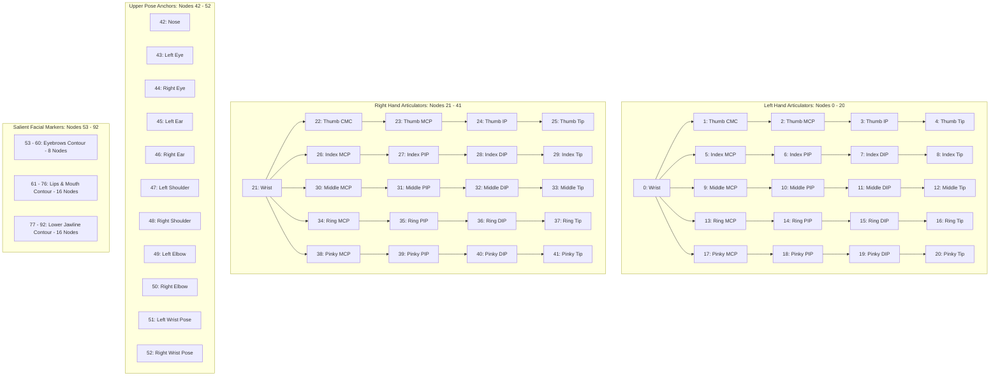

# Landmark Data Schema: SignTalk AI

**Document ID:** STAI-P2P2-001  
**Project:** SignTalk AI  
**Phase:** Phase 2 — Part 2 (Landmark Extraction & Preprocessing)  
**Status:** Approved Engineering Specification  

---

## 1. Landmark Node Topology ($V = 93$ Nodes)

SignTalk AI operates on an anatomically curated 93-node skeletal graph derived from Google MediaPipe Tasks Vision models (`PoseLandmarker`, `HandLandmarker`, `FaceLandmarker`).

---

## 2. Anatomical Subsystems Breakdown

| Node Range | Subsystem | Count | Source Detector | Role in Indian Sign Language |
| :---: | :--- | :---: | :--- | :--- |
| **0 – 20** | Left Hand Articulators | 21 | `HandLandmarker` | Secondary or symmetric sign articulator, fingerspelling base |
| **21 – 41** | Right Hand Articulators | 21 | `HandLandmarker` | Primary/dominant sign articulator, trajectory carrier |
| **42 – 52** | Upper Pose Anchors | 11 | `PoseLandmarker` | Anatomical spatial frame-of-reference, torso center, shoulder scale |
| **53 – 60** | Eyebrow Contours | 8 | `FaceLandmarker` | Non-manual question markers (wh-furrow, polar-raise) |
| **61 – 76** | Lip & Mouth Contours | 16 | `FaceLandmarker` | Mouthing morphemes, grammatical facial adjectives |
| **77 – 92** | Jawline Contours | 16 | `FaceLandmarker` | Head nods/shakes, spatial perspective shifts |

---

## 3. Storage Container Schema: NumPy Compressed (`.npz`)

All processed samples are serialized as standalone `.npz` archive files located at `data/processed/landmarks/{split}/{sample_id}.npz`:

| Field Key | Data Type | Array Shape | Description |
| :--- | :--- | :---: | :--- |
| `data` | `float32` | `(3, 45, 93)` | Normalized spatial coordinates $[C, T, V]$ ($C=3$ channels: $x, y, z$). |
| `mask` | `bool` | `(1, 45, 93)` | Binary visibility mask indicating valid/imputed vs missing nodes. |
| `raw_coords` | `float32` | `(T_orig, 93, 3)` | Original unnormalized coordinates prior to temporal resampling. |
| `raw_mask` | `bool` | `(T_orig, 93)` | Original binary detection mask from MediaPipe detectors. |
| `class_id` | `int64` | Scalar | Numerical class label index ($0$ to $49$). |
| `class_label`| `str` | Scalar | English gloss text string (e.g. `'hello'`, `'thankyou'`). |
| `signer_id` | `str` | Scalar | Identifier of the human subject (e.g. `'signer_01'`). |
| `sample_id` | `str` | Scalar | Unique sequence identifier (e.g. `'raw_0001'`). |
| `split` | `str` | Scalar | Dataset partition (`'train'`, `'val'`, `'test'`). |
| `fps` | `float64` | Scalar | Effective video frame rate (standardized to $25.0\text{ FPS}$). |
| `quality_score`| `float64` | Scalar | Sequence-level quality evaluation score $[0.0, 1.0]$. |
| `classification`| `str` | Scalar | Quality classification (`'GOOD'`, `'ACCEPTABLE'`, `'REVIEW'`, `'REJECT'`). |

---

## 4. Metadata Manifest Schema (`processed_dataset_manifest.csv`)

The accompanying dataset manifest records:
- `sample_id`: Unique identifier.
- `split`: Partition assignment (`train`, `val`, `test`).
- `class_label`: Vocabulary gloss name.
- `class_id`: Integer label.
- `signer_id`: Signer code.
- `processed_file`: Relative path to the `.npz` file.
- `original_frames`: Frame count prior to resampling.
- `target_frames`: Standardized sequence length ($T = 45$).
- `average_quality`: Weighted sequence quality score.
- `classification`: Quality status.
- `classification_reason`: Documented justification.
- `pose_detection_rate`: Percentage of frames with valid pose.
- `left_hand_detection_rate`: Percentage of frames with valid left hand.
- `right_hand_detection_rate`: Percentage of frames with valid right hand.
- `face_detection_rate`: Percentage of frames with valid face.
- `elapsed_seconds`: Extraction latency.
- `status`: Execution checkpoint (`COMPLETED` or `FAILED`).
